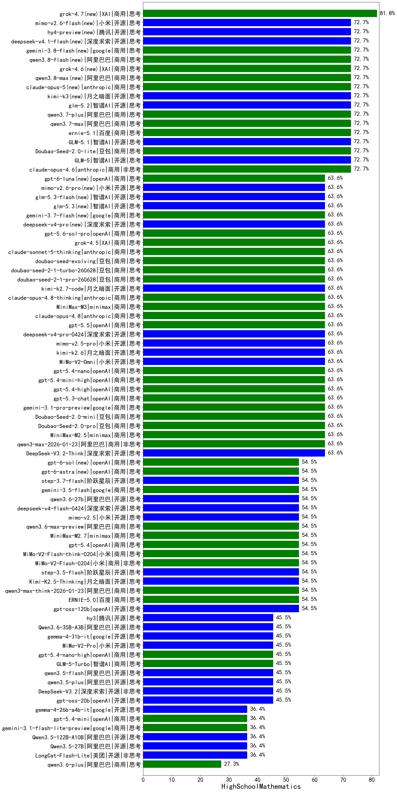

|类别|机构|大模型|【HighSchoolMathematics】准确率|平均耗时|平均消耗token|花费/千次（元）|排名（准确率）|
|---|---|-----|-------------------|-------|-----------|-----------|-----------|
|开源|小米|mimo-v2.6-flash(new)|72.7%|427s|10314|20.5|1|
|商用|XAI|grok-4.6(new)|72.7%|364s|6066|244.7|2|
|商用|阿里巴巴|qwen3.7-max|72.7%|158s|7640|270.9|3|
|开源|智谱AI|glm-5.2(new)|72.7%|226s|8921|246.4|4|
|商用|anthropic|claude-opus-4.6|72.7%|16s|1299|197.6|5|
|开源|智谱AI|GLM-5|72.7%|341s|9736|173.0|6|
|商用|百度|ernie-5.1|72.7%|163s|6753|119.4|7|
|商用|豆包|doubao-seed-1-8-251215|72.7%|81s|2719|20.3|8|
|开源|月之暗面|kimi-k3(new)|72.7%|113s|2980|279.3|9|
|商用|anthropic|claude-opus-5(new)|72.7%|16s|1414|212.8|10|
|商用|阿里巴巴|qwen3.8-max(new)|72.7%|169s|7203|254.3|11|
|商用|腾讯|hunyuan-2.0-thinking-20251109|72.7%|80s|6303|24.8|12|
|商用|豆包|Doubao-Seed-2.0-lite|72.7%|492s|3029|10.3|13|
|开源|智谱AI|GLM-5.1|72.7%|296s|9851|233.5|14|
|商用|阿里巴巴|qwen3.8-flash(new)|72.7%|134s|10050|26.7|15|
|商用|google|gemini-3.8-flash(new)|72.7%|22s|2991|150.2|16|
|开源|深度求索|deepseek-v4.1-flash(new)|72.7%|22s|5350|41.8|17|
|开源|腾讯|hy4-preview(new)|72.7%|87s|6460|114.4|18|
|商用|阿里巴巴|qwen3.7-plus(new)|72.7%|176s|9476|74.8|19|
|开源|月之暗面|kimi-k2.6|63.6%|511s|9972|242.1|20|
|商用|minimax|MiniMax-M3(new)|63.6%|136s|5750|92.7|21|
|开源|小米|mimo-v2.5-pro|63.6%|184s|8982|182.8|22|
|开源|深度求索|deepseek-v4-pro-0424|63.6%|277s|10761|256.5|23|
|商用|openAI|gpt-5.5|63.6%|43s|1774|342.8|24|
|开源|小米|MiMo-V2-Omni|63.6%|404s|9139|123.3|25|
|商用|openAI|gpt-5.4-nano|63.6%|132s|1057|8.0|26|
|商用|anthropic|claude-opus-4.8(new)|63.6%|13s|1166|169.4|27|
|商用|豆包|doubao-seed-2-1-turbo-260628(new)|63.6%|687s|17674|262.8|28|
|商用|anthropic|claude-opus-4.8-thinking(new)|63.6%|23s|2297|367.3|29|
|开源|月之暗面|kimi-k2.7-code(new)|63.6%|77s|4414|116.0|30|
|商用|豆包|doubao-seed-2-1-pro-260628(new)|63.6%|498s|24438|728.4|31|
|商用|openAI|gpt-5.3-chat|63.6%|23s|1490|131.5|32|
|商用|豆包|doubao-seed-evolving(new)|63.6%|382s|19279|573.9|33|
|商用|anthropic|claude-sonnet-5-thinking(new)|63.6%|30s|3226|212.0|34|
|商用|XAI|grok-4.5(new)|63.6%|126s|8502|347.0|35|
|商用|openAI|gpt-5.6-sol-pro(new)|63.6%|39s|8813|914.9|36|
|开源|深度求索|deepseek-v4-pro(new)|63.6%|137s|7718|204.4|37|
|商用|google|gemini-3.7-flash(new)|63.6%|8s|2295|56.9|38|
|开源|智谱AI|glm-5.3(new)|63.6%|532s|6361|174.7|39|
|开源|智谱AI|glm-5.3-flash(new)|63.6%|307s|8017|22.1|40|
|开源|小米|mimo-v2.6-pro(new)|63.6%|250s|11680|69.6|41|
|商用|openAI|gpt-5.4-high|63.6%|42s|2295|227.1|42|
|商用|openAI|gpt-5.4-mini-high|63.6%|108s|4106|124.9|43|
|开源|深度求索|DeepSeek-V3.2-Think|63.6%|332s|7778|23.2|44|
|商用|minimax|MiniMax-M2.5|63.6%|110s|6332|52.1|45|
|商用|豆包|Doubao-Seed-2.0-pro|63.6%|526s|2677|40.3|46|
|商用|openAI|gpt-5.2-high|63.6%|88s|3794|362.4|47|
|商用|google|gemini-3.1-pro-preview|63.6%|98s|7929|664.1|48|
|商用|google|gemini-3-flash-preview|63.6%|256s|12356|260.3|49|
|商用|豆包|Doubao-Seed-2.0-mini|63.6%|1038s|7894|15.4|50|
|商用|阿里巴巴|qwen3-max-2026-01-23|63.6%|95s|3959|38.3|51|
|开源|月之暗面|Kimi-K2.5-Thinking|54.5%|389s|12794|266.0|52|
|开源|阶跃星辰|step-3.7-flash(new)|54.5%|75s|10028|80.2|53|
|商用|google|gemini-3.5-flash|54.5%|21s|4694|287.2|54|
|开源|阶跃星辰|step-3.5-flash|54.5%|79s|16142|33.7|55|
|商用|阿里巴巴|qwen3-max-think-2026-01-23|54.5%|808s|10916|107.9|56|
|开源|智谱AI|GLM-4.7-Flash|54.5%|1241s|16656|0.0|57|
|商用|百度|ERNIE-5.0|54.5%|570s|13517|321.7|58|
|开源|美团|LongCat-Flash-Thinking-2601|54.5%|187s|14757|0.0|59|
|商用|小米|MiMo-V2-Flash-0204|54.5%|996s|3483|7.0|60|
|商用|阿里巴巴|qwen3-max-preview-think|54.5%|204s|8547|202.0|61|
|商用|openAI|gpt-5.2-medium|54.5%|50s|2607|244.4|62|
|商用|阿里巴巴|qwen-plus-2025-12-01|54.5%|99s|3861|7.5|63|
|商用|腾讯|hunyuan-2.0-instruct-20251111|54.5%|33s|2235|4.3|64|
|商用|openAI|gpt-6-astra(new)|54.5%|22s|856|251.8|65|
|开源|阿里巴巴|qwen3.6-27b|54.5%|97s|6846|120.7|66|
|开源|openAI|gpt-oss-120b|54.5%|131s|2226|6.8|67|
|商用|minimax|MiniMax-M2.7|54.5%|198s|8789|72.7|68|
|商用|小米|MiMo-V2-Flash-think-0204|54.5%|677s|9704|20.1|69|
|开源|小米|mimo-v2.5|54.5%|120s|7331|98.0|70|
|商用|阿里巴巴|qwen3.6-max-preview|54.5%|199s|7161|379.0|71|
|开源|深度求索|deepseek-v4-flash-0424|54.5%|117s|5369|10.6|72|
|商用|openAI|gpt-5.4|54.5%|31s|1274|118.9|73|
|开源|小米|MiMo-V2-Pro|45.5%|161s|4335|85.3|74|
|开源|openAI|gpt-oss-20b|45.5%|179s|2977|3.3|75|
|商用|openAI|gpt-5.4-nano-high|45.5%|292s|5116|43.5|76|
|开源|腾讯|hy3(new)|45.5%|76s|1290|4.7|77|
|开源|小米|MiMo-V2-Flash-think|45.5%|212s|10999|0.0|78|
|开源|阿里巴巴|qwen3.5-flash|45.5%|963s|19115|37.9|79|
|商用|阿里巴巴|qwen-plus-think-2025-12-01|45.5%|140s|8548|67.1|80|
|商用|智谱AI|GLM-5-Turbo|45.5%|126s|11159|242.7|81|
|开源|阿里巴巴|qwen3.5-plus|45.5%|181s|16044|76.3|82|
|开源|阿里巴巴|qwen3-next-80b-a3b-thinking|45.5%|330s|7417|29.1|83|
|开源|google|gemma-4-31b-it|45.5%|205s|1219|3.1|84|
|开源|阿里巴巴|Qwen3.6-35B-A3B|45.5%|226s|8862|94.2|85|
|开源|深度求索|DeepSeek-V3.2|45.5%|72s|2238|6.6|86|
|开源|阿里巴巴|Qwen3.5-27B|36.4%|274s|19218|91.5|87|
|商用|openAI|gpt-5.2|36.4%|11s|850|69.7|88|
|开源|美团|LongCat-Flash-Lite|36.4%|510s|4093|0.0|89|
|开源|小米|MiMo-V2-Flash|36.4%|107s|7169|0.0|90|
|商用|openAI|gpt-5.4-mini|36.4%|218s|880|23.3|91|
|开源|智谱AI|GLM-4.7|36.4%|246s|7081|97.3|92|
|开源|google|gemma-4-26b-a4b-it|36.4%|112s|1653|4.3|93|
|商用|google|gemini-3.1-flash-lite-preview|36.4%|41s|1047|9.6|94|
|开源|阿里巴巴|Qwen3.5-122B-A10B|36.4%|808s|17377|110.3|95|
|开源|Mistral|Ministral-3-3B-Instruct-2512|27.3%|28s|4832|3.4|96|
|开源|Mistral|Ministral-3-8B-Instruct-2512|27.3%|24s|2746|2.9|97|
|开源|Mistral|mistral-large-2512|27.3%|45s|2423|24.8|98|
|商用|minimax|MiniMax-M2.1|27.3%|137s|11306|93.9|99|
|商用|阿里巴巴|qwen3.6-plus|27.3%|187s|5674|66.7|100|
|开源|Mistral|Ministral-3-14B-Instruct-2512|18.2%|21s|2917|4.2|101|

