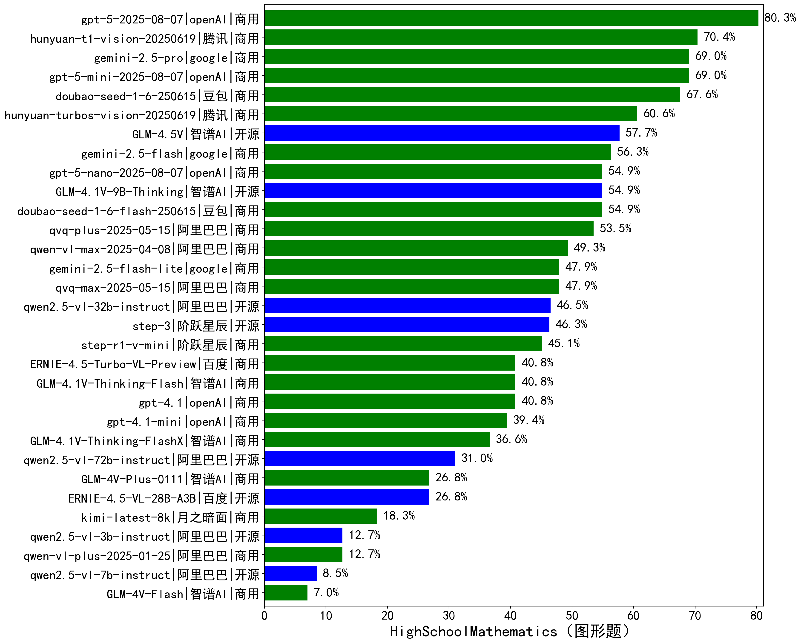

|类别|机构|大模型|【HighSchoolMathematics（图形题）】准确率|平均耗时|平均消耗token|花费/千次（元）|排名（准确率）|
|---|---|-----|-------------------|-------|-----------|-----------|-----------|
|商用|腾讯|hunyuan-t1-vision-20250619|70.4%|85s|4760|37.5|1|
|商用|豆包|doubao-seed-1-6-250615|67.6%|/|2648|13.8|2|
|商用|腾讯|hunyuan-turbos-vision-20250619|60.6%|21s|1683|10.2|3|
|开源|智谱AI|GLM-4.5V|57.7%|65s|4494|22.4|4|
|商用|豆包|doubao-seed-1-6-flash-250615|54.9%|/|2321|2.1|5|
|开源|智谱AI|GLM-4.1V-9B-Thinking|54.9%|139s|4673|3.8|6|
|商用|阿里巴巴|qvq-plus-2025-05-15|53.5%|339s|6866|31.3|7|
|商用|阿里巴巴|qwen-vl-max-2025-04-08|49.3%|57s|1897|11.1|8|
|商用|阿里巴巴|qvq-max-2025-05-15|47.9%|118s|3974|103.3|9|
|开源|阶跃星辰|step-3|47.0%|383s|7293|28.4|10|
|开源|阿里巴巴|qwen2.5-vl-32b-instruct|46.5%|63s|2231|4.2|11|
|商用|阶跃星辰|step-r1-v-mini|45.1%|111s|7538|56.5|12|
|商用|openAI|gpt-4.1|40.8%|44s|1631|61.2|13|
|商用|智谱AI|GLM-4.1V-Thinking-Flash|40.8%|35s|2556|0.0|14|
|商用|百度|ERNIE-4.5-Turbo-VL-Preview|40.8%|53s|2659|14.7|15|
|商用|openAI|gpt-4.1-mini|39.4%|36s|1820|14.6|16|
|商用|智谱AI|GLM-4.1V-Thinking-FlashX|36.6%|29s|2596|5.2|17|
|开源|阿里巴巴|qwen2.5-vl-72b-instruct|31.0%|55s|1639|6.8|18|
|开源|百度|ERNIE-4.5-VL-28B-A3B|27.1%|40s|2331|5.9|19|
|商用|智谱AI|GLM-4V-Plus-0111|26.8%|21s|1540|6.2|20|
|商用|月之暗面|kimi-latest-8k|18.3%|21s|1641|19.7|21|
|开源|阿里巴巴|qwen2.5-vl-3b-instruct|12.7%|40s|1732|3.8|22|
|商用|阿里巴巴|qwen-vl-plus-2025-01-25|12.7%|38s|1378|3.2|23|
|开源|阿里巴巴|qwen2.5-vl-7b-instruct|8.5%|38s|1688|0.6|24|
|商用|智谱AI|GLM-4V-Flash|7.0%|8s|1490|0.0|25|

