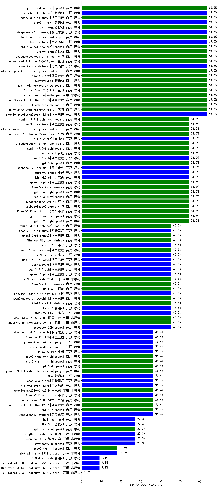

|类别|机构|大模型|【HighSchoolPhysics】准确率|平均耗时|平均消耗token|花费/千次（元）|排名（准确率）|
|---|---|-----|-------------------|-------|-----------|-----------|-----------|
|商用|智谱AI|GLM-5-Turbo|63.6%|72s|4283|92.1|1|
|商用|XAI|grok-4.5(new)|63.6%|173s|3435|135.2|2|
|商用|豆包|Doubao-Seed-2.0-lite|63.6%|357s|1919|6.4|3|
|商用|google|gemini-3.1-pro-preview|63.6%|75s|4809|400.3|4|
|商用|阿里巴巴|qwen3.7-max|63.6%|129s|5731|203.3|5|
|商用|anthropic|claude-opus-4.8-thinking(new)|63.6%|16s|1209|183.3|6|
|开源|月之暗面|kimi-k2.7-code(new)|63.6%|56s|2220|57.5|7|
|商用|豆包|doubao-seed-2-1-pro-260628(new)|63.6%|308s|16424|488.8|8|
|商用|豆包|doubao-seed-evolving(new)|63.6%|335s|13818|410.6|9|
|商用|openAI|gpt-5.6-sol-pro(new)|63.6%|43s|5433|495.3|10|
|商用|阿里巴巴|qwen3-max-think-2026-01-23|63.6%|482s|6507|64.0|11|
|开源|月之暗面|kimi-k3(new)|63.6%|61s|1363|120.7|12|
|商用|anthropic|claude-opus-5(new)|63.6%|12s|898|128.8|13|
|开源|深度求索|deepseek-v4-pro(new)|63.6%|179s|3709|96.7|14|
|商用|XAI|grok-4.6(new)|63.6%|63s|3262|127.9|15|
|开源|智谱AI|glm-5.3(new)|63.6%|612s|12004|333.5|16|
|商用|阿里巴巴|qwen3.8-flash(new)|63.6%|145s|8266|22.0|17|
|开源|智谱AI|glm-5.3-flash(new)|63.6%|165s|2903|7.9|18|
|商用|anthropic|claude-opus-4.6|63.6%|43s|865|124.0|19|
|商用|openAI|gpt-6-astra(new)|63.6%|21s|525|140.7|20|
|开源|阿里巴巴|qwen3-next-80b-a3b-thinking|63.6%|328s|6903|27.2|21|
|商用|腾讯|hunyuan-2.0-thinking-20251109|63.6%|48s|3258|12.7|22|
|商用|google|gemini-3-flash-preview|63.6%|27s|2788|57.0|23|
|开源|小米|mimo-v2.5-pro|54.5%|96s|4438|87.9|24|
|商用|小米|MiMo-V2-Flash-think-0204|54.5%|448s|5079|10.5|25|
|商用|openAI|gpt-5.5|54.5%|13s|921|166.5|26|
|商用|openAI|gpt-5.3-chat|54.5%|14s|819|67.1|27|
|开源|阿里巴巴|qwen3.6-27b|54.5%|73s|4545|79.9|28|
|商用|百度|ernie-5.1|54.5%|73s|3051|53.2|29|
|商用|google|gemini-3.5-flash|54.5%|14s|2981|180.8|30|
|商用|openAI|gpt-5.2-medium|54.5%|24s|1063|92.4|31|
|商用|anthropic|claude-opus-4.8(new)|54.5%|9s|888|127.1|32|
|商用|豆包|Doubao-Seed-2.0-mini|54.5%|896s|4363|8.4|33|
|商用|阿里巴巴|qwen3.6-plus|54.5%|108s|6207|73.2|34|
|商用|豆包|Doubao-Seed-2.0-pro|54.5%|366s|1674|24.6|35|
|商用|openAI|gpt-5.4-high|54.5%|24s|1630|157.8|36|
|开源|深度求索|deepseek-v4-pro-0424|54.5%|102s|3556|84.0|37|
|商用|openAI|gpt-5.2-high|54.5%|17s|1131|99.1|38|
|开源|智谱AI|glm-5.2(new)|54.5%|125s|5764|158.7|39|
|开源|月之暗面|kimi-k2.6|54.5%|357s|9625|257.5|40|
|商用|豆包|doubao-seed-2-1-turbo-260628(new)|54.5%|384s|12960|192.4|41|
|商用|anthropic|claude-sonnet-5-thinking(new)|54.5%|37s|2965|196.2|42|
|商用|阿里巴巴|qwen3.8-max(new)|54.5%|177s|7349|260.7|43|
|商用|google|gemini-3.7-flash(new)|54.5%|6s|1481|36.1|44|
|商用|minimax|MiniMax-M2.7|54.5%|109s|4391|36.0|45|
|开源|小米|mimo-v2.5|45.5%|77s|3544|45.4|46|
|商用|阿里巴巴|qwen3.6-max-preview|45.5%|111s|3839|201.7|47|
|开源|智谱AI|GLM-4.7|45.5%|118s|5594|76.9|48|
|商用|minimax|MiniMax-M3(new)|45.5%|160s|5634|91.1|49|
|商用|阿里巴巴|qwen3.7-plus(new)|45.5%|263s|14619|116.2|50|
|开源|阶跃星辰|step-3.7-flash(new)|45.5%|45s|5036|40.0|51|
|商用|阿里巴巴|qwen-plus-2025-12-01|45.5%|56s|2103|4.0|52|
|商用|腾讯|hunyuan-2.0-instruct-20251111|45.5%|27s|1116|2.1|53|
|商用|google|gemini-3.8-flash(new)|45.5%|32s|1743|85.9|54|
|商用|minimax|MiniMax-M2.1|45.5%|243s|6909|57.1|55|
|开源|openAI|gpt-oss-120b|45.5%|106s|1349|3.9|56|
|开源|小米|MiMo-V2-Omni|45.5%|1511s|4342|56.5|57|
|开源|阿里巴巴|Qwen3.5-122B-A10B|45.5%|823s|6782|42.7|58|
|商用|阿里巴巴|qwen3-max-preview-think|45.5%|134s|5042|118.5|59|
|开源|美团|LongCat-Flash-Thinking-2601|45.5%|181s|6789|0.0|60|
|商用|百度|ERNIE-5.0|45.5%|335s|5877|139.1|61|
|开源|小米|MiMo-V2-Flash|45.5%|53s|2268|0.0|62|
|商用|小米|MiMo-V2-Flash-0204|45.5%|146s|1745|3.4|63|
|开源|阿里巴巴|qwen3.5-plus|45.5%|76s|6421|30.3|64|
|开源|阿里巴巴|qwen3.5-flash|45.5%|785s|7305|14.4|65|
|开源|阿里巴巴|Qwen3.5-27B|45.5%|994s|8000|37.9|66|
|商用|minimax|MiniMax-M2.5|45.5%|73s|3606|29.4|67|
|商用|openAI|gpt-5.4|36.4%|50s|694|59.4|68|
|开源|智谱AI|GLM-5|36.4%|191s|6348|112.7|69|
|开源|小米|MiMo-V2-Pro|36.4%|212s|1449|25.2|70|
|开源|深度求索|DeepSeek-V3.2-Think|36.4%|128s|3998|11.9|71|
|开源|阿里巴巴|Qwen3.6-35B-A3B|36.4%|23s|4231|44.6|72|
|商用|阿里巴巴|qwen3-max-2026-01-23|36.4%|42s|1785|16.8|73|
|开源|小米|MiMo-V2-Flash-think|36.4%|70s|6209|0.0|74|
|商用|google|gemini-3.1-flash-lite-preview|36.4%|35s|764|6.9|75|
|商用|openAI|gpt-5.2|36.4%|11s|594|45.7|76|
|开源|阶跃星辰|step-3.5-flash|36.4%|51s|9474|19.7|77|
|商用|openAI|gpt-5.4-nano-high|36.4%|284s|1874|15.3|78|
|开源|月之暗面|Kimi-K2.5-Thinking|36.4%|407s|9957|207.1|79|
|商用|阿里巴巴|qwen-plus-think-2025-12-01|36.4%|113s|6626|52.0|80|
|商用|豆包|doubao-seed-1-8-251215|36.4%|44s|1284|9.1|81|
|开源|深度求索|deepseek-v4-flash-0424|36.4%|71s|2773|5.4|82|
|开源|google|gemma-4-31b-it|36.4%|138s|909|2.3|83|
|商用|openAI|gpt-5.4-mini-high|36.4%|27s|1433|41.1|84|
|开源|google|gemma-4-26b-a4b-it|36.4%|86s|876|2.2|85|
|开源|腾讯|hy3(new)|27.3%|57s|642|2.2|86|
|商用|openAI|gpt-5.4-nano|27.3%|9s|700|5.0|87|
|开源|智谱AI|GLM-5.1|27.3%|722s|6306|149.1|88|
|开源|美团|LongCat-Flash-Lite|27.3%|289s|1228|0.0|89|
|开源|深度求索|DeepSeek-V3.2|27.3%|35s|997|2.9|90|
|开源|openAI|gpt-oss-20b|27.3%|213s|1665|1.8|91|
|开源|Mistral|mistral-large-2512|18.2%|18s|1004|9.5|92|
|商用|openAI|gpt-5.4-mini|18.2%|34s|527|12.6|93|
|开源|Mistral|Ministral-3-8B-Instruct-2512|9.1%|10s|1364|1.5|94|
|开源|Mistral|Ministral-3-14B-Instruct-2512|9.1%|16s|1273|1.8|95|
|开源|智谱AI|GLM-4.7-Flash|9.1%|1862s|13148|0.0|96|
|开源|Mistral|Ministral-3-3B-Instruct-2512|0.0%|23s|4268|3.0|97|

