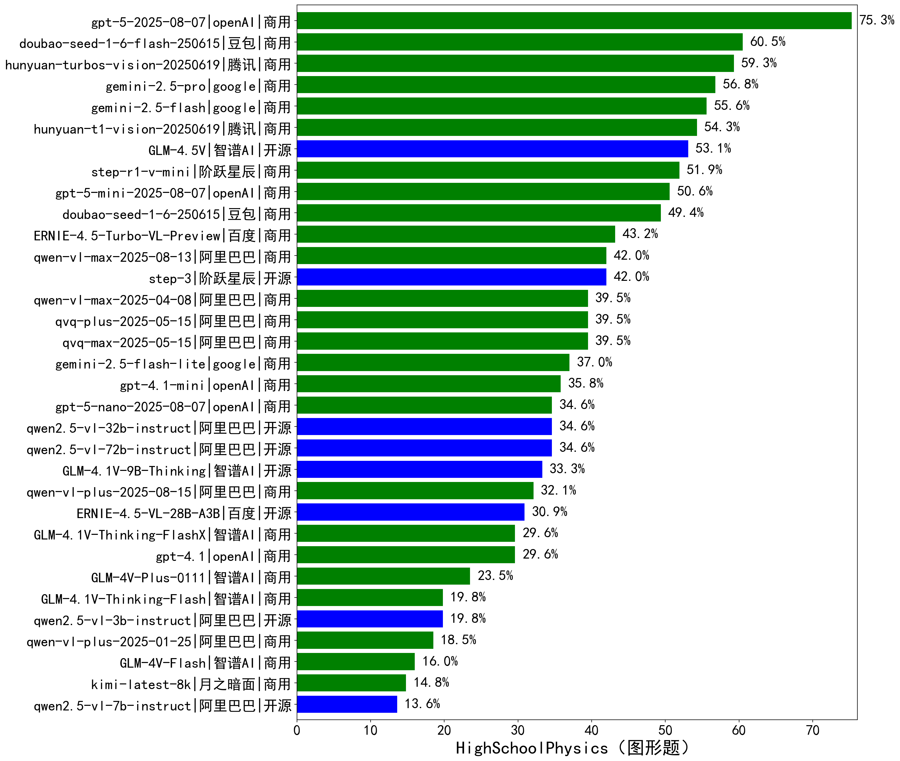

|类别|机构|大模型|【HighSchoolPhysics（图形题）】准确率|平均耗时|平均消耗token|花费/千次（元）|排名（准确率）|
|---|---|-----|-------------------|-------|-----------|-----------|-----------|
|商用|豆包|doubao-seed-1-6-flash-250615|60.5%|/|1695|1.1|1|
|商用|腾讯|hunyuan-turbos-vision-20250619|59.3%|20s|1407|8.0|2|
|商用|腾讯|hunyuan-t1-vision-20250619|54.3%|101s|5013|40.1|3|
|开源|智谱AI|GLM-4.5V|53.1%|70s|4363|20.2|4|
|商用|阶跃星辰|step-r1-v-mini|51.9%|120s|8082|60.4|5|
|商用|豆包|doubao-seed-1-6-250615|49.4%|/|1866|6.8|6|
|商用|百度|ERNIE-4.5-Turbo-VL-Preview|43.2%|46s|2393|12.2|7|
|开源|阶跃星辰|step-3|42.0%|460s|8236|32.1|8|
|商用|阿里巴巴|qvq-max-2025-05-15|39.5%|105s|3771|94.8|9|
|商用|阿里巴巴|qvq-plus-2025-05-15|39.5%|301s|6379|28.7|10|
|商用|阿里巴巴|qwen-vl-max-2025-04-08|39.5%|53s|1807|9.8|11|
|商用|openAI|gpt-4.1-mini|35.8%|41s|1695|11.7|12|
|开源|阿里巴巴|qwen2.5-vl-72b-instruct|34.6%|51s|1740|7.2|13|
|开源|阿里巴巴|qwen2.5-vl-32b-instruct|34.6%|63s|2434|4.6|14|
|开源|智谱AI|GLM-4.1V-9B-Thinking|33.3%|116s|4871|3.8|15|
|开源|百度|ERNIE-4.5-VL-28B-A3B|30.9%|31s|2226|4.7|16|
|商用|openAI|gpt-4.1|29.6%|39s|1669|56.8|17|
|商用|智谱AI|GLM-4.1V-Thinking-FlashX|29.6%|32s|2775|5.6|18|
|商用|智谱AI|GLM-4V-Plus-0111|23.5%|32s|1773|7.1|19|
|开源|阿里巴巴|qwen2.5-vl-3b-instruct|19.8%|20s|1442|2.6|20|
|商用|智谱AI|GLM-4.1V-Thinking-Flash|19.8%|33s|2730|0.0|21|
|商用|阿里巴巴|qwen-vl-plus-2025-01-25|18.5%|22s|1417|3.1|22|
|商用|智谱AI|GLM-4V-Flash|16.0%|8s|1700|0.0|23|
|商用|月之暗面|kimi-latest-8k|14.8%|32s|1553|18.6|24|
|开源|阿里巴巴|qwen2.5-vl-7b-instruct|13.6%|18s|1760|0.6|25|

