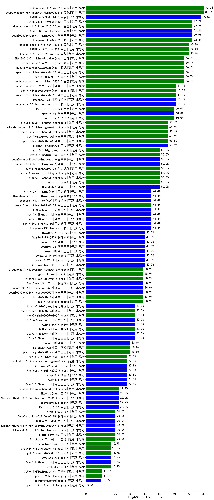

|类别|机构|大模型|【HighSchoolPolitics】准确率|平均耗时|平均消耗token|花费/千次（元）|排名（准确率）|
|---|---|-----|-------------------|-------|-----------|-----------|-----------|
|商用|豆包|doubao-seed-1-6-flash-thinking-250615|80.0%|6s|865|1.0|1|
|商用|豆包|doubao-seed-1-6-250615|80.0%|132s|240|0.7|2|
|开源|百度|ERNIE-4.5-300B-A47B|77.8%|215s|362|2.0|3|
|开源|深度求索|DeepSeek-V3.2-Think(new)|77.8%|57s|1775|5.2|4|
|开源|阿里巴巴|qwen3-235b-a22b-thinking-2507|72.2%|136s|3464|62.1|5|
|商用|腾讯|hunyuan-t1-20250711|72.2%|67s|1072|3.7|6|
|商用|百度|ERNIE-X1.1-Preview(new)|72.2%|172s|1820|6.8|7|
|开源|豆包|Seed-OSS-36B-Instruct|72.2%|116s|1627|6.1|8|
|商用|豆包|doubao-seed-1-6-lite-251015(new)|72.2%|18s|970|1.9|9|
|商用|豆包|doubao-seed-1-6-flash-250615|70.0%|3s|508|0.6|10|
|商用|百度|ERNIE-4.5-Turbo-32K|70.0%|17s|479|1.2|11|
|商用|豆包|Doubao-1.5-lite-32k-250115|70.0%|7s|304|0.1|12|
|商用|豆包|doubao-seed-1-6-thinking-250715|66.7%|16s|1138|8.0|13|
|商用|百度|ERNIE-5.0-Thinking-Preview(new)|66.7%|273s|1162|25.3|14|
|商用|阿里巴巴|qwen-plus-think-2025-07-28|66.7%|/|3033|23.0|15|
|商用|openAI|gpt-5-2025-08-07|66.7%|44s|455|21.6|16|
|商用|腾讯|hunyuan-turbos-20250926(new)|66.7%|10s|546|0.9|17|
|商用|豆包|doubao-seed-1-6-251015(new)|66.7%|7s|859|5.4|18|
|开源|腾讯|Hunyuan-A13B-Instruct-nothink|61.1%|64s|486|1.5|19|
|商用|阿里巴巴|qwen-turbo-think-2025-07-15|61.1%|/|2893|8.2|20|
|商用|google|gemini-3-pro-preview(new)|61.1%|68s|3140|253.7|21|
|开源|阿里巴巴|qwen3-next-80b-a3b-thinking(new)|61.1%|258s|4754|18.5|22|
|开源|深度求索|DeepSeek-V3.1|61.1%|20s|480|4.6|23|
|商用|阿里巴巴|qwen3-max-2025-09-23(new)|61.1%|31s|740|14.5|24|
|商用|百度|ERNIE-X1-Turbo-32K|60.0%|525s|1009|3.6|25|
|商用|360|360zhinao2-o1|60.0%|55s|3545|32.9|26|
|开源|阿里巴巴|Qwen3-14B|60.0%|62s|3281|6.4|27|
|商用|anthropic|claude-sonnet-4.5(new)|55.6%|10s|845|66.0|28|
|商用|阿里巴巴|qwen-plus-2025-07-28|55.6%|19s|749|1.3|29|
|开源|百度|ERNIE-4.5-21B-A3B|55.6%|110s|431|0.1|30|
|商用|anthropic|claude-opus-4.5(new)|55.6%|24s|908|119.3|31|
|商用|阿里巴巴|qwen3-max-preview|55.6%|14s|683|13.3|32|
|商用|anthropic|claude-sonnet-4.5-thinking(new)|55.6%|52s|3568|359.6|33|
|开源|阿里巴巴|qwen3-next-80b-a3b-instruct|50.0%|14s|774|2.6|34|
|商用|科大讯飞|xunfei-spark-x1-0725|50.0%|/|1426|11.8|35|
|商用|openAI|gpt-5.1-medium(new)|50.0%|61s|942|53.8|36|
|开源|阿里巴巴|Qwen3-30B-A3B-Thinking-2507|50.0%|157s|3111|8.4|37|
|开源|Mistral|mistral-large-2512(new)|50.0%|13s|664|5.2|38|
|开源|深度求索|DeepSeek-V3.2(new)|50.0%|132s|473|1.3|39|
|商用|openAI|gpt-5.1-high(new)|50.0%|151s|2648|174.9|40|
|开源|阿里巴巴|Qwen3-32B|50.0%|49s|1688|6.3|41|
|商用|anthropic|claude-4-sonnet-thinking|50.0%|51s|1495|140.6|42|
|商用|anthropic|claude-4-sonnet|50.0%|45s|774|62.2|43|
|商用|openAI|o4-mini|50.0%|36s|1432|41.9|44|
|开源|月之暗面|Kimi-K2-Thinking(new)|44.4%|294s|3989|61.9|45|
|开源|阿里巴巴|Qwen3-32B-nothink|44.4%|117s|632|2.0|46|
|开源|深度求索|DeepSeek-V3.2-Exp(new)|44.4%|17s|426|1.1|47|
|商用|阿里巴巴|qwen-flash-think-2025-07-28|44.4%|98s|2914|4.1|48|
|开源|深度求索|DeepSeek-V3.2-Exp-Think(new)|44.4%|51s|1431|4.1|49|
|开源|智谱AI|GLM-4.5-nothink|44.4%|91s|1230|15.6|50|
|开源|月之暗面|kimi-k2-0711-preview|44.4%|23s|509|6.4|51|
|开源|阿里巴巴|Qwen3-4B-nothink|44.4%|32s|600|1.3|52|
|开源|腾讯|Hunyuan-A13B-Instruct|44.4%|137s|983|3.5|53|
|开源|minimax|MiniMax-Text-01|40.0%|13s|938|7.5|54|
|开源|深度求索|DeepSeek-R1-0528|40.0%|254s|2677|41.3|55|
|开源|google|gemma-3-27b-it|40.0%|40s|493|0.6|56|
|开源|google|gemma-3-4b-it|40.0%|27s|465|0.0|57|
|开源|阿里巴巴|Qwen3-0.6B|40.0%|27s|1620|4.5|58|
|开源|阿里巴巴|Qwen3-1.7B|40.0%|37s|2553|7.3|59|
|开源|阿里巴巴|Qwen3-4B|40.0%|27s|1863|5.2|60|
|开源|minimax|MiniMax-M1|40.0%|142s|2714|18.8|61|
|商用|openAI|gpt-5.1(new)|38.9%|159s|432|17.6|62|
|开源|阿里巴巴|Qwen3-30B-A3B-Instruct-2507|38.9%|66s|712|1.7|63|
|商用|阿里巴巴|qwen-turbo-2025-07-15|38.9%|81s|604|0.3|64|
|开源|深度求索|DeepSeek-V3.1-Think|38.9%|74s|1513|17.0|65|
|商用|Mistral|mistral-medium-2508|38.9%|338s|636|6.4|66|
|商用|anthropic|claude-haiku-4.5-thinking(new)|38.9%|69s|4279|145.2|67|
|开源|阿里巴巴|qwen3-235b-a22b-instruct-2507|38.9%|73s|814|5.5|68|
|商用|google|gemini-2.5-pro|38.9%|103s|2947|202.4|69|
|开源|阿里巴巴|Qwen3-14B-nothink|33.3%|61s|664|1.1|70|
|商用|阿里巴巴|qwen-flash-2025-07-28|33.3%|96s|724|0.9|71|
|商用|智谱AI|GLM-4.5-Flash|33.3%|58s|1986|0.0|72|
|开源|智谱AI|GLM-4.5-Air-nothink|33.3%|22s|895|4.6|73|
|开源|阿里巴巴|Qwen3-8B-nothink|33.3%|23s|616|0.0|74|
|开源|月之暗面|kimi-k2-0905(new)|33.3%|115s|497|5.8|75|
|开源|智谱AI|GLM-4.5-Air|33.3%|54s|2448|13.9|76|
|商用|openAI|gpt-5-mini-2025-08-07|33.3%|53s|1248|15.8|77|
|商用|阿里巴巴|qwen-long-2025-01-25|30.0%|11s|515|0.8|78|
|开源|阿里巴巴|Qwen3-8B|30.0%|31s|2958|0.0|79|
|商用|百川智能|Baichuan4-Air|30.0%|26s|361|0.4|80|
|商用|XAI|grok-4-1-fast-non-reasoning(new)|27.8%|109s|657|1.6|81|
|开源|minimax|MiniMax-M2(new)|27.8%|31s|2090|16.4|82|
|商用|openAI|gpt-5-mini-high(new)|27.8%|78s|2449|32.8|83|
|开源|Mistral|Magistral-Small-2507|27.8%|69s|5786|61.2|84|
|开源|阿里巴巴|Qwen3-0.6B-nothink|27.8%|19s|345|0.6|85|
|开源|阶跃星辰|step-3|27.8%|132s|2233|8.6|86|
|开源|智谱AI|GLM-4.5|27.8%|174s|4459|60.8|87|
|开源|Mistral|Mistral-Small-3.2-24B-Instruct-2506|22.2%|30s|689|1.2|88|
|开源|百度|ERNIE-4.5-0.3B|22.2%|49s|411|0.0|89|
|商用|anthropic|claude-haiku-4.5(new)|22.2%|15s|843|21.5|90|
|开源|智谱AI|GLM-4.6(new)|22.2%|61s|2294|30.2|91|
|开源|openAI|gpt-oss-120b|22.2%|201s|907|2.3|92|
|商用|百川智能|Baichuan4-Turbo|20.0%|26s|384|5.8|93|
|商用|百度|ERNIE-Lite-8K|20.0%|19s|357|0.0|94|
|开源|meta|Llama-4-Scout-17B-16E-Instruct|20.0%|14s|617|1.1|95|
|开源|meta|Llama-4-Maverick-17B-128E-Instruct-FP8|20.0%|7s|672|2.5|96|
|开源|智谱AI|GLM-4-9B-0414|20.0%|7s|440|0.0|97|
|开源|深度求索|DeepSeek-R1-0528-Qwen3-8B|20.0%|199s|2701|0.0|98|
|商用|XAI|grok-4-0709|20.0%|149s|1540|154.6|99|
|商用|openAI|gpt-5-nano-2025-08-07|16.7%|165s|2381|6.4|100|
|商用|XAI|grok-3-mini|16.7%|174s|1216|4.2|101|
|开源|openAI|gpt-oss-20b|16.7%|25s|1687|1.8|102|
|商用|openAI|gpt-5-nano-high(new)|16.7%|783s|4566|12.7|103|
|商用|XAI|grok-4-1-fast-reasoning(new)|16.7%|22s|1897|6.0|104|
|开源|阿里巴巴|Qwen3-1.7B-nothink|16.7%|23s|585|1.3|105|
|商用|google|gemini-2.5-flash|11.1%|88s|2767|47.3|106|
|商用|智谱AI|GLM-4.5-Flash-nothink|11.1%|37s|885|0.0|107|
|开源|google|gemma-3-12b-it|10.0%|50s|477|0.0|108|
|商用|google|gemini-2.5-flash-lite|/%|4s|710|1.7|109|

