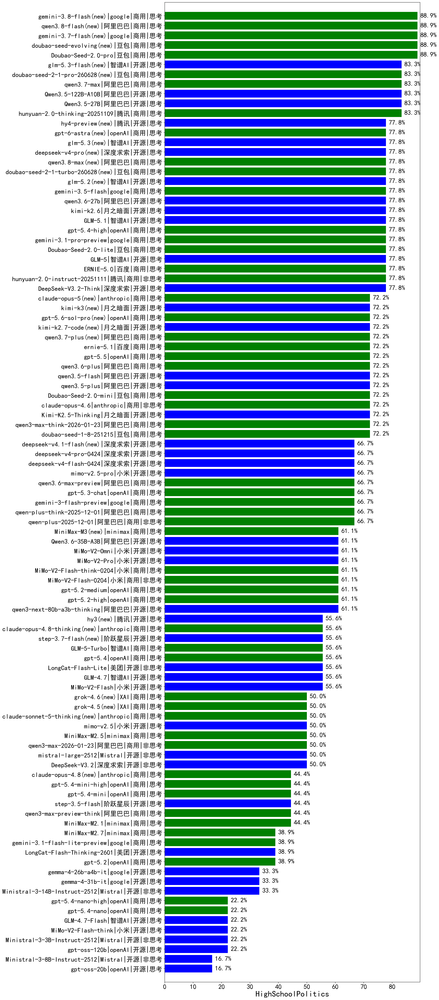

|类别|机构|大模型|【HighSchoolPolitics】准确率|平均耗时|平均消耗token|花费/千次（元）|排名（准确率）|
|---|---|-----|-------------------|-------|-----------|-----------|-----------|
|商用|google|gemini-3.8-flash(new)|88.9%|13s|962|42.3|1|
|商用|阿里巴巴|qwen3.8-flash(new)|88.9%|34s|1944|4.8|2|
|商用|google|gemini-3.7-flash(new)|88.9%|5s|862|18.5|3|
|商用|豆包|doubao-seed-evolving|88.9%|161s|6987|204.4|4|
|商用|豆包|Doubao-Seed-2.0-pro|88.9%|177s|1070|14.3|5|
|开源|阿里巴巴|Qwen3.5-122B-A10B|83.3%|631s|4835|30.0|6|
|商用|豆包|doubao-seed-2-1-pro-260628|83.3%|218s|7896|231.7|7|
|开源|阿里巴巴|Qwen3.5-27B|83.3%|191s|4731|22.0|8|
|开源|智谱AI|glm-5.3-flash(new)|83.3%|153s|4375|11.9|9|
|商用|阿里巴巴|qwen3.7-max|83.3%|23s|1232|40.3|10|
|开源|智谱AI|GLM-5.1|77.8%|292s|2128|48.1|11|
|开源|阿里巴巴|qwen3.6-27b|77.8%|36s|2278|38.5|12|
|商用|google|gemini-3.5-flash|77.8%|10s|1997|115.5|13|
|开源|智谱AI|glm-5.2|77.8%|83s|2427|64.5|14|
|开源|月之暗面|kimi-k2.6|77.8%|90s|1603|40.1|15|
|商用|豆包|doubao-seed-2-1-turbo-260628|77.8%|332s|8072|118.5|16|
|商用|openAI|gpt-5.4-high|77.8%|15s|1000|86.6|17|
|开源|深度求索|deepseek-v4-pro(new)|77.8%|123s|2501|63.3|18|
|开源|智谱AI|glm-5.3(new)|77.8%|358s|4966|135.6|19|
|商用|openAI|gpt-6-astra(new)|77.8%|13s|467|104.4|20|
|开源|腾讯|hy4-preview(new)|77.8%|173s|6928|122.6|21|
|开源|小米|mimo-v2.6-pro(new)|77.8%|37s|1487|8.4|22|
|商用|阿里巴巴|qwen3.8-max(new)|77.8%|35s|1486|48.6|23|
|商用|openAI|gpt-6-sol(new)|77.8%|113s|465|20.8|24|
|开源|深度求索|DeepSeek-V3.2-Think|77.8%|57s|1775|5.2|25|
|商用|google|gemini-3.1-pro-preview|77.8%|46s|2342|185.7|26|
|商用|百度|ERNIE-5.0|77.8%|75s|1025|22.0|27|
|开源|智谱AI|GLM-5|77.8%|122s|2668|45.7|28|
|商用|豆包|Doubao-Seed-2.0-lite|77.8%|228s|1155|3.5|29|
|商用|阿里巴巴|qwen3.7-plus|72.2%|35s|1653|12.2|30|
|商用|openAI|gpt-5.6-sol-pro|72.2%|34s|4798|416.2|31|
|商用|百度|ernie-5.1|72.2%|34s|1053|16.4|32|
|开源|阿里巴巴|qwen3.5-plus|72.2%|51s|4122|19.1|33|
|商用|豆包|Doubao-Seed-2.0-mini|72.2%|637s|3068|5.7|34|
|开源|月之暗面|kimi-k2.7-code|72.2%|55s|2115|53.9|35|
|开源|阿里巴巴|qwen3.5-flash|72.2%|652s|4672|9.0|36|
|开源|月之暗面|kimi-k3(new)|72.2%|45s|1177|98.9|37|
|商用|阿里巴巴|qwen3.6-plus|72.2%|51s|2512|28.5|38|
|商用|anthropic|claude-opus-5(new)|72.2%|19s|1087|148.5|39|
|商用|anthropic|claude-opus-4.6|72.2%|20s|976|129.1|40|
|开源|月之暗面|Kimi-K2.5-Thinking|72.2%|436s|2306|45.8|41|
|商用|阿里巴巴|qwen3-max-think-2026-01-23|72.2%|360s|4387|42.5|42|
|商用|openAI|gpt-5.5|72.2%|16s|1114|197.2|43|
|开源|深度求索|deepseek-v4-pro-0424|66.7%|55s|2198|50.9|44|
|开源|深度求索|deepseek-v4.1-flash(new)|66.7%|26s|2510|19.0|45|
|商用|openAI|gpt-5.3-chat|66.7%|7s|526|33.5|46|
|开源|深度求索|deepseek-v4-flash-0424|66.7%|49s|1881|3.6|47|
|开源|小米|mimo-v2.5-pro|66.7%|45s|1926|34.5|48|
|商用|阿里巴巴|qwen3.6-max-preview|66.7%|70s|2296|116.5|49|
|开源|小米|MiMo-V2-Pro|61.1%|23s|1729|30.4|50|
|商用|小米|MiMo-V2-Flash-0204|61.1%|59s|687|1.2|51|
|商用|小米|MiMo-V2-Flash-think-0204|61.1%|388s|1891|3.7|52|
|开源|阿里巴巴|Qwen3.6-35B-A3B|61.1%|152s|2222|22.5|53|
|商用|minimax|MiniMax-M3|61.1%|43s|1171|15.5|54|
|开源|小米|MiMo-V2-Omni|61.1%|74s|2517|30.5|55|
|商用|openAI|gpt-5.4|55.6%|24s|431|26.9|56|
|开源|阶跃星辰|step-3.7-flash|55.6%|31s|3040|23.5|57|
|商用|anthropic|claude-opus-4.8-thinking|55.6%|19s|1618|241.6|58|
|商用|openAI|gpt-6-luna(new)|55.6%|141s|681|1.8|59|
|开源|美团|LongCat-Flash-Lite|55.6%|382s|645|0.0|60|
|商用|智谱AI|GLM-5-Turbo|55.6%|64s|1383|27.6|61|
|开源|腾讯|hy3|55.6%|91s|402|1.1|62|
|商用|XAI|grok-4.6(new)|50.0%|314s|3771|147.6|63|
|开源|深度求索|DeepSeek-V3.2|50.0%|132s|473|1.3|64|
|商用|minimax|MiniMax-M2.5|50.0%|45s|2467|19.5|65|
|商用|阿里巴巴|qwen3-max-2026-01-23|50.0%|24s|745|6.1|66|
|商用|anthropic|claude-sonnet-5-thinking|50.0%|17s|1217|68.6|67|
|商用|XAI|grok-4.5|50.0%|131s|6160|248.0|68|
|开源|小米|mimo-v2.6-flash(new)|50.0%|91s|1187|2.2|69|
|开源|小米|mimo-v2.5|50.0%|41s|1819|20.8|70|
|商用|anthropic|claude-opus-4.8|44.4%|9s|761|91.6|71|
|开源|阶跃星辰|step-3.5-flash|44.4%|20s|2079|4.1|72|
|商用|openAI|gpt-5.4-mini-high|44.4%|55s|1980|56.9|73|
|商用|openAI|gpt-5.4-mini|44.4%|11s|413|7.5|74|
|商用|minimax|MiniMax-M2.7|38.9%|83s|3859|31.2|75|
|商用|google|gemini-3.1-flash-lite-preview|38.9%|20s|563|4.2|76|
|开源|google|gemma-4-31b-it|33.3%|143s|683|1.5|77|
|开源|google|gemma-4-26b-a4b-it|33.3%|48s|817|1.9|78|
|商用|openAI|gpt-5.4-nano|22.2%|103s|384|1.8|79|
|商用|openAI|gpt-5.4-nano-high|22.2%|12s|784|5.3|80|
|开源|openAI|gpt-oss-120b|22.2%|201s|907|2.3|81|
|开源|openAI|gpt-oss-20b|16.7%|25s|1687|1.8|82|

