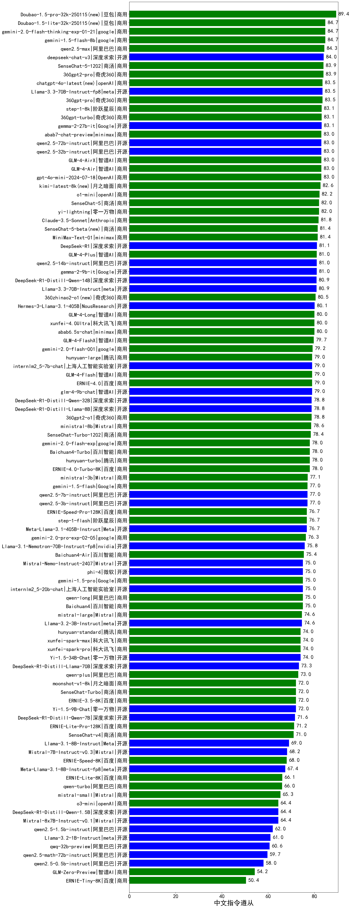

| 类别 | 大模型                         | 中文指令遵从 | 排名 |
|-----|------------------------------|---------|----|
|商用|Doubao-pro-32k|85.0|1|
|商用|gemini-1.5-flash-8b|84.7|2|
|开源|deepseek-chat-v3|84.0|3|
|商用|360gpt2-pro|83.9|4|
|商用|360gpt-pro|83.5|5|
|开源|Llama-3.3-70B-Instruct-fp8(new)|83.5|6|
|商用|360gpt-turbo|83.1|7|
|开源|gemma-2-27b-it|83.1|8|
|商用|step-1-8k|83.1|9|
|商用|GLM-4-AirX|83.0|10|
|开源|qwen2.5-32b-instruct|83.0|11|
|商用|GLM-4-Air|83.0|12|
|开源|qwen2.5-72b-instruct|83.0|13|
|商用|gpt-4o-mini|83.0|14|
|商用|gpt-4o|83.0|15|
|商用|abab7-chat-preview|83.0|16|
|商用|yi-lightning|82.0|17|
|商用|SenseChat-5|82.0|18|
|商用|Claude-3.5-Sonnet|81.8|19|
|开源|gemma-2-9b-it|81.0|20|
|开源|qwen2.5-14b-instruct|81.0|21|
|商用|GLM-4-Plus|81.0|22|
|开源|Llama-3.3-70B-Instruct|80.9|23|
|开源|Hermes-3-Llama-3.1-405B(new)|80.1|24|
|商用|xunfei-4.0Ultra|80.0|25|
|商用|abab6.5s-chat|80.0|26|
|商用|GLM-4-Long|80.0|27|
|商用|hunyuan-large|79.0|28|
|开源|Llama-3.1-70B-Instruct|79.0|29|
|开源|internlm2_5-7b-chat|79.0|30|
|商用|GLM-4-Flash|79.0|31|
|开源|glm-4-9b-chat|79.0|32|
|商用|ERNIE-4.0|79.0|33|
|商用|360gpt2-o1(new)|78.8|34|
|商用|ministral-8b(new)|78.6|35|
|商用|hunyuan-turbo|78.0|36|
|商用|ERNIE-4.0-Turbo-8K|78.0|37|
|商用|Baichuan4-Turbo|78.0|38|
|商用|gemini-2.0-flash-exp|78.0|39|
|商用|ministral-3b(new)|77.1|40|
|开源|qwen2.5-3b-instruct|77.0|41|
|商用|qwen-max|77.0|42|
|开源|qwen2.5-7b-instruct|77.0|43|
|商用|gemini-1.5-flash|77.0|44|
|商用|GLM4|77.0|45|
|开源|Meta-Llama-3.1-405B-Instruct|76.7|46|
|商用|step-1-flash|76.7|47|
|开源|Meta-Llama-3.1-70B-Instruct-fp8(new)|76.3|48|
|商用|gemini-1.0-pro|76.0|49|
|开源|Llama-3.1-Nemotron-70B-Instruct-fp8(new)|75.8|50|
|商用|Baichuan4-Air|75.4|51|
|商用|qwen-long|75.0|52|
|商用|Baichuan4|75.0|53|
|开源|phi-4|75.0|54|
|开源|Mistral-Nemo-Instruct-2407(new)|75.0|55|
|开源|internlm2_5-20b-chat|75.0|56|
|商用|gemini-1.5-pro|75.0|57|
|商用|mistral-large(new)|74.6|58|
|开源|Llama-3.2-3B-Instruct(new)|74.6|59|
|开源|WizardLM-2-8x22B(new)|74.2|60|
|商用|xunfei-spark-max|74.0|61|
|开源|Yi-1.5-34B-Chat|74.0|62|
|商用|xunfei-spark-pro|74.0|63|
|商用|hunyuan-standard|74.0|64|
|商用|qwen-plus|73.0|65|
|商用|ERNIE-3.5-8K|72.0|66|
|开源|Yi-1.5-9B-Chat|72.0|67|
|商用|SenseChat-Turbo|72.0|68|
|商用|moonshot-v1-8k|72.0|69|
|商用|SenseChat-v4|71.0|70|
|开源|Llama-3.1-8B-Instruct|69.0|71|
|开源|Mistral-7B-Instruct-v0.3(new)|68.2|72|
|商用|ERNIE-Speed-8K|68.0|73|
|开源|Meta-Llama-3.1-8B-Instruct-fp8(new)|67.4|74|
|商用|qwen-turbo|66.0|75|
|商用|mistral-small(new)|65.3|76|
|开源|Mixtral-8x7B-Instruct-v0.1(new)|64.4|77|
|商用|Doubao-lite-32k|62.0|78|
|开源|qwen2.5-1.5b-instruct|62.0|79|
|开源|Llama-3.2-1B-Instruct(new)|61.0|80|
|开源|qwen2.5-0.5b-instruct|58.0|81|
|开源|qwen2.5-math-72b-instruct|/|82|
|开源|qwq-32b-preview|/|83|
|商用|o1-mini|/|84|
|商用|o1-preview|/|85|

