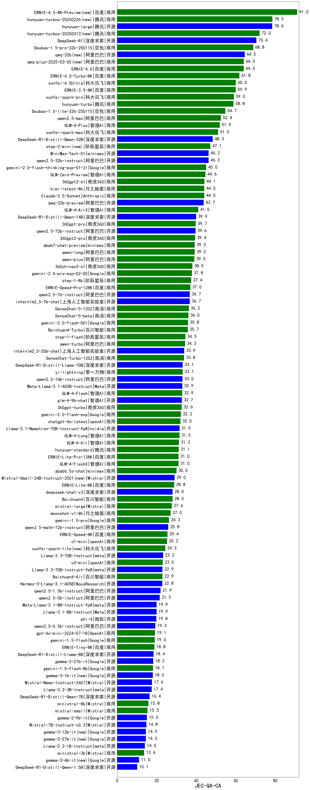

| 类别 | 大模型                         | JEC-QA-CA | 排名 |
|-----|------------------------------|---------|----|
|商用|ERNIE-4.5-8K-Preview|91.0|1|
|商用|ERNIE-4.5-Turbo-32K(new)|84.0|2|
|商用|hunyuan-turbos-20250226|78.5|3|
|开源|hunyuan-large|78.4|4|
|商用|ERNIE-X1-32K-Preview|76.7|5|
|商用|ERNIE-X1-Turbo-32K(new)|76.7|6|
|商用|hunyuan-turbos-20250313|72.0|7|
|开源|DeepSeek-R1|70.4|8|
|商用|Doubao-1.5-thinking-pro(new)|70.0|9|
|商用|hunyuan-t1-20250321|69.0|10|
|商用|Doubao-1.5-pro-32k-250115|68.8|11|
|商用|xunfei-spark-x1(new)|66.0|12|
|开源|qwq-32b|64.5|13|
|商用|qwq-plus-2025-03-05|64.0|14|
|商用|ERNIE-4.0-Turbo-8K|61.8|15|
|商用|xunfei-4.0Ultra|60.0|16|
|商用|ERNIE-3.5-8K|59.9|17|
|开源|deepseek-chat-v3-0324|59.0|18|
|商用|xunfei-spark-pro|59.0|19|
|商用|hunyuan-turbo|58.8|20|
|开源|DeepSeek-R1-0528(new)|56.7|21|
|商用|Doubao-1.5-lite-32k-250115|54.7|22|
|开源|GLM-4-32B-0414|52.5|23|
|商用|qwen2.5-max|52.4|24|
|商用|GLM-4-Plus|51.9|25|
|商用|xunfei-spark-max|51.0|26|
|商用|gpt-4.1(new)|50.0|27|
|开源|Qwen3-32B(new)|50.0|28|
|开源|Qwen3-235B-A22B(new)|50.0|29|
|商用|gemini-2.5-flash-preview-05-20(new)|50.0|30|
|商用|GLM-Z1-Air|50.0|31|
|开源|DeepSeek-R1-Distill-Qwen-32B|48.3|32|
|商用|step-2-mini|47.1|33|
|开源|Qwen3-14B(new)|46.7|34|
|开源|qwen2.5-32b-instruct|46.2|35|
|开源|MiniMax-Text-01|46.2|36|
|商用|360gpt2-o1|44.1|37|
|商用|Claude-3.5-Sonnet|44.0|38|
|商用|kimi-latest-8k|44.0|39|
|商用|gemini-2.5-flash-preview-04-17|43.3|40|
|商用|GLM-4-AirX|41.0|41|
|开源|Llama-4-Maverick-17B-128E-Instruct-FP8|41.0|42|
|开源|GLM-Z1-32B-0414|40.0|43|
|商用|gemini-2.5-pro-preview-05-06(new)|40.0|44|
|商用|gemini-2.5-pro-preview-03-25|40.0|45|
|开源|Qwen3-8B(new)|40.0|46|
|开源|DeepSeek-R1-Distill-Qwen-14B|39.9|47|
|开源|qwen2.5-72b-instruct|39.6|48|
|商用|360gpt2-pro|39.4|49|
|商用|qwen-long|39.2|50|
|商用|qwen-plus|39.0|51|
|商用|360zhinao2-o1|38.0|52|
|商用|ERNIE-Speed-Pro-128K|37.0|53|
|开源|qwen2.5-7b-instruct|36.7|54|
|开源|internlm2_5-7b-chat|36.7|55|
|开源|DeepSeek-R1-0528-Qwen3-8B(new)|36.7|56|
|商用|SenseChat-5-1202|36.2|57|
|商用|SenseChat-5-beta|36.0|58|
|商用|gemini-2.0-flash-001|35.8|59|
|商用|Baichuan4-Turbo|35.7|60|
|商用|qwen-turbo|34.3|61|
|开源|GLM-4-9B-0414|34.0|62|
|开源|internlm2_5-20b-chat|33.9|63|
|商用|SenseChat-Turbo-1202|33.8|64|
|商用|yi-lightning|33.1|65|
|开源|DeepSeek-R1-Distill-Llama-70B|33.1|66|
|开源|qwen2.5-14b-instruct|33.0|67|
|商用|GLM-4-Flash|32.9|68|
|开源|Meta-Llama-3.1-405B-Instruct|32.9|69|
|开源|glm-4-9b-chat|32.7|70|
|商用|360gpt-turbo|32.6|71|
|商用|chatgpt-4o-latest|32.0|72|
|商用|GLM-4-Long|31.5|73|
|开源|GLM-Z1-9B-0414|31.5|74|
|商用|GLM-Z1-Flash|31.5|75|
|商用|GLM-4-Air|31.2|76|
|商用|hunyuan-standard|31.1|77|
|商用|ERNIE-Lite-Pro-128K|31.0|78|
|商用|GLM-4-FlashX|31.0|79|
|商用|GLM-Z1-AirX|30.0|80|
|商用|abab6.5s-chat|30.0|81|
|商用|GLM-Z1-FlashX|30.0|82|
|开源|GLM-Z1-Rumination-32B-0414|30.0|83|
|商用|ERNIE-Lite-8K|28.8|84|
|商用|mistral-large|27.6|85|
|开源|Mistral-Small-3.1-24B-Instruct-2503|27.6|86|
|开源|Llama-4-Scout-17B-16E-Instruct|27.5|87|
|商用|moonshot-v1-8k|27.0|88|
|开源|Qwen3-30B-A3B(new)|26.7|89|
|商用|ERNIE-Speed-8K|25.4|90|
|商用|xunfei-spark-lite|24.3|91|
|开源|Qwen3-4B(new)|23.3|92|
|开源|Llama-3.3-70B-Instruct|23.2|93|
|商用|o3-mini|23.0|94|
|商用|Baichuan4-Air|22.9|95|
|开源|Llama-3.3-70B-Instruct-fp8|22.9|96|
|开源|qwen2.5-1.5b-instruct|21.9|97|
|开源|qwen2.5-3b-instruct|21.5|98|
|开源|Llama-3.1-8B-Instruct|19.9|99|
|开源|Meta-Llama-3.1-8B-Instruct-fp8|19.9|100|
|开源|phi-4|19.8|101|
|开源|qwen2.5-0.5b-instruct|19.3|102|
|商用|gpt-4o-mini|19.1|103|
|商用|ERNIE-Tiny-8K|18.8|104|
|开源|DeepSeek-R1-Distill-Llama-8B|18.4|105|
|开源|Llama-3.2-3B-Instruct|17.4|106|
|开源|Qwen3-0.6B(new)|16.7|107|
|开源|Qwen3-1.7B(new)|16.7|108|
|开源|DeepSeek-R1-Distill-Qwen-7B|16.4|109|
|商用|ministral-8b|15.8|110|
|商用|mistral-small|15.3|111|
|开源|gemma-3-12b-it|14.5|112|
|开源|gemma-3-27b-it|14.5|113|
|开源|Llama-3.2-1B-Instruct|14.0|114|
|商用|ministral-3b|13.6|115|
|开源|gemma-3-4b-it|11.0|116|
|开源|DeepSeek-R1-Distill-Qwen-1.5B|10.1|117|
|商用|gpt-4.1-mini(new)|10.0|118|
|商用|o4-mini(new)|10.0|119|

