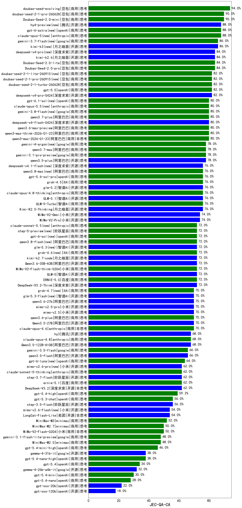

|类别|机构|大模型|【JEC-QA-CA】准确率|平均耗时|平均消耗token|花费/千次（元）|排名（准确率）|
|---|---|-----|-------------------|-------|-----------|-----------|-----------|
|商用|豆包|doubao-seed-evolving|94.0%|280s|13119|389.0|1|
|商用|豆包|doubao-seed-2-1-pro-260628|90.0%|326s|14743|437.6|2|
|开源|腾讯|hy4-preview(new)|88.0%|241s|15700|280.7|3|
|商用|openAI|gpt-6-astra(new)|88.0%|25s|669|181.4|4|
|商用|anthropic|claude-opus-5|88.0%|23s|1478|222.4|5|
|商用|google|gemini-3.7-flash|86.0%|7s|1117|25.7|6|
|开源|月之暗面|kimi-k3|86.0%|150s|4256|408.2|7|
|开源|深度求索|deepseek-v4-pro|84.0%|158s|5307|139.3|8|
|开源|月之暗面|kimi-k2.6|84.0%|181s|4866|128.5|9|
|商用|openAI|gpt-5.5|82.0%|40s|2262|442.0|10|
|商用|豆包|doubao-seed-2-1-turbo-260628|82.0%|241s|12518|185.4|11|
|商用|豆包|doubao-seed-2-1-pro-260915(new)|82.0%|103s|3213|91.7|12|
|商用|豆包|doubao-seed-2-1-lite-260915(new)|82.0%|123s|5700|15.1|13|
|开源|深度求索|deepseek-v4-pro-0424|82.0%|65s|2078|48.1|14|
|开源|深度求索|deepseek-v4-flash-0424|80.0%|56s|2708|5.3|15|
|商用|google|gemini-3.8-flash(new)|80.0%|14s|1367|64.5|16|
|商用|anthropic|claude-opus-5.5(new)|80.0%|18s|1058|118.9|17|
|商用|阿里巴巴|qwen3.7-plus|80.0%|52s|2844|21.9|18|
|商用|openAI|gpt-6.1-sol(new)|80.0%|52s|561|28.7|19|
|开源|月之暗面|kimi-k3.1-pro(new)|80.0%|214s|6910|457.9|20|
|商用|阿里巴巴|qwen3.6-max-preview|80.0%|97s|3028|156.9|21|
|商用|google|gemini-4-argon(new)|78.0%|16s|742|82.1|22|
|商用|阿里巴巴|qwen3.7-max|78.0%|49s|2400|82.9|23|
|商用|google|gemini-3.1-pro-preview|78.0%|70s|3009|244.0|24|
|开源|智谱AI|glm-5.2|76.0%|85s|3922|106.7|25|
|商用|阿里巴巴|qwen3.8-max|76.0%|227s|9193|326.5|26|
|开源|深度求索|deepseek-v4.1-flash(new)|76.0%|24s|4640|36.1|27|
|商用|openAI|gpt-5.6-sol-pro|76.0%|47s|8295|855.2|28|
|商用|XAI|grok-4.5|76.0%|82s|4736|188.7|29|
|商用|anthropic|claude-opus-4.8-thinking|76.0%|31s|2329|371.4|30|
|开源|智谱AI|GLM-5.1|76.0%|124s|2978|68.8|31|
|开源|阿里巴巴|Qwen3.6-35B-A3B|72.0%|117s|3083|32.0|32|
|商用|openAI|gpt-6-sol(new)|72.0%|176s|744|41.6|33|
|商用|XAI|grok-4.6|72.0%|137s|3597|140.9|34|
|开源|智谱AI|glm-5.3(new)|72.0%|419s|9468|262.0|35|
|开源|月之暗面|kimi-k2.7-code|72.0%|131s|4774|126.0|36|
|商用|百度|ERNIE-5.0|72.0%|277s|3527|82.2|37|
|开源|深度求索|DeepSeek-V3.2-Think|72.0%|218s|3086|9.1|38|
|商用|阶跃星辰|step-5-preview(new)|72.0%|100s|8504|168.1|39|
|商用|anthropic|claude-sonnet-5.5(new)|72.0%|11s|1084|61.3|40|
|商用|阿里巴巴|qwen3.8-flash(new)|72.0%|139s|6829|18.1|41|
|商用|XAI|grok-4.7(new)|70.0%|123s|8882|333.8|42|
|开源|阿里巴巴|Qwen3.5-27B|70.0%|480s|5937|27.9|43|
|开源|智谱AI|glm-5.3-flash(new)|70.0%|274s|8419|23.3|44|
|开源|小米|mimo-v2.5-pro|70.0%|78s|4677|92.6|45|
|商用|阿里巴巴|qwen3.6-plus|70.0%|68s|3028|34.8|46|
|开源|阿里巴巴|qwen3.6-27b|70.0%|50s|3154|54.6|47|
|开源|小米|mimo-v2.5|70.0%|33s|3190|40.2|48|
|开源|阿里巴巴|Qwen3.5-122B-A10B|68.0%|503s|6256|39.2|49|
|开源|腾讯|hy3|68.0%|33s|454|1.4|50|
|商用|anthropic|claude-opus-4.8|68.0%|12s|912|123.3|51|
|商用|google|gemini-3.5-flash|66.0%|20s|2831|169.3|52|
|商用|anthropic|claude-haiku-5.5(new)|64.0%|14s|2231|7.1|53|
|商用|openAI|gpt-6-luna(new)|64.0%|303s|1895|6.1|54|
|商用|anthropic|claude-sonnet-5-thinking|62.0%|32s|1958|122.6|55|
|商用|百度|ernie-5.1|62.0%|48s|1763|29.5|56|
|开源|小米|mimo-v2.6-pro(new)|62.0%|164s|8251|49.0|57|
|开源|深度求索|DeepSeek-V3.2|62.0%|115s|894|2.5|58|
|开源|阶跃星辰|step-3.7-flash|62.0%|78s|7570|60.3|59|
|开源|小米|mimo-v2.6-flash(new)|54.0%|180s|4602|9.0|60|
|商用|minimax|MiniMax-M3|52.0%|97s|2566|39.2|61|
|商用|minimax|MiniMax-M2.7|50.0%|82s|3304|26.6|62|
|商用|google|gemini-3.1-flash-lite-preview|48.0%|9s|663|5.4|63|
|商用|minimax|MiniMax-M3.1-Flash(new)|46.0%|168s|11107|43.4|64|
|开源|google|gemma-4-31b-it|38.0%|115s|773|1.8|65|
|开源|google|gemma-4-26b-a4b-it|32.0%|39s|890|2.1|66|
|开源|openAI|gpt-oss-20b|22.0%|266s|2137|2.3|67|
|开源|openAI|gpt-oss-120b|18.0%|7s|1369|3.8|68|

