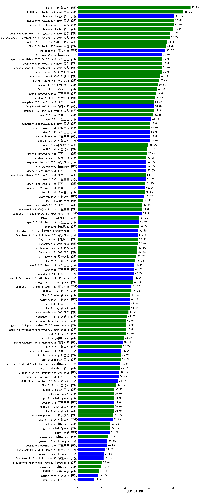

| 类别 | 大模型                         | JEC-QA-KD | 排名 |
|-----|------------------------------|---------|----|
|商用|GLM-4-Plus|95.9|1|
|商用|ERNIE-4.5-8K-Preview|90.0|2|
|商用|ERNIE-4.5-Turbo-32K(new)|88.0|3|
|商用|hunyuan-turbos-20250226|80.9|4|
|开源|hunyuan-large|80.3|5|
|商用|Doubao-1.5-thinking-pro(new)|80.0|6|
|商用|hunyuan-turbo|79.3|7|
|商用|Doubao-1.5-pro-32k-250115|74.2|8|
|商用|ERNIE-X1-Turbo-32K(new)|73.3|9|
|开源|DeepSeek-R1|73.0|10|
|商用|GLM-Z1-Air|72.6|11|
|商用|kimi-latest-8k|70.0|12|
|商用|hunyuan-turbos-20250313|68.5|13|
|商用|xunfei-spark-max|67.4|14|
|商用|hunyuan-t1-20250321|66.5|15|
|商用|xunfei-spark-pro|66.0|16|
|商用|qwq-plus-2025-03-05|65.0|17|
|商用|xunfei-4.0Ultra|64.0|18|
|商用|Doubao-1.5-lite-32k-250115|63.3|19|
|开源|DeepSeek-R1-0528(new)|63.3|20|
|商用|qwen2.5-max|62.8|21|
|开源|qwq-32b|61.0|22|
|商用|gemini-2.5-flash-preview-04-17|60.0|23|
|开源|Qwen3-235B-A22B|60.0|24|
|开源|GLM-Z1-32B-0414|60.0|25|
|开源|Qwen3-14B|60.0|26|
|商用|360gpt2-pro|58.7|27|
|商用|GLM-Z1-AirX|58.0|28|
|商用|qwen-plus|57.4|29|
|开源|deepseek-chat-v3-0324|57.0|30|
|开源|MiniMax-Text-01|57.0|31|
|商用|xunfei-spark-x1(new)|57.0|32|
|开源|qwen2.5-72b-instruct|57.0|33|
|开源|Qwen3-32B|56.7|34|
|商用|qwen-long|56.2|35|
|开源|qwen2.5-32b-instruct|56.0|36|
|商用|step-2-mini|55.6|37|
|开源|GLM-4-32B-0414|55.5|38|
|商用|ERNIE-3.5-8K|54.3|39|
|商用|qwen-turbo|53.8|40|
|开源|DeepSeek-R1-0528-Qwen3-8B(new)|53.3|41|
|商用|360gpt-turbo|51.3|42|
|开源|qwen2.5-14b-instruct|50.9|43|
|商用|360gpt2-o1|50.7|44|
|开源|internlm2_5-7b-chat|50.3|45|
|商用|GLM-4-AirX|50.3|46|
|开源|DeepSeek-R1-Distill-Qwen-32B|50.2|47|
|商用|360zhinao2-o1|50.0|48|
|商用|SenseChat-5-beta|50.0|49|
|商用|GLM-4-Air|49.7|50|
|商用|Baichuan4-Turbo|49.6|51|
|商用|SenseChat-5-1202|49.4|52|
|商用|yi-lightning|48.8|53|
|商用|GLM-4-Long|48.3|54|
|开源|qwen2.5-7b-instruct|46.8|55|
|开源|Qwen3-4B|46.7|56|
|开源|Qwen3-30B-A3B|46.7|57|
|商用|chatgpt-4o-latest|46.0|58|
|开源|Llama-4-Maverick-17B-128E-Instruct-FP8|46.0|59|
|商用|GLM-4-Flash|44.7|60|
|开源|DeepSeek-R1-Distill-Qwen-14B|44.7|61|
|商用|GLM-4-FlashX|43.6|62|
|开源|GLM-4-9B-0414|43.5|63|
|开源|Qwen3-8B|43.3|64|
|商用|SenseChat-Turbo-1202|42.2|65|
|商用|ERNIE-Speed-Pro-128K|42.0|66|
|开源|Meta-Llama-3.1-405B-Instruct|41.9|67|
|商用|moonshot-v1-8k|41.0|68|
|商用|claude-4-sonnet(new)|40.0|69|
|商用|Claude-3.5-Sonnet|40.0|70|
|商用|gemini-2.5-pro-preview-05-06(new)|40.0|71|
|商用|gemini-2.5-flash-preview-05-20(new)|40.0|72|
|商用|gpt-4.1(new)|40.0|73|
|商用|mistral-large|38.3|74|
|开源|DeepSeek-R1-Distill-Llama-70B|37.7|75|
|开源|qwen2.5-3b-instruct|36.0|76|
|商用|Baichuan4-Air|35.9|77|
|商用|ERNIE-Speed-8K|35.9|78|
|开源|Mistral-Small-3.1-24B-Instruct-2503|35.2|79|
|商用|hunyuan-standard|35.1|80|
|开源|Llama-3.3-70B-Instruct|35.0|81|
|开源|Llama-4-Scout-17B-16E-Instruct|34.5|82|
|开源|qwen2.5-1.5b-instruct|34.0|83|
|开源|Llama-3.3-70B-Instruct-fp8|33.8|84|
|开源|GLM-Z1-Rumination-32B-0414|33.3|85|
|商用|GLM-Z1-Flash|32.0|86|
|商用|GLM-Z1-FlashX|32.0|87|
|商用|ERNIE-Lite-Pro-128K|31.0|88|
|商用|ERNIE-Lite-8K|30.2|89|
|商用|o4-mini(new)|30.0|90|
|商用|gemini-2.5-pro-preview-03-25|30.0|91|
|开源|Qwen3-1.7B|30.0|92|
|商用|gpt-4.1-mini(new)|30.0|93|
|商用|xunfei-spark-lite|29.5|94|
|开源|GLM-Z1-9B-0414|29.0|95|
|商用|mistral-small|27.2|96|
|商用|gpt-4o-mini|27.0|97|
|开源|phi-4|26.7|98|
|开源|Meta-Llama-3.1-8B-Instruct-fp8|26.0|99|
|商用|ministral-8b|25.2|100|
|开源|gemma-3-27b-it|24.5|101|
|开源|Llama-3.1-8B-Instruct|24.5|102|
|开源|qwen2.5-0.5b-instruct|24.0|103|
|开源|DeepSeek-R1-Distill-Qwen-7B|22.6|104|
|开源|gemma-3-12b-it|21.5|105|
|开源|DeepSeek-R1-Distill-Llama-8B|21.4|106|
|商用|claude-4-sonnet-thinking(new)|20.0|107|
|商用|ministral-3b|19.4|108|
|开源|Llama-3.2-3B-Instruct|19.3|109|
|商用|ERNIE-Tiny-8K|17.4|110|
|开源|gemma-3-4b-it|17.0|111|
|开源|Llama-3.2-1B-Instruct|14.9|112|
|开源|Qwen3-0.6B|13.3|113|

