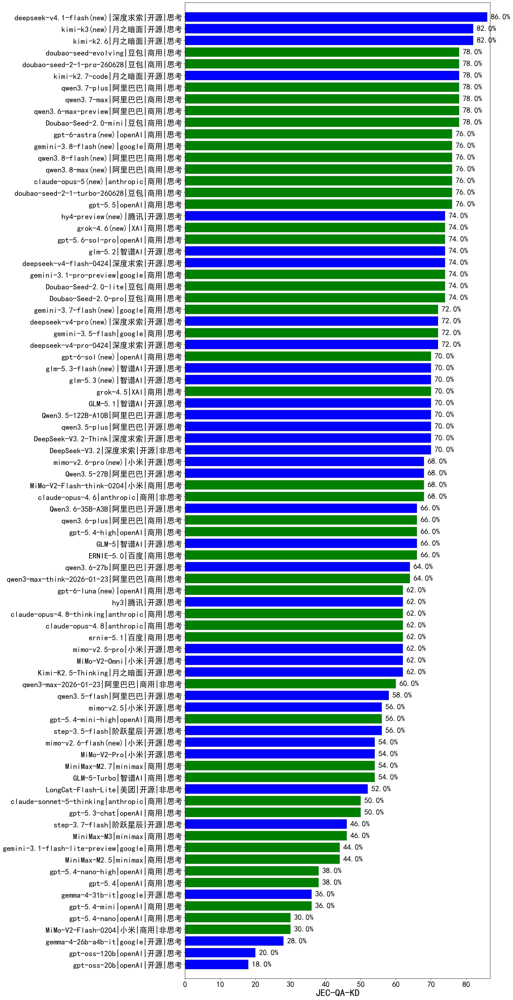

|类别|机构|大模型|【JEC-QA-KD】准确率|平均耗时|平均消耗token|花费/千次（元）|排名（准确率）|
|---|---|-----|-------------------|-------|-----------|-----------|-----------|
|开源|月之暗面|kimi-k2.6|82.0%|185s|3230|85.2|1|
|开源|月之暗面|kimi-k3(new)|82.0%|134s|2545|240.5|2|
|开源|月之暗面|kimi-k2.7-code(new)|78.0%|83s|3055|80.5|3|
|商用|阿里巴巴|qwen3.7-plus(new)|78.0%|34s|1844|14.1|4|
|商用|豆包|Doubao-Seed-2.0-mini|78.0%|177s|3439|6.6|5|
|商用|豆包|doubao-seed-evolving(new)|78.0%|285s|12137|360.5|6|
|商用|阿里巴巴|qwen3.6-max-preview|78.0%|105s|2327|121.0|7|
|商用|豆包|doubao-seed-2-1-pro-260628(new)|78.0%|272s|11513|341.8|8|
|商用|阿里巴巴|qwen3.7-max|78.0%|35s|1700|58.8|9|
|商用|anthropic|claude-opus-5(new)|76.0%|17s|1118|169.8|10|
|商用|阿里巴巴|qwen3.8-max(new)|76.0%|77s|3114|108.7|11|
|商用|豆包|doubao-seed-2-1-turbo-260628(new)|76.0%|186s|9017|133.5|12|
|商用|豆包|doubao-seed-1-8-251215|76.0%|21s|796|5.3|13|
|商用|openAI|gpt-6-astra(new)|76.0%|18s|537|151.3|14|
|商用|google|gemini-3.8-flash(new)|76.0%|16s|1193|57.6|15|
|商用|openAI|gpt-5.5|76.0%|21s|1421|275.4|16|
|商用|阿里巴巴|qwen3.8-flash(new)|76.0%|76s|4585|12.1|17|
|商用|XAI|grok-4.6(new)|74.0%|71s|2627|101.6|18|
|商用|豆包|Doubao-Seed-2.0-pro|74.0%|283s|1224|17.6|19|
|商用|豆包|Doubao-Seed-2.0-lite|74.0%|281s|1305|4.2|20|
|商用|google|gemini-3.1-pro-preview|74.0%|64s|2192|178.3|21|
|开源|深度求索|deepseek-v4-flash-0424|74.0%|43s|1243|2.4|22|
|开源|智谱AI|glm-5.2(new)|74.0%|73s|2920|79.6|23|
|商用|openAI|gpt-5.6-sol-pro(new)|74.0%|53s|6158|607.0|24|
|商用|google|gemini-3.7-flash(new)|72.0%|5s|880|20.6|25|
|开源|深度求索|deepseek-v4-pro-0424|72.0%|48s|1386|32.1|26|
|开源|深度求索|deepseek-v4-pro(new)|72.0%|81s|2767|71.6|27|
|商用|google|gemini-3.5-flash|72.0%|12s|2426|146.6|28|
|开源|阿里巴巴|Qwen3.5-122B-A10B|70.0%|459s|5350|33.7|29|
|开源|智谱AI|GLM-5.1|70.0%|110s|1975|45.6|30|
|开源|阿里巴巴|qwen3.5-plus|70.0%|59s|4915|23.2|31|
|商用|XAI|grok-4.5(new)|70.0%|79s|2774|107.7|32|
|开源|深度求索|DeepSeek-V3.2|70.0%|106s|606|1.7|33|
|开源|深度求索|DeepSeek-V3.2-Think|70.0%|55s|1775|5.2|34|
|开源|智谱AI|glm-5.3-flash(new)|70.0%|121s|5118|14.1|35|
|开源|智谱AI|glm-5.3(new)|70.0%|289s|6127|169.4|36|
|商用|腾讯|hunyuan-2.0-thinking-20251109|70.0%|13s|1116|4.2|37|
|商用|anthropic|claude-opus-4.6|68.0%|24s|850|122.6|38|
|商用|小米|MiMo-V2-Flash-think-0204|68.0%|232s|2670|5.4|39|
|开源|阿里巴巴|Qwen3.5-27B|68.0%|132s|5333|25.2|40|
|商用|阿里巴巴|qwen-plus-think-2025-12-01|68.0%|71s|3103|24.0|41|
|开源|智谱AI|GLM-5|66.0%|96s|2741|47.9|42|
|开源|阿里巴巴|qwen3-next-80b-a3b-thinking|66.0%|184s|3807|14.9|43|
|商用|百度|ERNIE-5.0|66.0%|143s|1810|41.8|44|
|开源|阿里巴巴|Qwen3.6-35B-A3B|66.0%|14s|2459|25.6|45|
|开源|美团|LongCat-Flash-Thinking-2601|66.0%|272s|3727|0.0|46|
|商用|阿里巴巴|qwen3.6-plus|66.0%|55s|2529|29.3|47|
|商用|openAI|gpt-5.4-high|66.0%|29s|1672|164.0|48|
|开源|阿里巴巴|qwen3.6-27b|64.0%|41s|2585|45.0|49|
|商用|阿里巴巴|qwen3-max-think-2026-01-23|64.0%|240s|4290|42.1|50|
|商用|google|gemini-3-flash-preview|62.0%|31s|1849|37.3|51|
|开源|腾讯|hy3(new)|62.0%|57s|408|1.3|52|
|商用|百度|ernie-5.1|62.0%|36s|1428|24.1|53|
|开源|月之暗面|Kimi-K2.5-Thinking|62.0%|181s|3514|72.1|54|
|开源|小米|mimo-v2.5-pro|62.0%|38s|2057|38.2|55|
|开源|小米|MiMo-V2-Flash-think|62.0%|99s|2297|0.0|56|
|商用|腾讯|hunyuan-2.0-instruct-20251111|62.0%|7s|451|0.7|57|
|开源|小米|MiMo-V2-Omni|62.0%|11s|1754|20.6|58|
|商用|anthropic|claude-opus-4.8(new)|62.0%|11s|754|106.1|59|
|商用|anthropic|claude-opus-4.8-thinking(new)|62.0%|20s|1489|234.6|60|
|商用|阿里巴巴|qwen-plus-2025-12-01|60.0%|31s|1214|2.3|61|
|商用|阿里巴巴|qwen3-max-preview-think|60.0%|228s|3070|71.6|62|
|商用|阿里巴巴|qwen3-max-2026-01-23|60.0%|22s|756|6.7|63|
|开源|智谱AI|GLM-4.7|60.0%|104s|3079|42.0|64|
|开源|阿里巴巴|qwen3.5-flash|58.0%|110s|5733|11.3|65|
|开源|小米|mimo-v2.5|56.0%|21s|1746|20.5|66|
|开源|阶跃星辰|step-3.5-flash|56.0%|34s|3761|7.8|67|
|商用|openAI|gpt-5.2-medium|56.0%|18s|760|64.1|68|
|商用|openAI|gpt-5.4-mini-high|56.0%|89s|2597|78.4|69|
|商用|智谱AI|GLM-5-Turbo|54.0%|46s|2053|43.4|70|
|开源|小米|MiMo-V2-Pro|54.0%|19s|1352|23.5|71|
|商用|minimax|MiniMax-M2.7|54.0%|68s|2670|21.6|72|
|商用|openAI|gpt-5.2-high|52.0%|26s|1182|106.0|73|
|开源|美团|LongCat-Flash-Lite|52.0%|291s|670|0.0|74|
|商用|openAI|gpt-5.3-chat|50.0%|47s|559|43.5|75|
|商用|anthropic|claude-sonnet-5-thinking(new)|50.0%|21s|1541|97.5|76|
|开源|Mistral|mistral-large-2512|48.0%|16s|688|6.2|77|
|商用|minimax|MiniMax-M3(new)|46.0%|51s|1496|21.8|78|
|开源|阶跃星辰|step-3.7-flash(new)|46.0%|1296s|4022|31.9|79|
|开源|小米|MiMo-V2-Flash|44.0%|17s|678|0.0|80|
|商用|minimax|MiniMax-M2.5|44.0%|48s|2530|20.4|81|
|商用|google|gemini-3.1-flash-lite-preview|44.0%|4s|506|4.3|82|
|商用|openAI|gpt-5.2|42.0%|5s|335|21.8|83|
|商用|minimax|MiniMax-M2.1|40.0%|139s|3623|29.6|84|
|商用|openAI|gpt-5.4|38.0%|5s|388|29.4|85|
|商用|openAI|gpt-5.4-nano-high|38.0%|106s|1249|10.0|86|
|开源|google|gemma-4-31b-it|36.0%|58s|573|1.4|87|
|商用|openAI|gpt-5.4-mini|36.0%|58s|346|7.4|88|
|开源|智谱AI|GLM-4.7-Flash|36.0%|1146s|5738|0.0|89|
|商用|小米|MiMo-V2-Flash-0204|30.0%|116s|632|1.1|90|
|商用|openAI|gpt-5.4-nano|30.0%|80s|365|2.2|91|
|开源|Mistral|Ministral-3-8B-Instruct-2512|28.0%|4s|639|0.7|92|
|开源|google|gemma-4-26b-a4b-it|28.0%|88s|714|1.8|93|
|开源|Mistral|Ministral-3-14B-Instruct-2512|26.0%|12s|655|0.9|94|
|开源|Mistral|Ministral-3-3B-Instruct-2512|24.0%|4s|675|0.5|95|
|开源|openAI|gpt-oss-120b|20.0%|27s|1030|2.9|96|
|开源|openAI|gpt-oss-20b|18.0%|12s|1884|2.0|97|

