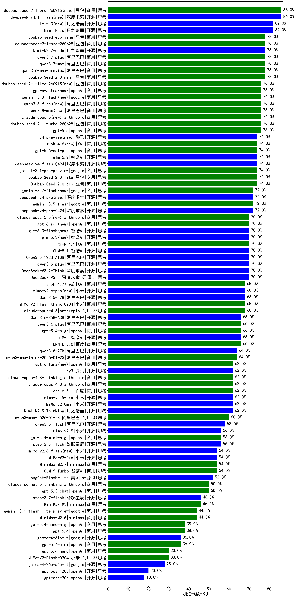

|类别|机构|大模型|【JEC-QA-KD】准确率|平均耗时|平均消耗token|花费/千次（元）|排名（准确率）|
|---|---|-----|-------------------|-------|-----------|-----------|-----------|
|商用|豆包|doubao-seed-2-1-pro-260915(new)|86.0%|68s|2399|68.4|1|
|开源|深度求索|deepseek-v4.1-flash(new)|86.0%|20s|2419|18.6|2|
|开源|月之暗面|kimi-k2.6|82.0%|185s|3230|85.2|3|
|开源|月之暗面|kimi-k3(new)|82.0%|134s|2545|240.5|4|
|商用|阿里巴巴|qwen3.6-max-preview|78.0%|105s|2327|121.0|5|
|商用|阿里巴巴|qwen3.7-plus|78.0%|34s|1844|14.1|6|
|商用|豆包|doubao-seed-2-1-pro-260628|78.0%|272s|11513|341.8|7|
|商用|阿里巴巴|qwen3.7-max|78.0%|35s|1700|58.8|8|
|商用|豆包|doubao-seed-evolving|78.0%|285s|12137|360.5|9|
|开源|月之暗面|kimi-k2.7-code|78.0%|83s|3055|80.5|10|
|商用|豆包|Doubao-Seed-2.0-mini|78.0%|177s|3439|6.6|11|
|商用|阿里巴巴|qwen3.8-max(new)|76.0%|77s|3114|108.7|12|
|商用|google|gemini-3.8-flash(new)|76.0%|16s|1193|57.6|13|
|商用|阿里巴巴|qwen3.8-flash(new)|76.0%|76s|4585|12.1|14|
|商用|豆包|doubao-seed-2-1-lite-260915(new)|76.0%|69s|3395|8.9|15|
|商用|anthropic|claude-opus-5(new)|76.0%|17s|1118|169.8|16|
|商用|openAI|gpt-5.5|76.0%|21s|1421|275.4|17|
|商用|豆包|doubao-seed-2-1-turbo-260628|76.0%|186s|9017|133.5|18|
|商用|openAI|gpt-6-astra(new)|76.0%|18s|537|151.3|19|
|商用|XAI|grok-4.6(new)|74.0%|71s|2627|101.6|20|
|商用|openAI|gpt-5.6-sol-pro|74.0%|53s|6158|607.0|21|
|开源|深度求索|deepseek-v4-flash-0424|74.0%|43s|1243|2.4|22|
|开源|智谱AI|glm-5.2|74.0%|73s|2920|79.6|23|
|开源|腾讯|hy4-preview(new)|74.0%|164s|9867|176.3|24|
|商用|google|gemini-3.1-pro-preview|74.0%|64s|2192|178.3|25|
|商用|豆包|Doubao-Seed-2.0-lite|74.0%|281s|1305|4.2|26|
|商用|豆包|Doubao-Seed-2.0-pro|74.0%|283s|1224|17.6|27|
|商用|google|gemini-3.5-flash|72.0%|12s|2426|146.6|28|
|商用|google|gemini-3.7-flash(new)|72.0%|5s|880|20.6|29|
|开源|深度求索|deepseek-v4-pro(new)|72.0%|81s|2767|71.6|30|
|开源|深度求索|deepseek-v4-pro-0424|72.0%|48s|1386|32.1|31|
|开源|阿里巴巴|Qwen3.5-122B-A10B|70.0%|459s|5350|33.7|32|
|开源|智谱AI|GLM-5.1|70.0%|110s|1975|45.6|33|
|开源|深度求索|DeepSeek-V3.2|70.0%|106s|606|1.7|34|
|开源|深度求索|DeepSeek-V3.2-Think|70.0%|55s|1775|5.2|35|
|商用|anthropic|claude-opus-5.5(new)|70.0%|43s|923|108.2|36|
|商用|XAI|grok-4.5|70.0%|79s|2774|107.7|37|
|商用|openAI|gpt-6-sol(new)|70.0%|284s|517|28.8|38|
|开源|智谱AI|glm-5.3-flash(new)|70.0%|121s|5118|14.1|39|
|开源|智谱AI|glm-5.3(new)|70.0%|289s|6127|169.4|40|
|开源|阿里巴巴|qwen3.5-plus|70.0%|59s|4915|23.2|41|
|开源|阿里巴巴|Qwen3.5-27B|68.0%|132s|5333|25.2|42|
|开源|小米|mimo-v2.6-pro(new)|68.0%|170s|7558|45.0|43|
|商用|anthropic|claude-opus-4.6|68.0%|24s|850|122.6|44|
|商用|XAI|grok-4.7(new)|68.0%|85s|6580|238.6|45|
|商用|小米|MiMo-V2-Flash-think-0204|68.0%|232s|2670|5.4|46|
|开源|智谱AI|GLM-5|66.0%|96s|2741|47.9|47|
|商用|阿里巴巴|qwen3.6-plus|66.0%|55s|2529|29.3|48|
|商用|百度|ERNIE-5.0|66.0%|143s|1810|41.8|49|
|商用|openAI|gpt-5.4-high|66.0%|29s|1672|164.0|50|
|开源|阿里巴巴|Qwen3.6-35B-A3B|66.0%|14s|2459|25.6|51|
|开源|阿里巴巴|qwen3.6-27b|64.0%|41s|2585|45.0|52|
|商用|阿里巴巴|qwen3-max-think-2026-01-23|64.0%|240s|4290|42.1|53|
|商用|openAI|gpt-6-luna(new)|62.0%|362s|1183|3.8|54|
|开源|腾讯|hy3|62.0%|57s|408|1.3|55|
|开源|小米|mimo-v2.5-pro|62.0%|38s|2057|38.2|56|
|商用|anthropic|claude-opus-4.8-thinking|62.0%|20s|1489|234.6|57|
|开源|小米|MiMo-V2-Omni|62.0%|11s|1754|20.6|58|
|商用|anthropic|claude-opus-4.8|62.0%|11s|754|106.1|59|
|商用|百度|ernie-5.1|62.0%|36s|1428|24.1|60|
|开源|月之暗面|Kimi-K2.5-Thinking|62.0%|181s|3514|72.1|61|
|商用|阿里巴巴|qwen3-max-2026-01-23|60.0%|22s|756|6.7|62|
|开源|阿里巴巴|qwen3.5-flash|58.0%|110s|5733|11.3|63|
|开源|阶跃星辰|step-3.5-flash|56.0%|34s|3761|7.8|64|
|商用|openAI|gpt-5.4-mini-high|56.0%|89s|2597|78.4|65|
|开源|小米|mimo-v2.5|56.0%|21s|1746|20.5|66|
|开源|小米|mimo-v2.6-flash(new)|54.0%|237s|2144|4.2|67|
|开源|小米|MiMo-V2-Pro|54.0%|19s|1352|23.5|68|
|商用|minimax|MiniMax-M2.7|54.0%|68s|2670|21.6|69|
|商用|智谱AI|GLM-5-Turbo|54.0%|46s|2053|43.4|70|
|开源|美团|LongCat-Flash-Lite|52.0%|291s|670|0.0|71|
|商用|openAI|gpt-5.3-chat|50.0%|47s|559|43.5|72|
|商用|anthropic|claude-sonnet-5-thinking|50.0%|21s|1541|97.5|73|
|商用|minimax|MiniMax-M3|46.0%|51s|1496|21.8|74|
|开源|阶跃星辰|step-3.7-flash|46.0%|1296s|4022|31.9|75|
|商用|minimax|MiniMax-M2.5|44.0%|48s|2530|20.4|76|
|商用|google|gemini-3.1-flash-lite-preview|44.0%|4s|506|4.3|77|
|商用|openAI|gpt-5.4-nano-high|38.0%|106s|1249|10.0|78|
|商用|openAI|gpt-5.4|38.0%|5s|388|29.4|79|
|开源|google|gemma-4-31b-it|36.0%|58s|573|1.4|80|
|商用|openAI|gpt-5.4-mini|36.0%|58s|346|7.4|81|
|商用|小米|MiMo-V2-Flash-0204|30.0%|116s|632|1.1|82|
|商用|openAI|gpt-5.4-nano|30.0%|80s|365|2.2|83|
|开源|google|gemma-4-26b-a4b-it|28.0%|88s|714|1.8|84|
|开源|openAI|gpt-oss-120b|20.0%|27s|1030|2.9|85|
|开源|openAI|gpt-oss-20b|18.0%|12s|1884|2.0|86|

