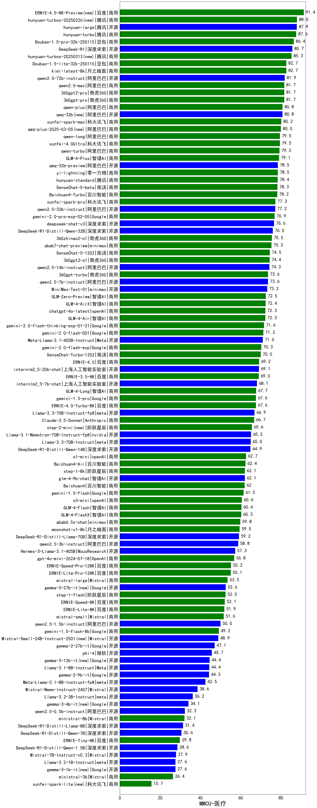

| 类别 | 大模型                         | MMCU-医疗 | 排名 |
|-----|------------------------------|---------|----|
|商用|ERNIE-4.5-8K-Preview(new)|91.4|1|
|商用|hunyuan-turbos-20250226(new)|88.0|2|
|开源|hunyuan-large|87.9|3|
|商用|hunyuan-turbo|87.6|4|
|商用|Doubao-1.5-pro-32k-250115|86.4|5|
|开源|DeepSeek-R1|85.7|6|
|商用|hunyuan-turbos-20250313(new)|85.3|7|
|商用|Doubao-1.5-lite-32k-250115|82.7|8|
|商用|kimi-latest-8k|82.7|9|
|开源|qwen2.5-72b-instruct|81.9|10|
|商用|360gpt2-pro|81.7|11|
|商用|qwen2.5-max|81.7|12|
|商用|360gpt-pro|81.7|13|
|商用|qwen-plus|80.8|14|
|开源|qwq-32b(new)|80.8|15|
|商用|xunfei-spark-max|80.2|16|
|商用|qwq-plus-2025-03-05(new)|80.0|17|
|商用|qwen-long|79.5|18|
|商用|xunfei-4.0Ultra|79.5|19|
|商用|qwen-turbo|79.3|20|
|商用|GLM-4-Plus|79.1|21|
|开源|qwq-32b-preview|78.5|22|
|商用|yi-lightning|78.5|23|
|商用|hunyuan-standard|78.4|24|
|商用|SenseChat-5-beta|78.3|25|
|商用|Baichuan4-Turbo|78.2|26|
|商用|xunfei-spark-pro|77.3|27|
|开源|qwen2.5-32b-instruct|77.2|28|
|商用|gemini-2.0-pro-exp-02-05|76.9|29|
|开源|deepseek-chat-v3|76.6|30|
|开源|DeepSeek-R1-Distill-Qwen-32B|76.0|31|
|商用|360zhinao2-o1|75.5|32|
|商用|abab7-chat-preview|75.3|33|
|商用|SenseChat-5-1202|74.5|34|
|商用|360gpt2-o1|74.4|35|
|开源|qwen2.5-14b-instruct|74.3|36|
|商用|360gpt-turbo|73.6|37|
|开源|qwen2.5-7b-instruct|73.6|38|
|开源|MiniMax-Text-01|73.2|39|
|商用|GLM-Zero-Preview|72.5|40|
|商用|GLM-4-AirX|72.4|41|
|商用|chatgpt-4o-latest|72.3|42|
|商用|GLM-4-Air|72.3|43|
|商用|gemini-2.0-flash-thinking-exp-01-21|71.6|44|
|商用|gemini-2.0-flash-001|71.3|45|
|开源|Meta-Llama-3.1-405B-Instruct|71.0|46|
|商用|gemini-2.0-flash-exp|70.3|47|
|商用|SenseChat-Turbo-1202|70.0|48|
|商用|ERNIE-4.0|69.2|49|
|开源|internlm2_5-20b-chat|69.1|50|
|商用|ERNIE-3.5-8K|69.0|51|
|开源|internlm2_5-7b-chat|68.1|52|
|商用|GLM-4-Long|67.7|53|
|商用|gemini-1.5-pro|67.6|54|
|商用|ERNIE-4.0-Turbo-8K|67.6|55|
|开源|Llama-3.3-70B-Instruct-fp8|66.9|56|
|商用|Claude-3.5-Sonnet|66.7|57|
|商用|step-2-mini(new)|65.6|58|
|开源|Llama-3.1-Nemotron-70B-Instruct-fp8|65.2|59|
|开源|Llama-3.3-70B-Instruct|65.0|60|
|开源|DeepSeek-R1-Distill-Qwen-14B|64.9|61|
|商用|o1-mini|62.7|62|
|商用|Baichuan4-Air|62.4|63|
|商用|step-1-8k|62.1|64|
|开源|glm-4-9b-chat|62.1|65|
|商用|Baichuan4|62.0|66|
|商用|gemini-1.5-flash|61.5|67|
|商用|o3-mini|60.6|68|
|商用|GLM-4-Flash|60.4|69|
|商用|GLM-4-FlashX|60.3|70|
|商用|abab6.5s-chat|59.8|71|
|商用|moonshot-v1-8k|59.5|72|
|开源|DeepSeek-R1-Distill-Llama-70B|59.2|73|
|开源|qwen2.5-3b-instruct|58.8|74|
|开源|Hermes-3-Llama-3.1-405B|57.3|75|
|商用|gpt-4o-mini-2024-07-18|56.8|76|
|商用|ERNIE-Speed-Pro-128K|55.2|77|
|商用|ERNIE-Lite-Pro-128K|55.1|78|
|商用|mistral-large|53.5|79|
|开源|gemma-3-27b-it(new)|52.6|80|
|商用|step-1-flash|52.5|81|
|商用|ERNIE-Speed-8K|52.1|82|
|商用|ERNIE-Lite-8K|51.9|83|
|商用|mistral-small|51.6|84|
|开源|qwen2.5-1.5b-instruct|50.0|85|
|商用|gemini-1.5-flash-8b|49.2|86|
|开源|Mistral-Small-24B-Instruct-2501(new)|48.9|87|
|开源|gemma-2-27b-it|47.1|88|
|开源|phi-4|45.7|89|
|开源|gemma-3-12b-it(new)|44.6|90|
|开源|Llama-3.1-8B-Instruct|44.4|91|
|开源|gemma-2-9b-it|44.3|92|
|开源|Meta-Llama-3.1-8B-Instruct-fp8|42.5|93|
|开源|Mistral-Nemo-Instruct-2407|38.6|94|
|开源|Llama-3.2-3B-Instruct|36.2|95|
|开源|gemma-3-4b-it(new)|34.1|96|
|开源|qwen2.5-0.5b-instruct|32.3|97|
|商用|ministral-8b|32.1|98|
|开源|DeepSeek-R1-Distill-Llama-8B|31.4|99|
|开源|DeepSeek-R1-Distill-Qwen-7B|30.6|100|
|商用|ERNIE-Tiny-8K|29.8|101|
|开源|DeepSeek-R1-Distill-Qwen-1.5B|28.6|102|
|开源|Mistral-7B-Instruct-v0.3|27.9|103|
|开源|Llama-3.2-1B-Instruct|27.6|104|
|开源|gemma-3-1b-it(new)|27.6|105|
|商用|ministral-3b|26.4|106|
|商用|xunfei-spark-lite(new)|15.7|107|
|开源|qwen2.5-math-72b-instruct|/|108|

