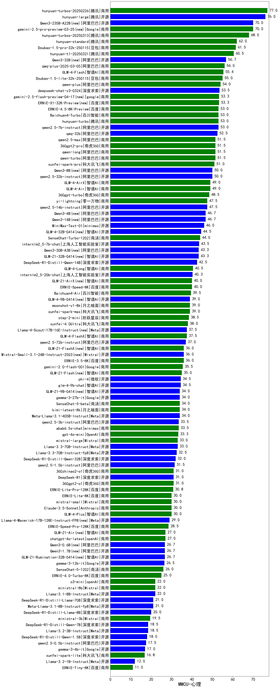

| 类别 | 大模型                         | MMCU-心理 | 排名 |
|-----|------------------------------|---------|----|
|商用|hunyuan-turbos-20250226|77.0|1|
|开源|hunyuan-large|76.0|2|
|商用|gemini-2.5-pro-preview-03-25(new)|70.0|3|
|开源|Qwen3-235B-A22B(new)|70.0|4|
|商用|hunyuan-turbos-20250313|68.0|5|
|商用|hunyuan-standard|62.0|6|
|商用|Doubao-1.5-pro-32k-250115|61.5|7|
|商用|hunyuan-t1-20250321|60.5|8|
|开源|Qwen3-32B(new)|56.7|9|
|商用|qwq-plus-2025-03-05|56.0|10|
|商用|GLM-4-Flash|55.4|11|
|商用|Doubao-1.5-lite-32k-250115|55.0|12|
|商用|qwen-plus|54.0|13|
|开源|deepseek-chat-v3-0324|53.5|14|
|商用|gemini-2.5-flash-preview-04-17(new)|53.3|15|
|商用|ERNIE-X1-32K-Preview|53.3|16|
|商用|ERNIE-4.5-8K-Preview|53.0|17|
|商用|Baichuan4-Turbo|53.0|18|
|商用|hunyuan-turbo|53.0|19|
|开源|qwen2.5-7b-instruct|53.0|20|
|开源|qwq-32b|52.5|21|
|商用|qwen-long|51.5|22|
|商用|qwen2.5-max|51.5|23|
|商用|qwen-turbo|51.5|24|
|商用|360gpt2-pro|51.5|25|
|商用|xunfei-spark-pro|51.0|26|
|开源|Qwen3-8B(new)|50.0|27|
|开源|qwen2.5-32b-instruct|50.0|28|
|商用|GLM-4-AirX|49.0|29|
|商用|GLM-4-Air|49.0|30|
|商用|360gpt-turbo|48.5|31|
|商用|yi-lightning|47.5|32|
|开源|qwen2.5-14b-instruct|47.5|33|
|开源|Qwen3-14B(new)|46.7|34|
|开源|Qwen3-4B(new)|46.7|35|
|开源|MiniMax-Text-01|46.0|36|
|开源|GLM-4-32B-0414(new)|44.5|37|
|商用|SenseChat-Turbo-1202|44.0|38|
|开源|internlm2_5-7b-chat|43.5|39|
|开源|GLM-Z1-32B-0414(new)|43.3|40|
|开源|Qwen3-30B-A3B(new)|43.3|41|
|开源|DeepSeek-R1-Distill-Qwen-14B|42.5|42|
|商用|GLM-4-Long|40.5|43|
|开源|internlm2_5-20b-chat|40.3|44|
|商用|ERNIE-Speed-8K|40.0|45|
|商用|GLM-Z1-AirX(new)|40.0|46|
|商用|Baichuan4-Air|39.5|47|
|商用|moonshot-v1-8k|39.0|48|
|开源|GLM-4-9B-0414(new)|39.0|49|
|商用|xunfei-spark-max|39.0|50|
|商用|step-2-mini|38.5|51|
|商用|xunfei-4.0Ultra|38.0|52|
|商用|GLM-4-FlashX|37.5|53|
|开源|Llama-4-Scout-17B-16E-Instruct|37.5|54|
|开源|qwen2.5-72b-instruct|37.0|55|
|商用|ERNIE-3.5-8K|36.0|56|
|开源|Mistral-Small-3.1-24B-Instruct-2503|36.0|57|
|商用|GLM-Z1-FlashX(new)|36.0|58|
|商用|gemini-2.0-flash-001|35.5|59|
|商用|GLM-Z1-Flash(new)|35.0|60|
|开源|phi-4|34.5|61|
|开源|glm-4-9b-chat|34.5|62|
|开源|gemma-3-27b-it|34.0|63|
|商用|kimi-latest-8k|34.0|64|
|商用|SenseChat-5-beta|34.0|65|
|开源|GLM-Z1-9B-0414(new)|34.0|66|
|开源|Meta-Llama-3.1-405B-Instruct|34.0|67|
|开源|qwen2.5-3b-instruct|33.5|68|
|商用|abab6.5s-chat|33.5|69|
|商用|gpt-4o-mini|33.3|70|
|商用|mistral-large|33.0|71|
|开源|Llama-3.3-70B-Instruct|33.0|72|
|开源|Llama-3.3-70B-Instruct-fp8|32.5|73|
|开源|DeepSeek-R1-Distill-Qwen-32B|32.0|74|
|开源|qwen2.5-1.5b-instruct|31.5|75|
|商用|360gpt2-o1|31.0|76|
|商用|xunfei-spark-x1(new)|31.0|77|
|开源|DeepSeek-R1|31.0|78|
|商用|360zhinao2-o1|31.0|79|
|商用|ERNIE-Lite-Pro-128K|30.8|80|
|商用|Claude-3.5-Sonnet|30.0|81|
|商用|mistral-small|30.0|82|
|商用|ERNIE-Lite-8K|30.0|83|
|商用|GLM-4-Plus|30.0|84|
|开源|Llama-4-Maverick-17B-128E-Instruct-FP8|29.0|85|
|商用|ERNIE-Speed-Pro-128K|28.5|86|
|商用|chatgpt-4o-latest|27.0|87|
|商用|GLM-Z1-Air(new)|27.0|88|
|开源|Qwen3-1.7B(new)|26.7|89|
|开源|Qwen3-0.6B(new)|26.7|90|
|开源|GLM-Z1-Rumination-32B-0414(new)|26.7|91|
|开源|gemma-3-12b-it|26.5|92|
|商用|SenseChat-5-1202|26.0|93|
|商用|ERNIE-4.0-Turbo-8K|25.0|94|
|开源|Llama-3.1-8B-Instruct|22.0|95|
|商用|ministral-8b|22.0|96|
|商用|o3-mini|22.0|97|
|开源|Meta-Llama-3.1-8B-Instruct-fp8|21.0|98|
|开源|DeepSeek-R1-Distill-Llama-70B|21.0|99|
|开源|DeepSeek-R1-Distill-Llama-8B|20.0|100|
|商用|ministral-3b|19.5|101|
|开源|Llama-3.2-3B-Instruct|18.5|102|
|开源|DeepSeek-R1-Distill-Qwen-7B|18.5|103|
|开源|DeepSeek-R1-Distill-Qwen-1.5B|18.0|104|
|开源|qwen2.5-0.5b-instruct|17.5|105|
|开源|gemma-3-4b-it|17.0|106|
|商用|xunfei-spark-lite|16.8|107|
|开源|Llama-3.2-1B-Instruct|12.0|108|
|商用|ERNIE-Tiny-8K|11.0|109|

