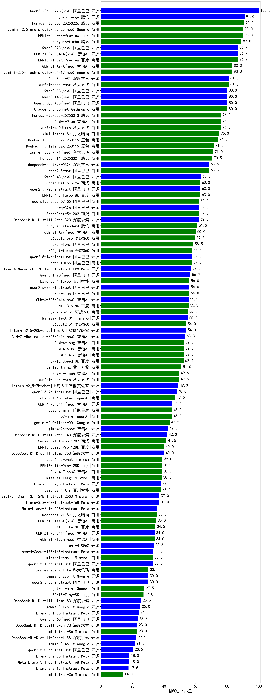

| 类别 | 大模型                         | MMCU-法律 | 排名 |
|-----|------------------------------|---------|----|
|开源|hunyuan-large|91.0|1|
|商用|hunyuan-turbos-20250226(new)|90.5|2|
|商用|ERNIE-4.5-8K-Preview(new)|90.0|3|
|商用|hunyuan-turbo|89.0|4|
|商用|xunfei-spark-max|81.0|5|
|开源|DeepSeek-R1|81.0|6|
|商用|Claude-3.5-Sonnet|80.0|7|
|商用|hunyuan-turbos-20250313(new)|76.0|8|
|商用|xunfei-4.0Ultra|76.0|9|
|商用|GLM-4-Plus|76.0|10|
|商用|kimi-latest-8k|75.0|11|
|商用|Doubao-1.5-pro-32k-250115|74.0|12|
|商用|Doubao-1.5-lite-32k-250115|71.5|13|
|商用|qwen2.5-max|68.5|14|
|商用|ERNIE-4.0|64.0|15|
|开源|qwq-32b-preview|63.5|16|
|商用|ERNIE-4.0-Turbo-8K|63.0|17|
|开源|qwen2.5-72b-instruct|63.0|18|
|商用|SenseChat-5-beta|63.0|19|
|开源|qwq-32b(new)|62.0|20|
|开源|DeepSeek-R1-Distill-Qwen-32B|62.0|21|
|商用|qwq-plus-2025-03-05(new)|62.0|22|
|商用|SenseChat-5-1202|62.0|23|
|商用|hunyuan-standard|61.0|24|
|商用|360gpt2-pro|59.5|25|
|商用|360gpt-pro|59.5|26|
|商用|qwen-long|58.5|27|
|商用|360gpt-turbo|57.5|28|
|商用|qwen-turbo|57.5|29|
|开源|qwen2.5-14b-instruct|57.5|30|
|商用|GLM-Zero-Preview|57.0|31|
|商用|qwen-plus|56.0|32|
|商用|Baichuan4-Turbo|56.0|33|
|开源|qwen2.5-32b-instruct|56.0|34|
|商用|ERNIE-3.5-8K|55.5|35|
|开源|MiniMax-Text-01|55.0|36|
|商用|360zhinao2-o1|55.0|37|
|商用|abab7-chat-preview|54.5|38|
|开源|internlm2_5-20b-chat|54.0|39|
|商用|360gpt2-o1|54.0|40|
|商用|GLM-4-Long|52.5|41|
|商用|GLM-4-AirX|52.5|42|
|商用|GLM-4-Air|52.5|43|
|商用|ERNIE-Speed-8K|52.4|44|
|商用|yi-lightning|51.0|45|
|商用|Baichuan4|50.0|46|
|商用|GLM-4-Flash|49.6|47|
|商用|gemini-2.0-pro-exp-02-05|49.5|48|
|商用|xunfei-spark-pro|49.5|49|
|开源|internlm2_5-7b-chat|49.0|50|
|商用|gemini-2.0-flash-thinking-exp-01-21|49.0|51|
|开源|qwen2.5-7b-instruct|48.0|52|
|商用|chatgpt-4o-latest|47.0|53|
|开源|deepseek-chat-v3|46.5|54|
|商用|step-2-mini(new)|45.0|55|
|商用|o3-mini|45.0|56|
|商用|gemini-2.0-flash-exp|45.0|57|
|商用|gemini-1.5-pro|45.0|58|
|商用|step-1-8k|44.0|59|
|商用|gemini-2.0-flash-001|43.5|60|
|开源|glm-4-9b-chat|42.5|61|
|开源|DeepSeek-R1-Distill-Qwen-14B|42.0|62|
|商用|SenseChat-Turbo-1202|41.5|63|
|开源|DeepSeek-R1-Distill-Llama-70B|40.0|64|
|商用|ERNIE-Speed-Pro-128K|40.0|65|
|商用|step-1-flash|39.5|66|
|商用|abab6.5s-chat|39.0|67|
|商用|GLM-4-FlashX|38.5|68|
|商用|ERNIE-Lite-Pro-128K|38.5|69|
|商用|mistral-large|38.5|70|
|商用|Baichuan4-Air|38.0|71|
|开源|Llama-3.3-70B-Instruct|38.0|72|
|开源|Llama-3.3-70B-Instruct-fp8|37.0|73|
|开源|Hermes-3-Llama-3.1-405B|36.0|74|
|开源|Meta-Llama-3.1-405B-Instruct|35.5|75|
|商用|moonshot-v1-8k|35.5|76|
|商用|o1-mini|35.0|77|
|商用|ERNIE-Lite-8K|34.5|78|
|商用|gemini-1.5-flash|33.5|79|
|开源|phi-4|33.5|80|
|商用|mistral-small|33.0|81|
|开源|qwen2.5-1.5b-instruct|33.0|82|
|开源|Llama-3.1-Nemotron-70B-Instruct-fp8|32.5|83|
|商用|xunfei-spark-lite(new)|30.1|84|
|开源|qwen2.5-3b-instruct|30.0|85|
|开源|gemma-3-27b-it(new)|30.0|86|
|开源|Mistral-Small-24B-Instruct-2501(new)|28.5|87|
|开源|gemma-2-27b-it|28.5|88|
|商用|gpt-4o-mini-2024-07-18|27.5|89|
|商用|ERNIE-Tiny-8K|27.0|90|
|商用|gemini-1.5-flash-8b|27.0|91|
|开源|DeepSeek-R1-Distill-Llama-8B|25.5|92|
|开源|gemma-3-12b-it(new)|25.0|93|
|开源|gemma-2-9b-it|24.0|94|
|开源|Llama-3.1-8B-Instruct|24.0|95|
|商用|ministral-8b|23.0|96|
|开源|DeepSeek-R1-Distill-Qwen-7B|23.0|97|
|开源|DeepSeek-R1-Distill-Qwen-1.5B|22.5|98|
|开源|gemma-3-4b-it(new)|21.5|99|
|开源|Mistral-7B-Instruct-v0.3|21.5|100|
|开源|Mistral-Nemo-Instruct-2407|21.0|101|
|开源|qwen2.5-0.5b-instruct|20.5|102|
|开源|Meta-Llama-3.1-8B-Instruct-fp8|18.0|103|
|开源|Llama-3.2-3B-Instruct|18.0|104|
|开源|Llama-3.2-1B-Instruct|17.5|105|
|开源|gemma-3-1b-it(new)|15.5|106|
|商用|ministral-3b|14.0|107|
|开源|qwen2.5-math-72b-instruct|/|108|
|开源|Yi-1.5-34B-Chat|/|109|
|开源|Yi-1.5-9B-Chat|/|110|

