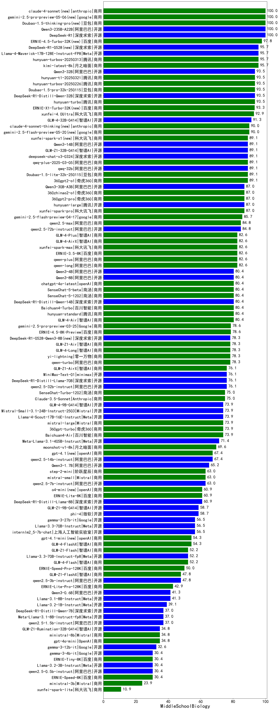

| 类别 | 大模型                         | MiddleSchoolBiology | 排名 |
|-----|------------------------------|---------|----|
|商用|xunfei-spark-max|100.0|1|
|商用|xunfei-spark-pro|100.0|2|
|商用|xunfei-4.0Ultra|100.0|3|
|商用|Baichuan4-Turbo|100.0|4|
|开源|hunyuan-large|100.0|5|
|商用|hunyuan-turbo|100.0|6|
|开源|qwq-32b-preview|100.0|7|
|商用|abab7-chat-preview|100.0|8|
|商用|GLM-4-Plus|100.0|9|
|开源|DeepSeek-R1-Distill-Llama-70B|100.0|10|
|开源|DeepSeek-R1|100.0|11|
|商用|gemini-2.0-pro-exp-02-05|100.0|12|
|开源|DeepSeek-R1-Distill-Qwen-32B|100.0|13|
|商用|gemini-2.0-flash-exp|100.0|14|
|商用|hunyuan-turbos-20250313(new)|100.0|15|
|商用|gemini-2.0-flash-001|100.0|16|
|商用|Doubao-1.5-pro-32k-250115|100.0|17|
|商用|SenseChat-5-1202|100.0|18|
|商用|chatgpt-4o-latest|100.0|19|
|开源|deepseek-chat-v3-0324(new)|100.0|20|
|商用|hunyuan-t1-20250321(new)|100.0|21|
|商用|hunyuan-turbos-20250226|100.0|22|
|商用|mistral-large|100.0|23|
|开源|MiniMax-Text-01|100.0|24|
|商用|gemini-1.5-pro|92.9|25|
|商用|kimi-latest-8k|92.9|26|
|商用|gemini-2.0-flash-thinking-exp-01-21|92.9|27|
|商用|SenseChat-Turbo-1202|92.9|28|
|商用|GLM-4-FlashX|92.9|29|
|商用|GLM-Zero-Preview|92.9|30|
|商用|360gpt2-o1|92.9|31|
|商用|Claude-3.5-Sonnet|92.9|32|
|开源|internlm2_5-20b-chat|92.9|33|
|商用|yi-lightning|92.9|34|
|开源|qwen2.5-32b-instruct|92.9|35|
|开源|qwen2.5-72b-instruct|92.9|36|
|商用|Baichuan4-Air|92.9|37|
|开源|internlm2_5-7b-chat|92.9|38|
|商用|step-1-8k|92.9|39|
|商用|qwen2.5-max|92.9|40|
|商用|SenseChat-5-beta|92.9|41|
|商用|GLM-4-Flash|92.9|42|
|商用|ERNIE-4.0|92.9|43|
|商用|ERNIE-3.5-8K|92.9|44|
|商用|qwen-turbo|92.9|45|
|商用|ERNIE-4.0-Turbo-8K|92.9|46|
|商用|o3-mini|92.9|47|
|商用|qwq-plus-2025-03-05|92.9|48|
|商用|Doubao-1.5-lite-32k-250115|92.9|49|
|商用|ERNIE-4.5-8K-Preview(new)|92.9|50|
|商用|step-2-mini|85.7|51|
|开源|qwq-32b|85.7|52|
|商用|hunyuan-standard|85.7|53|
|商用|moonshot-v1-8k|85.7|54|
|开源|DeepSeek-R1-Distill-Qwen-14B|85.7|55|
|开源|Llama-3.3-70B-Instruct-fp8|85.7|56|
|开源|Llama-3.3-70B-Instruct|85.7|57|
|商用|ERNIE-Lite-8K|85.7|58|
|开源|qwen2.5-7b-instruct|85.7|59|
|商用|GLM-4-AirX|85.7|60|
|开源|gemma-2-9b-it|85.7|61|
|开源|gemma-2-27b-it|85.7|62|
|商用|GLM-4-Air|85.7|63|
|开源|glm-4-9b-chat|85.7|64|
|商用|qwen-plus|85.7|65|
|商用|qwen-long|85.7|66|
|开源|deepseek-chat-v3|85.7|67|
|商用|gemini-1.5-flash|85.7|68|
|商用|360gpt-pro|85.7|69|
|商用|gemini-1.5-flash-8b|85.7|70|
|商用|360gpt2-pro|85.7|71|
|商用|mistral-small|85.7|72|
|商用|GLM-4-Long|78.6|73|
|开源|qwen2.5-14b-instruct|78.6|74|
|商用|Baichuan4|78.6|75|
|商用|gpt-4o-mini-2024-07-18|78.6|76|
|商用|ERNIE-Lite-Pro-128K|78.6|77|
|开源|Meta-Llama-3.1-405B-Instruct|78.6|78|
|商用|360zhinao2-o1|78.6|79|
|商用|360gpt-turbo|78.6|80|
|商用|step-1-flash|78.6|81|
|商用|o1-mini|78.6|82|
|开源|DeepSeek-R1-Distill-Qwen-7B|78.6|83|
|开源|Hermes-3-Llama-3.1-405B|78.6|84|
|开源|Llama-3.1-Nemotron-70B-Instruct-fp8|78.6|85|
|开源|Mistral-Small-24B-Instruct-2501(new)|78.6|86|
|开源|phi-4|78.6|87|
|开源|DeepSeek-R1-Distill-Llama-8B|71.4|88|
|商用|abab6.5s-chat|71.4|89|
|开源|gemma-3-27b-it(new)|71.4|90|
|开源|qwen2.5-1.5b-instruct|71.4|91|
|商用|ERNIE-Speed-8K|64.3|92|
|商用|ERNIE-Tiny-8K|64.3|93|
|开源|qwen2.5-3b-instruct|64.3|94|
|开源|gemma-3-12b-it(new)|64.3|95|
|开源|gemma-3-4b-it(new)|64.3|96|
|开源|Mistral-Nemo-Instruct-2407|64.3|97|
|商用|ERNIE-Speed-Pro-128K|64.3|98|
|商用|ministral-8b|64.3|99|
|开源|Meta-Llama-3.1-8B-Instruct-fp8|50.0|100|
|开源|DeepSeek-R1-Distill-Qwen-1.5B|42.9|101|
|商用|ministral-3b|42.9|102|
|开源|Llama-3.2-3B-Instruct|42.9|103|
|开源|gemma-3-1b-it(new)|35.7|104|
|开源|Llama-3.1-8B-Instruct|35.7|105|
|开源|Mistral-7B-Instruct-v0.3|35.7|106|
|开源|qwen2.5-0.5b-instruct|28.6|107|
|开源|Llama-3.2-1B-Instruct|14.3|108|
|商用|xunfei-spark-lite|14.3|109|
|开源|qwen2.5-math-72b-instruct|/|110|

