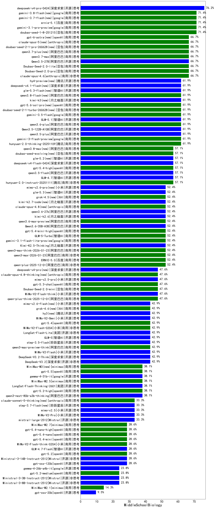

|类别|机构|大模型|【MiddleSchoolBiology】准确率|平均耗时|平均消耗token|花费/千次（元）|排名（准确率）|
|---|---|-----|-------------------|-------|-----------|-----------|-----------|
|开源|深度求索|deepseek-v4-pro-0424|76.2%|45s|1362|31.5|1|
|商用|google|gemini-3.7-flash(new)|71.4%|5s|611|13.7|2|
|商用|google|gemini-3.1-pro-preview|71.4%|30s|1257|99.1|3|
|商用|百度|ernie-5.1|71.4%|31s|1093|18.2|4|
|商用|google|gemini-3.8-flash(new)|71.4%|19s|798|37.2|5|
|商用|豆包|Doubao-Seed-2.0-lite|66.7%|168s|818|2.5|6|
|商用|豆包|Doubao-Seed-2.0-pro|66.7%|159s|823|11.2|7|
|商用|openAI|gpt-6-astra(new)|66.7%|14s|294|67.1|8|
|商用|anthropic|claude-opus-4.6|66.7%|12s|566|75.0|9|
|商用|anthropic|claude-opus-5(new)|66.7%|13s|719|102.0|10|
|商用|阿里巴巴|qwen3.7-max|66.7%|23s|1162|39.3|11|
|商用|豆包|doubao-seed-2-1-pro-260628|66.7%|180s|5556|163.1|12|
|商用|阿里巴巴|qwen3.7-plus|66.7%|35s|1891|14.5|13|
|开源|阿里巴巴|Qwen3.5-27B|66.7%|479s|3270|15.3|14|
|开源|智谱AI|GLM-5.1|61.9%|187s|1467|33.3|15|
|开源|月之暗面|kimi-k3(new)|61.9%|49s|1116|97.4|16|
|商用|豆包|doubao-seed-2-1-turbo-260628|61.9%|163s|6460|95.1|17|
|开源|阿里巴巴|Qwen3.5-122B-A10B|61.9%|146s|3245|20.2|18|
|商用|阿里巴巴|qwen3.6-plus|61.9%|23s|1512|17.1|19|
|开源|阿里巴巴|qwen3.5-plus|61.9%|34s|2685|12.5|20|
|商用|openAI|gpt-5.6-sol-pro|61.9%|18s|3725|297.9|21|
|开源|腾讯|hy4-preview(new)|61.9%|89s|4202|74.3|22|
|商用|阿里巴巴|qwen3.8-flash(new)|61.9%|31s|2212|5.7|23|
|开源|智谱AI|glm-5.3-flash(new)|61.9%|89s|4560|12.5|24|
|开源|深度求索|deepseek-v4.1-flash(new)|61.9%|31s|1543|11.6|25|
|商用|google|gemini-3.5-flash|61.9%|8s|1422|83.7|26|
|开源|智谱AI|glm-5.2|57.1%|49s|2016|54.2|27|
|商用|阿里巴巴|qwen3.8-max(new)|57.1%|88s|3522|123.4|28|
|开源|阿里巴巴|qwen3.5-flash|57.1%|172s|4022|7.9|29|
|开源|深度求索|deepseek-v4-flash-0424|57.1%|38s|1167|2.2|30|
|商用|openAI|gpt-5.4-high|57.1%|14s|769|69.5|31|
|商用|豆包|doubao-seed-evolving|57.1%|190s|7381|217.9|32|
|商用|阿里巴巴|qwen3.6-max-preview|52.4%|52s|1642|83.9|33|
|开源|阿里巴巴|Qwen3.6-35B-A3B|52.4%|217s|1785|18.3|34|
|商用|XAI|grok-4.5|52.4%|89s|2391|91.8|35|
|商用|anthropic|claude-opus-4.8|52.4%|7s|534|69.7|36|
|开源|阿里巴巴|qwen3.6-27b|52.4%|26s|1603|27.3|37|
|开源|月之暗面|kimi-k2.6|52.4%|99s|2634|69.1|38|
|商用|google|gemini-3.1-flash-lite-preview|52.4%|3s|324|2.4|39|
|开源|月之暗面|Kimi-K2.5-Thinking|52.4%|200s|2229|45.1|40|
|商用|openAI|gpt-5.4-mini-high|52.4%|73s|1612|47.4|41|
|开源|小米|mimo-v2.6-pro(new)|52.4%|162s|4229|25.0|42|
|开源|月之暗面|kimi-k2.7-code|52.4%|28s|972|24.2|43|
|商用|百度|ERNIE-5.0|52.4%|249s|1915|44.3|44|
|商用|智谱AI|GLM-5-Turbo|52.4%|36s|1523|31.7|45|
|开源|智谱AI|glm-5.3(new)|52.4%|41s|1408|37.2|46|
|商用|阿里巴巴|qwen3-max-2026-01-23|52.4%|130s|583|5.0|47|
|商用|阿里巴巴|qwen3-max-think-2026-01-23|52.4%|93s|3040|29.5|48|
|开源|深度求索|deepseek-v4-pro(new)|47.6%|64s|1813|45.7|49|
|商用|豆包|Doubao-Seed-2.0-mini|47.6%|461s|2086|3.9|50|
|商用|openAI|gpt-5.3-chat|47.6%|12s|417|29.9|51|
|开源|小米|mimo-v2.5-pro|47.6%|43s|2073|38.6|52|
|商用|anthropic|claude-opus-4.8-thinking|47.6%|14s|871|128.7|53|
|商用|XAI|grok-4.6(new)|42.9%|74s|2510|96.7|54|
|开源|腾讯|hy3|42.9%|39s|258|0.7|55|
|开源|小米|mimo-v2.6-flash(new)|42.9%|25s|879|1.6|56|
|商用|openAI|gpt-6-sol(new)|42.9%|164s|277|12.2|57|
|开源|小米|MiMo-V2-Omni|42.9%|264s|1372|15.2|58|
|开源|美团|LongCat-Flash-Lite|42.9%|43s|430|0.0|59|
|商用|openAI|gpt-5.4|42.9%|4s|276|17.7|60|
|开源|智谱AI|GLM-5|42.9%|120s|2340|40.7|61|
|开源|阶跃星辰|step-3.5-flash|42.9%|38s|2797|5.7|62|
|开源|深度求索|DeepSeek-V3.2-Think|42.9%|203s|1227|3.6|63|
|商用|小米|MiMo-V2-Flash-0204|42.9%|292s|547|1.0|64|
|开源|深度求索|DeepSeek-V3.2|42.9%|129s|296|0.8|65|
|开源|google|gemma-4-31b-it|38.1%|43s|392|0.9|66|
|商用|openAI|gpt-6-luna(new)|38.1%|367s|529|1.5|67|
|商用|minimax|MiniMax-M3|38.1%|22s|674|8.0|68|
|商用|openAI|gpt-5.5|38.1%|10s|600|103.5|69|
|商用|minimax|MiniMax-M2.5|38.1%|30s|1516|11.9|70|
|开源|小米|MiMo-V2-Pro|33.3%|221s|1024|16.6|71|
|商用|anthropic|claude-sonnet-5-thinking|33.3%|14s|955|57.3|72|
|开源|小米|mimo-v2.5|33.3%|17s|1277|13.9|73|
|开源|阶跃星辰|step-3.7-flash|33.3%|23s|1720|13.2|74|
|商用|openAI|gpt-5.4-nano|28.6%|18s|288|1.6|75|
|商用|小米|MiMo-V2-Flash-think-0204|28.6%|750s|2157|4.3|76|
|商用|openAI|gpt-5.4-mini|28.6%|4s|257|4.7|77|
|商用|openAI|gpt-5.4-nano-high|28.6%|10s|596|4.3|78|
|商用|minimax|MiniMax-M2.7|28.6%|54s|2165|17.4|79|
|开源|openAI|gpt-oss-120b|28.6%|15s|709|1.9|80|
|开源|google|gemma-4-26b-a4b-it|23.8%|63s|418|0.9|81|
|开源|openAI|gpt-oss-20b|9.5%|7s|1163|1.2|82|

