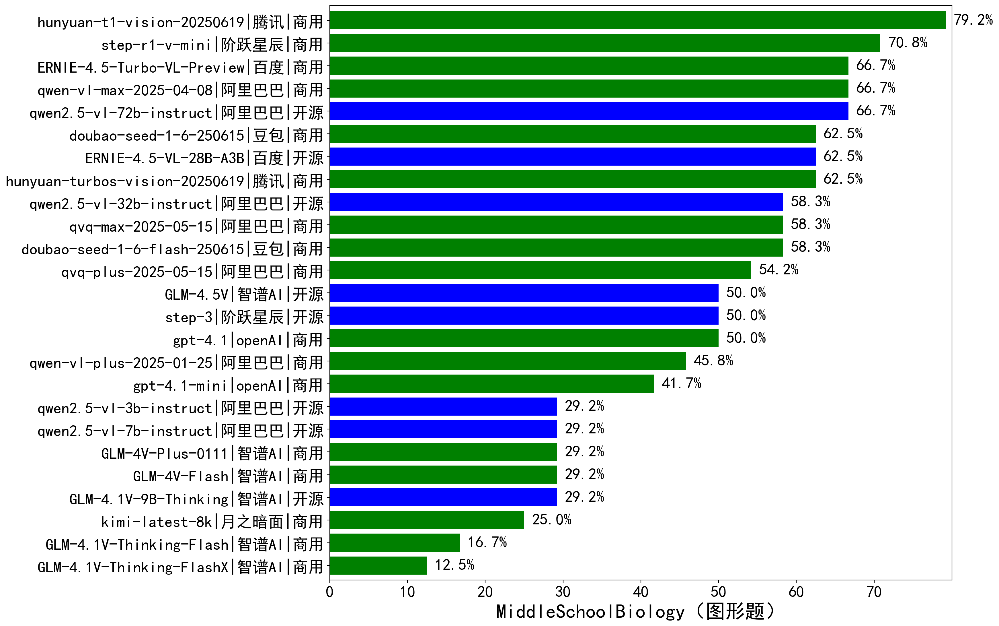

|类别|机构|大模型|【MiddleSchoolBiology（图形题）】准确率|平均耗时|平均消耗token|花费/千次（元）|排名（准确率）|
|---|---|-----|-------------------|-------|-----------|-----------|-----------|
|商用|google|gemini-2.5-flash|91.7%|116s|1265|16.6|1|
|商用|google|gemini-2.5-pro|83.3%|139s|1686|97.2|2|
|商用|腾讯|hunyuan-t1-vision-20250619|79.2%|824s|982|5.7|3|
|商用|openAI|gpt-5-2025-08-07|70.8%|183s|1311|66.2|4|
|商用|阶跃星辰|step-r1-v-mini|70.8%|502s|1772|11.4|5|
|开源|阿里巴巴|qwen2.5-vl-72b-instruct|66.7%|524s|358|1.5|6|
|商用|阿里巴巴|qwen-vl-max-2025-04-08|66.7%|513s|510|3.1|7|
|商用|百度|ERNIE-4.5-Turbo-VL-Preview|66.7%|469s|2215|9.6|8|
|商用|豆包|doubao-seed-1-6-250615|62.5%|/|422|1.4|9|
|开源|百度|ERNIE-4.5-VL-28B-A3B|62.5%|407s|451|1.0|10|
|商用|腾讯|hunyuan-turbos-vision-20250619|62.5%|222s|631|2.9|11|
|开源|阿里巴巴|qwen2.5-vl-32b-instruct|58.3%|415s|688|1.3|12|
|商用|豆包|doubao-seed-1-6-flash-250615|58.3%|/|427|0.3|13|
|商用|阿里巴巴|qvq-max-2025-05-15|58.3%|647s|1271|34.5|14|
|商用|openAI|gpt-5-mini-2025-08-07|54.2%|151s|977|11.0|15|
|商用|阿里巴巴|qvq-plus-2025-05-15|54.2%|787s|1506|6.8|16|
|开源|阶跃星辰|step-3|50.0%|316s|656|1.9|17|
|商用|openAI|gpt-4.1|50.0%|421s|559|13.5|18|
|开源|智谱AI|GLM-4.5V|50.0%|318s|845|4.1|19|
|商用|阿里巴巴|qwen-vl-plus-2025-01-25|45.8%|509s|350|0.8|20|
|商用|openAI|gpt-4.1-mini|41.7%|731s|383|2.3|21|
|商用|openAI|gpt-5-nano-2025-08-07|37.5%|130s|2109|5.5|22|
|开源|智谱AI|GLM-4.1V-9B-Thinking|29.2%|688s|1586|1.4|23|
|开源|阿里巴巴|qwen2.5-vl-3b-instruct|29.2%|827s|334|0.6|24|
|开源|阿里巴巴|qwen2.5-vl-7b-instruct|29.2%|14s|357|0.1|25|
|商用|智谱AI|GLM-4V-Flash|29.2%|15s|463|0.0|26|
|商用|智谱AI|GLM-4V-Plus-0111|29.2%|212s|456|1.8|27|
|商用|google|gemini-2.5-flash-lite|29.2%|112s|724|1.2|28|
|商用|月之暗面|kimi-latest-8k|25.0%|264s|1386|16.6|29|
|商用|智谱AI|GLM-4.1V-Thinking-Flash|16.7%|20s|816|0.0|30|
|商用|智谱AI|GLM-4.1V-Thinking-FlashX|12.5%|318s|1109|2.2|31|

