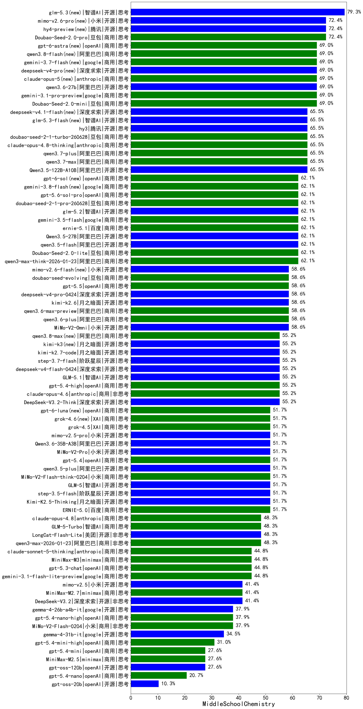

|类别|机构|大模型|【MiddleSchoolChemistry】准确率|平均耗时|平均消耗token|花费/千次（元）|排名（准确率）|
|---|---|-----|-------------------|-------|-----------|-----------|-----------|
|开源|智谱AI|glm-5.3(new)|79.3%|309s|3244|87.9|1|
|开源|腾讯|hy4-preview(new)|72.4%|66s|3494|61.2|2|
|商用|豆包|Doubao-Seed-2.0-pro|72.4%|166s|1009|13.8|3|
|商用|google|gemini-3-flash-preview|69.0%|16s|1344|26.1|4|
|开源|阿里巴巴|qwen3.6-27b|69.0%|39s|2509|43.1|5|
|开源|深度求索|deepseek-v4-pro(new)|69.0%|45s|1900|47.5|6|
|商用|google|gemini-3.1-pro-preview|69.0%|40s|1903|151.9|7|
|商用|豆包|Doubao-Seed-2.0-mini|69.0%|375s|2160|4.0|8|
|商用|google|gemini-3.7-flash(new)|69.0%|5s|845|19.2|9|
|商用|阿里巴巴|qwen3.8-flash(new)|69.0%|77s|2741|7.0|10|
|商用|anthropic|claude-opus-5(new)|69.0%|11s|803|107.2|11|
|商用|openAI|gpt-6-astra(new)|69.0%|12s|380|82.4|12|
|商用|阿里巴巴|qwen3.7-max|65.5%|41s|2231|77.0|13|
|开源|深度求索|deepseek-v4.1-flash(new)|65.5%|17s|1723|12.8|14|
|开源|腾讯|hy3(new)|65.5%|56s|420|1.3|15|
|商用|anthropic|claude-opus-4.8-thinking(new)|65.5%|14s|1241|183.9|16|
|开源|智谱AI|GLM-4.7|65.5%|61s|2861|38.5|17|
|商用|阿里巴巴|qwen3.7-plus(new)|65.5%|52s|2844|21.9|18|
|商用|豆包|doubao-seed-2-1-turbo-260628(new)|65.5%|120s|4740|69.0|19|
|开源|智谱AI|glm-5.3-flash(new)|65.5%|62s|2533|6.8|20|
|开源|阿里巴巴|Qwen3.5-122B-A10B|65.5%|152s|4115|25.6|21|
|开源|智谱AI|glm-5.2(new)|62.1%|66s|2905|78.4|22|
|开源|阿里巴巴|qwen3-next-80b-a3b-thinking|62.1%|41s|4048|15.7|23|
|商用|google|gemini-3.8-flash(new)|62.1%|14s|869|39.6|24|
|开源|阿里巴巴|qwen3.5-flash|62.1%|541s|4815|9.4|25|
|商用|阿里巴巴|qwen3-max-think-2026-01-23|62.1%|268s|3923|38.1|26|
|开源|阿里巴巴|Qwen3.5-27B|62.1%|567s|5209|24.4|27|
|商用|豆包|Doubao-Seed-2.0-lite|62.1%|172s|899|2.7|28|
|商用|腾讯|hunyuan-2.0-instruct-20251111|62.1%|25s|433|0.7|29|
|商用|百度|ernie-5.1|62.1%|43s|1398|23.3|30|
|商用|openAI|gpt-5.6-sol-pro(new)|62.1%|21s|4255|342.8|31|
|商用|豆包|doubao-seed-1-8-251215|62.1%|27s|756|4.8|32|
|商用|腾讯|hunyuan-2.0-thinking-20251109|62.1%|31s|1413|5.3|33|
|商用|豆包|doubao-seed-2-1-pro-260628(new)|62.1%|160s|6434|188.7|34|
|商用|google|gemini-3.5-flash|62.1%|10s|1985|117.5|35|
|商用|阿里巴巴|qwen-plus-2025-12-01|58.6%|31s|1428|2.7|36|
|商用|豆包|doubao-seed-evolving(new)|58.6%|134s|6125|179.4|37|
|开源|月之暗面|kimi-k2.6|58.6%|134s|3170|82.9|38|
|商用|阿里巴巴|qwen3.6-max-preview|58.6%|76s|2207|112.9|39|
|开源|深度求索|deepseek-v4-pro-0424|58.6%|50s|1379|31.5|40|
|商用|阿里巴巴|qwen3-max-preview-think|58.6%|285s|3285|76.1|41|
|商用|openAI|gpt-5.5|58.6%|30s|673|109.8|42|
|商用|阿里巴巴|qwen3.6-plus|58.6%|64s|2870|33.1|43|
|开源|小米|MiMo-V2-Omni|58.6%|513s|2380|28.9|44|
|开源|深度求索|deepseek-v4-flash-0424|55.2%|41s|1398|2.7|45|
|商用|阿里巴巴|qwen3.8-max(new)|55.2%|54s|2432|83.3|46|
|开源|智谱AI|GLM-5.1|55.2%|232s|2345|53.8|47|
|商用|openAI|gpt-5.4-high|55.2%|17s|1070|96.6|48|
|商用|anthropic|claude-opus-4.6|55.2%|25s|724|94.0|49|
|开源|阶跃星辰|step-3.7-flash(new)|55.2%|29s|2865|22.3|50|
|开源|深度求索|DeepSeek-V3.2-Think|55.2%|228s|2149|6.3|51|
|开源|月之暗面|kimi-k3(new)|55.2%|46s|1233|106.4|52|
|开源|月之暗面|kimi-k2.7-code(new)|55.2%|34s|1229|30.4|53|
|开源|阿里巴巴|Qwen3.6-35B-A3B|51.7%|13s|2357|24.2|54|
|开源|小米|mimo-v2.5-pro|51.7%|37s|1807|32.5|55|
|商用|XAI|grok-4.6(new)|51.7%|61s|2368|89.8|56|
|开源|小米|MiMo-V2-Pro|51.7%|633s|1948|35.4|57|
|开源|智谱AI|GLM-5|51.7%|111s|3012|52.3|58|
|商用|阿里巴巴|qwen-plus-think-2025-12-01|51.7%|83s|3147|24.1|59|
|商用|XAI|grok-4.5(new)|51.7%|94s|2604|99.8|60|
|商用|百度|ERNIE-5.0|51.7%|231s|3781|88.5|61|
|开源|月之暗面|Kimi-K2.5-Thinking|51.7%|154s|4276|87.5|62|
|开源|阶跃星辰|step-3.5-flash|51.7%|34s|3780|7.7|63|
|商用|小米|MiMo-V2-Flash-think-0204|51.7%|627s|3268|6.6|64|
|开源|阿里巴巴|qwen3.5-plus|51.7%|42s|3488|16.2|65|
|商用|openAI|gpt-5.4|51.7%|5s|385|24.7|66|
|开源|美团|LongCat-Flash-Lite|48.3%|114s|713|0.0|67|
|商用|智谱AI|GLM-5-Turbo|48.3%|35s|1985|41.3|68|
|商用|阿里巴巴|qwen3-max-2026-01-23|48.3%|181s|1634|15.2|69|
|开源|美团|LongCat-Flash-Thinking-2601|48.3%|296s|3709|0.0|70|
|商用|openAI|gpt-5.2-high|48.3%|19s|802|64.0|71|
|商用|anthropic|claude-opus-4.8(new)|48.3%|8s|679|85.5|72|
|商用|anthropic|claude-sonnet-5-thinking(new)|44.8%|22s|1655|102.5|73|
|商用|google|gemini-3.1-flash-lite-preview|44.8%|65s|481|3.8|74|
|商用|minimax|MiniMax-M3(new)|44.8%|51s|1738|25.5|75|
|商用|openAI|gpt-5.3-chat|44.8%|18s|567|40.2|76|
|商用|openAI|gpt-5.2-medium|44.8%|11s|662|50.1|77|
|开源|深度求索|DeepSeek-V3.2|41.4%|16s|555|1.5|78|
|开源|小米|mimo-v2.5|41.4%|21s|1802|20.9|79|
|商用|minimax|MiniMax-M2.7|41.4%|65s|2816|22.6|80|
|开源|小米|MiMo-V2-Flash-think|41.4%|114s|3518|0.0|81|
|开源|小米|MiMo-V2-Flash|41.4%|80s|1100|0.0|82|
|开源|google|gemma-4-26b-a4b-it|37.9%|92s|632|1.5|83|
|商用|openAI|gpt-5.4-nano-high|37.9%|97s|1012|7.5|84|
|商用|小米|MiMo-V2-Flash-0204|37.9%|362s|1027|1.9|85|
|开源|google|gemma-4-31b-it|34.5%|69s|630|1.5|86|
|商用|openAI|gpt-5.2|34.5%|4s|341|18.2|87|
|商用|openAI|gpt-5.4-mini-high|31.0%|65s|1481|41.9|88|
|开源|openAI|gpt-oss-120b|27.6%|30s|1138|3.1|89|
|商用|minimax|MiniMax-M2.5|27.6%|49s|2557|20.5|90|
|开源|智谱AI|GLM-4.7-Flash|27.6%|1601s|4299|0.0|91|
|开源|Mistral|mistral-large-2512|27.6%|16s|810|7.2|92|
|商用|openAI|gpt-5.4-mini|27.6%|69s|354|6.4|93|
|商用|openAI|gpt-5.4-nano|20.7%|34s|402|2.2|94|
|商用|minimax|MiniMax-M2.1|20.7%|170s|2575|20.6|95|
|开源|Mistral|Ministral-3-3B-Instruct-2512|20.7%|16s|1242|0.9|96|
|开源|Mistral|Ministral-3-8B-Instruct-2512|17.2%|16s|1207|1.3|97|
|开源|openAI|gpt-oss-20b|10.3%|141s|1685|1.8|98|
|开源|Mistral|Ministral-3-14B-Instruct-2512|10.3%|22s|1761|2.5|99|

