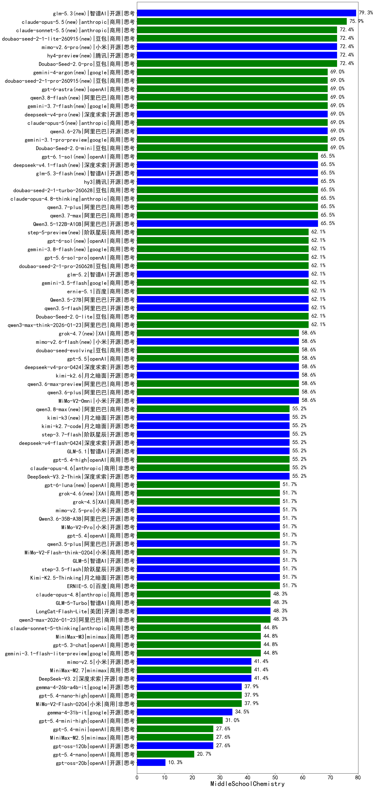

|类别|机构|大模型|【MiddleSchoolChemistry】准确率|平均耗时|平均消耗token|花费/千次（元）|排名（准确率）|
|---|---|-----|-------------------|-------|-----------|-----------|-----------|
|开源|智谱AI|glm-5.3(new)|79.3%|309s|3244|87.9|1|
|商用|anthropic|claude-opus-5.5(new)|75.9%|18s|705|71.9|2|
|商用|豆包|doubao-seed-2-1-lite-260915(new)|72.4%|34s|1467|3.7|3|
|开源|小米|mimo-v2.6-pro(new)|72.4%|41s|1772|10.2|4|
|开源|腾讯|hy4-preview(new)|72.4%|66s|3494|61.2|5|
|商用|anthropic|claude-sonnet-5.5(new)|72.4%|7s|647|31.9|6|
|开源|深度求索|deepseek-v4-pro|69.0%|45s|1900|47.5|7|
|开源|阿里巴巴|qwen3.6-27b|69.0%|39s|2509|43.1|8|
|商用|anthropic|claude-opus-5|69.0%|11s|803|107.2|9|
|商用|豆包|doubao-seed-2-1-pro-260915(new)|69.0%|42s|1354|36.4|10|
|商用|openAI|gpt-6-astra(new)|69.0%|12s|380|82.4|11|
|商用|google|gemini-3.7-flash|69.0%|5s|845|19.2|12|
|商用|google|gemini-3.1-pro-preview|69.0%|40s|1903|151.9|13|
|商用|google|gemini-4-argon(new)|69.0%|18s|502|51.7|14|
|商用|阿里巴巴|qwen3.8-flash(new)|69.0%|77s|2741|7.0|15|
|开源|深度求索|deepseek-v4.1-flash(new)|65.5%|17s|1723|12.8|16|
|商用|阿里巴巴|qwen3.7-plus|65.5%|52s|2844|21.9|17|
|商用|openAI|gpt-6.1-sol(new)|65.5%|5s|365|15.4|18|
|开源|阿里巴巴|Qwen3.5-122B-A10B|65.5%|152s|4115|25.6|19|
|开源|腾讯|hy3|65.5%|56s|420|1.3|20|
|商用|豆包|doubao-seed-2-1-turbo-260628|65.5%|120s|4740|69.0|21|
|开源|智谱AI|glm-5.3-flash(new)|65.5%|62s|2533|6.8|22|
|商用|anthropic|claude-opus-4.8-thinking|65.5%|14s|1241|183.9|23|
|商用|阿里巴巴|qwen3.7-max|65.5%|41s|2231|77.0|24|
|商用|openAI|gpt-5.6-sol-pro|62.1%|21s|4255|342.8|25|
|开源|智谱AI|glm-5.2|62.1%|66s|2905|78.4|26|
|商用|豆包|doubao-seed-2-1-pro-260628|62.1%|160s|6434|188.7|27|
|商用|google|gemini-3.8-flash(new)|62.1%|14s|869|39.6|28|
|商用|openAI|gpt-6-sol(new)|62.1%|298s|371|15.9|29|
|商用|google|gemini-3.5-flash|62.1%|10s|1985|117.5|30|
|开源|阿里巴巴|Qwen3.5-27B|62.1%|567s|5209|24.4|31|
|商用|百度|ernie-5.1|62.1%|43s|1398|23.3|32|
|商用|阶跃星辰|step-5-preview(new)|62.1%|30s|2176|41.7|33|
|商用|anthropic|claude-haiku-5.5(new)|58.6%|6s|904|2.5|34|
|商用|阿里巴巴|qwen3.6-plus|58.6%|64s|2870|33.1|35|
|商用|阿里巴巴|qwen3.6-max-preview|58.6%|76s|2207|112.9|36|
|开源|月之暗面|kimi-k2.6|58.6%|134s|3170|82.9|37|
|商用|XAI|grok-4.7(new)|58.6%|75s|6229|223.0|38|
|开源|深度求索|deepseek-v4-pro-0424|58.6%|50s|1379|31.5|39|
|商用|豆包|doubao-seed-evolving|58.6%|134s|6125|179.4|40|
|商用|openAI|gpt-5.5|58.6%|30s|673|109.8|41|
|开源|小米|mimo-v2.6-flash(new)|58.6%|119s|1471|2.8|42|
|开源|深度求索|deepseek-v4-flash-0424|55.2%|41s|1398|2.7|43|
|开源|月之暗面|kimi-k3|55.2%|46s|1233|106.4|44|
|商用|阿里巴巴|qwen3.8-max|55.2%|54s|2432|83.3|45|
|开源|智谱AI|GLM-5.1|55.2%|232s|2345|53.8|46|
|开源|月之暗面|kimi-k2.7-code|55.2%|34s|1229|30.4|47|
|开源|深度求索|DeepSeek-V3.2-Think|55.2%|228s|2149|6.3|48|
|开源|阶跃星辰|step-3.7-flash|55.2%|29s|2865|22.3|49|
|商用|openAI|gpt-6-luna(new)|51.7%|46s|797|2.3|50|
|商用|minimax|MiniMax-M3.1-Flash(new)|51.7%|36s|2404|8.6|51|
|商用|XAI|grok-4.6|51.7%|61s|2368|89.8|52|
|商用|XAI|grok-4.5|51.7%|94s|2604|99.8|53|
|开源|小米|mimo-v2.5-pro|51.7%|37s|1807|32.5|54|
|开源|阿里巴巴|Qwen3.6-35B-A3B|51.7%|13s|2357|24.2|55|
|商用|百度|ERNIE-5.0|51.7%|231s|3781|88.5|56|
|商用|anthropic|claude-opus-4.8|48.3%|8s|679|85.5|57|
|商用|anthropic|claude-sonnet-5-thinking|44.8%|22s|1655|102.5|58|
|商用|minimax|MiniMax-M3|44.8%|51s|1738|25.5|59|
|商用|google|gemini-3.1-flash-lite-preview|44.8%|65s|481|3.8|60|
|开源|小米|mimo-v2.5|41.4%|21s|1802|20.9|61|
|商用|minimax|MiniMax-M2.7|41.4%|65s|2816|22.6|62|
|开源|深度求索|DeepSeek-V3.2|41.4%|16s|555|1.5|63|
|开源|google|gemma-4-26b-a4b-it|37.9%|92s|632|1.5|64|
|开源|google|gemma-4-31b-it|34.5%|69s|630|1.5|65|
|开源|openAI|gpt-oss-120b|27.6%|30s|1138|3.1|66|
|开源|openAI|gpt-oss-20b|10.3%|141s|1685|1.8|67|

