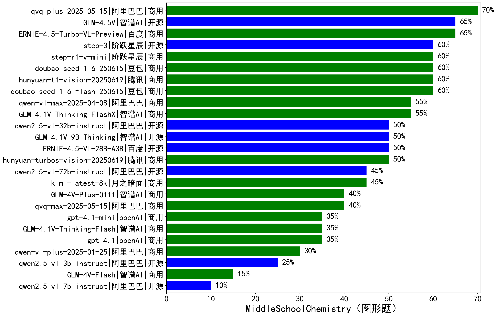

|类别|机构|大模型|【MiddleSchoolChemistry（图形题）】准确率|平均耗时|平均消耗token|花费/千次（元）|排名（准确率）|
|---|---|-----|-------------------|-------|-----------|-----------|-----------|
|商用|阿里巴巴|qvq-plus-2025-05-15|70.0%|870s|1802|7.5|1|
|商用|百度|ERNIE-4.5-Turbo-VL-Preview|65.0%|344s|1750|6.6|2|
|开源|智谱AI|GLM-4.5V|65.0%|313s|1168|4.9|3|
|商用|腾讯|hunyuan-t1-vision-20250619|60.0%|432s|1250|8.0|4|
|开源|阶跃星辰|step-3|60.0%|745s|1860|6.8|5|
|商用|豆包|doubao-seed-1-6-250615|60.0%|/|707|1.7|6|
|商用|阶跃星辰|step-r1-v-mini|60.0%|526s|2670|18.5|7|
|商用|豆包|doubao-seed-1-6-flash-250615|60.0%|/|814|0.5|8|
|商用|智谱AI|GLM-4.1V-Thinking-FlashX|55.0%|455s|1370|2.7|9|
|商用|阿里巴巴|qwen-vl-max-2025-04-08|55.0%|688s|839|4.4|10|
|开源|智谱AI|GLM-4.1V-9B-Thinking|50.0%|432s|1822|1.4|11|
|开源|百度|ERNIE-4.5-VL-28B-A3B|50.0%|399s|1110|2.8|12|
|商用|腾讯|hunyuan-turbos-vision-20250619|50.0%|536s|657|3.1|13|
|开源|阿里巴巴|qwen2.5-vl-32b-instruct|50.0%|335s|1017|1.9|14|
|开源|阿里巴巴|qwen2.5-vl-72b-instruct|45.0%|275s|647|2.7|15|
|商用|月之暗面|kimi-latest-8k|45.0%|528s|1213|14.6|16|
|商用|阿里巴巴|qvq-max-2025-05-15|40.0%|665s|1599|38.7|17|
|商用|智谱AI|GLM-4V-Plus-0111|40.0%|243s|681|2.7|18|
|商用|智谱AI|GLM-4.1V-Thinking-Flash|35.0%|17s|1340|0.0|19|
|商用|openAI|gpt-4.1-mini|35.0%|507s|644|3.6|20|
|商用|openAI|gpt-4.1|35.0%|291s|696|17.3|21|
|商用|阿里巴巴|qwen-vl-plus-2025-01-25|30.0%|373s|1063|3.2|22|
|开源|阿里巴巴|qwen2.5-vl-3b-instruct|25.0%|242s|593|0.9|23|
|商用|智谱AI|GLM-4V-Flash|15.0%|16s|960|0.0|24|
|开源|阿里巴巴|qwen2.5-vl-7b-instruct|10.0%|18s|878|0.3|25|

