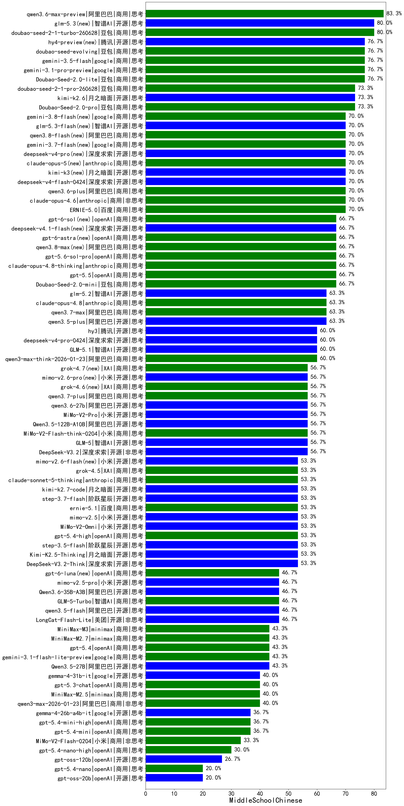

|类别|机构|大模型|【MiddleSchoolChinese】准确率|平均耗时|平均消耗token|花费/千次（元）|排名（准确率）|
|---|---|-----|-------------------|-------|-----------|-----------|-----------|
|商用|阿里巴巴|qwen3.6-max-preview|83.3%|96s|2899|148.1|1|
|商用|豆包|doubao-seed-2-1-turbo-260628|80.0%|260s|11351|167.6|2|
|开源|智谱AI|glm-5.3(new)|80.0%|416s|6061|165.9|3|
|商用|google|gemini-3.5-flash|76.7%|13s|2734|160.6|4|
|开源|腾讯|hy4-preview(new)|76.7%|212s|14126|252.0|5|
|商用|豆包|doubao-seed-evolving|76.7%|384s|12169|359.7|6|
|商用|google|gemini-3.1-pro-preview|76.7%|54s|3244|260.6|7|
|商用|豆包|Doubao-Seed-2.0-lite|76.7%|244s|1294|4.0|8|
|开源|月之暗面|kimi-k2.6|73.3%|172s|3635|94.5|9|
|商用|豆包|Doubao-Seed-2.0-pro|73.3%|274s|1433|20.0|10|
|商用|豆包|doubao-seed-2-1-pro-260628|73.3%|294s|13225|391.4|11|
|商用|阿里巴巴|qwen3.6-plus|70.0%|56s|2917|33.1|12|
|开源|月之暗面|kimi-k3(new)|70.0%|101s|2335|213.2|13|
|商用|anthropic|claude-opus-5(new)|70.0%|13s|926|122.4|14|
|开源|深度求索|deepseek-v4-flash-0424|70.0%|68s|3033|5.9|15|
|开源|深度求索|deepseek-v4-pro(new)|70.0%|70s|3207|82.0|16|
|商用|google|gemini-3.7-flash(new)|70.0%|21s|1051|22.9|17|
|商用|阿里巴巴|qwen3.8-flash(new)|70.0%|35s|2441|6.1|18|
|开源|智谱AI|glm-5.3-flash(new)|70.0%|199s|7019|19.3|19|
|商用|google|gemini-3.8-flash(new)|70.0%|15s|1332|60.6|20|
|商用|anthropic|claude-opus-4.6|70.0%|17s|1061|145.8|21|
|商用|百度|ERNIE-5.0|70.0%|175s|4184|97.5|22|
|商用|openAI|gpt-6-astra(new)|66.7%|17s|459|97.1|23|
|商用|anthropic|claude-opus-4.8-thinking|66.7%|32s|2135|334.0|24|
|商用|豆包|Doubao-Seed-2.0-mini|66.7%|552s|3552|6.7|25|
|开源|深度求索|deepseek-v4.1-flash(new)|66.7%|20s|2821|21.4|26|
|商用|openAI|gpt-5.6-sol-pro|66.7%|25s|5410|472.9|27|
|商用|openAI|gpt-5.5|66.7%|11s|865|141.8|28|
|商用|阿里巴巴|qwen3.8-max(new)|66.7%|80s|3500|120.6|29|
|商用|openAI|gpt-6-sol(new)|66.7%|291s|505|22.6|30|
|开源|智谱AI|glm-5.2|63.3%|115s|5316|145.1|31|
|开源|阿里巴巴|qwen3.5-plus|63.3%|54s|4510|20.9|32|
|商用|anthropic|claude-opus-4.8|63.3%|7s|643|72.9|33|
|商用|阿里巴巴|qwen3.7-max|63.3%|83s|3939|137.3|34|
|开源|智谱AI|GLM-5.1|60.0%|354s|3994|92.6|35|
|商用|阿里巴巴|qwen3-max-think-2026-01-23|60.0%|259s|5635|54.8|36|
|开源|腾讯|hy3|60.0%|61s|542|1.6|37|
|开源|深度求索|deepseek-v4-pro-0424|60.0%|102s|3786|88.8|38|
|开源|小米|mimo-v2.6-pro(new)|56.7%|121s|5244|30.9|39|
|开源|阿里巴巴|qwen3.6-27b|56.7%|49s|3045|52.0|40|
|商用|阿里巴巴|qwen3.7-plus|56.7%|101s|5148|40.1|41|
|商用|XAI|grok-4.6(new)|56.7%|462s|4807|190.9|42|
|商用|XAI|grok-4.7(new)|56.7%|173s|12425|481.9|43|
|开源|深度求索|DeepSeek-V3.2|56.7%|121s|600|1.6|44|
|开源|阿里巴巴|Qwen3.5-122B-A10B|56.7%|151s|5215|32.3|45|
|商用|小米|MiMo-V2-Flash-think-0204|56.7%|629s|3502|7.0|46|
|开源|智谱AI|GLM-5|56.7%|231s|4065|70.7|47|
|开源|小米|MiMo-V2-Pro|56.7%|320s|2281|41.7|48|
|商用|XAI|grok-4.5|53.3%|123s|7235|292.8|49|
|开源|小米|mimo-v2.5|53.3%|53s|3050|37.8|50|
|商用|anthropic|claude-sonnet-5-thinking|53.3%|22s|1680|101.8|51|
|开源|月之暗面|kimi-k2.7-code|53.3%|70s|2847|73.3|52|
|开源|阶跃星辰|step-3.7-flash|53.3%|58s|5078|39.9|53|
|开源|阶跃星辰|step-3.5-flash|53.3%|45s|5432|11.2|54|
|开源|月之暗面|Kimi-K2.5-Thinking|53.3%|673s|3456|69.6|55|
|开源|小米|MiMo-V2-Omni|53.3%|443s|3881|49.4|56|
|开源|深度求索|DeepSeek-V3.2-Think|53.3%|222s|2397|7.0|57|
|商用|百度|ernie-5.1|53.3%|64s|2412|40.8|58|
|开源|小米|mimo-v2.6-flash(new)|53.3%|373s|2281|4.4|59|
|商用|openAI|gpt-5.4-high|53.3%|30s|1408|127.9|60|
|开源|美团|LongCat-Flash-Lite|46.7%|394s|1110|0.0|61|
|开源|阿里巴巴|qwen3.5-flash|46.7%|585s|5641|10.9|62|
|商用|openAI|gpt-6-luna(new)|46.7%|276s|1088|3.2|63|
|开源|小米|mimo-v2.5-pro|46.7%|72s|3373|64.6|64|
|商用|智谱AI|GLM-5-Turbo|46.7%|61s|2831|59.2|65|
|开源|阿里巴巴|Qwen3.6-35B-A3B|46.7%|18s|3192|32.8|66|
|商用|openAI|gpt-5.4|43.3%|6s|473|29.8|67|
|商用|minimax|MiniMax-M2.7|43.3%|118s|5005|40.7|68|
|商用|google|gemini-3.1-flash-lite-preview|43.3%|5s|558|3.9|69|
|开源|阿里巴巴|Qwen3.5-27B|43.3%|579s|5069|23.5|70|
|商用|minimax|MiniMax-M3|43.3%|115s|3731|58.4|71|
|开源|google|gemma-4-31b-it|40.0%|115s|710|1.6|72|
|商用|阿里巴巴|qwen3-max-2026-01-23|40.0%|114s|1546|13.9|73|
|商用|minimax|MiniMax-M2.5|40.0%|70s|3631|29.2|74|
|商用|openAI|gpt-5.3-chat|40.0%|17s|709|50.0|75|
|商用|openAI|gpt-5.4-mini-high|36.7%|109s|3027|89.4|76|
|开源|google|gemma-4-26b-a4b-it|36.7%|40s|886|2.0|77|
|商用|openAI|gpt-5.4-mini|36.7%|9s|436|7.8|78|
|商用|小米|MiMo-V2-Flash-0204|33.3%|378s|850|1.5|79|
|商用|openAI|gpt-5.4-nano-high|30.0%|35s|1989|15.7|80|
|开源|openAI|gpt-oss-120b|26.7%|8s|1475|4.1|81|
|商用|openAI|gpt-5.4-nano|20.0%|73s|465|2.4|82|
|开源|openAI|gpt-oss-20b|20.0%|164s|3275|3.6|83|

