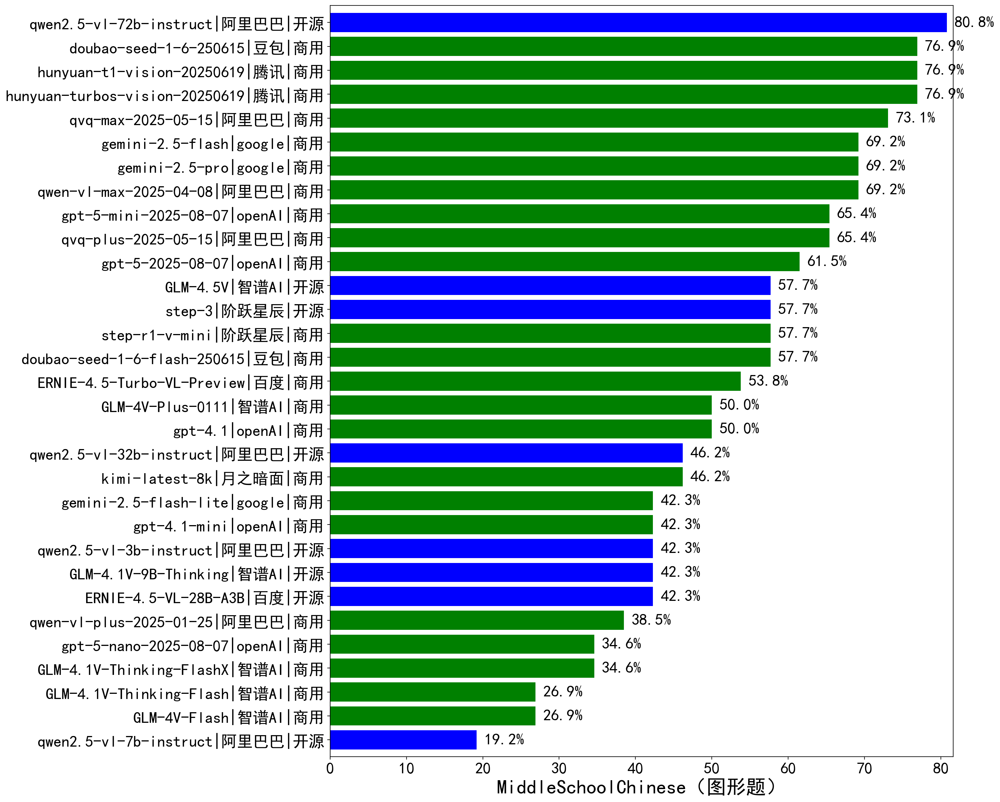

|类别|机构|大模型|【MiddleSchoolChinese（图形题）】准确率|平均耗时|平均消耗token|花费/千次（元）|排名（准确率）|
|---|---|-----|-------------------|-------|-----------|-----------|-----------|
|开源|阿里巴巴|qwen2.5-vl-72b-instruct|80.8%|535s|1338|5.5|1|
|商用|腾讯|hunyuan-turbos-vision-20250619|76.9%|572s|1575|6.5|2|
|商用|腾讯|hunyuan-t1-vision-20250619|76.9%|710s|2598|15.4|3|
|商用|豆包|doubao-seed-1-6-250615|76.9%|/|1282|1.5|4|
|商用|阿里巴巴|qvq-max-2025-05-15|73.1%|836s|2357|47.0|5|
|商用|阿里巴巴|qwen-vl-max-2025-08-13|69.2%|34s|1925|5.1|6|
|商用|google|gemini-2.5-flash|69.2%|147s|4020|56.0|7|
|商用|google|gemini-2.5-pro|69.2%|147s|3466|184.2|8|
|商用|阿里巴巴|qwen-vl-max-2025-04-08|69.2%|597s|1592|7.2|9|
|商用|openAI|gpt-5-mini-2025-08-07|65.4%|161s|2290|18.3|10|
|商用|阿里巴巴|qvq-plus-2025-05-15|65.4%|847s|2736|10.1|11|
|商用|openAI|gpt-5-2025-08-07|61.5%|176s|2229|77.3|12|
|商用|豆包|doubao-seed-1-6-flash-250615|57.7%|/|1470|0.6|13|
|开源|智谱AI|GLM-4.5V|57.7%|383s|2438|9.9|14|
|开源|阶跃星辰|step-3|57.7%|767s|3188|10.6|15|
|开源|智谱AI|GLM-4.6V|57.7%|18s|1795|3.0|16|
|商用|阶跃星辰|step-r1-v-mini|57.7%|481s|3114|18.3|17|
|商用|百度|ERNIE-4.5-Turbo-VL-Preview|53.8%|369s|2617|9.6|18|
|开源|智谱AI|GLM-4.6V-Flash|50.0%|23s|3079|0.0|19|
|商用|智谱AI|GLM-4V-Plus-0111|50.0%|177s|1446|5.8|20|
|商用|openAI|gpt-4.1|50.0%|414s|1567|34.7|21|
|开源|阿里巴巴|qwen2.5-vl-32b-instruct|46.2%|438s|1828|3.5|22|
|商用|阿里巴巴|qwen-vl-plus-2025-08-15|46.2%|8s|1545|1.8|23|
|商用|月之暗面|kimi-latest-8k|46.2%|276s|2095|25.1|24|
|商用|google|gemini-2.5-flash-lite|42.3%|133s|1323|1.5|25|
|开源|百度|ERNIE-4.5-VL-28B-A3B|42.3%|453s|1520|2.3|26|
|开源|智谱AI|GLM-4.1V-9B-Thinking|42.3%|865s|3187|2.3|27|
|开源|阿里巴巴|qwen2.5-vl-3b-instruct|42.3%|545s|1260|1.7|28|
|商用|openAI|gpt-4.1-mini|42.3%|678s|1537|7.6|29|
|商用|阿里巴巴|qwen-vl-plus-2025-01-25|38.5%|576s|1411|2.8|30|
|商用|openAI|gpt-5-nano-2025-08-07|34.6%|152s|3704|7.8|31|
|商用|智谱AI|GLM-4.1V-Thinking-FlashX|34.6%|603s|2296|4.6|32|
|商用|智谱AI|GLM-4V-Flash|26.9%|14s|1722|0.0|33|
|商用|智谱AI|GLM-4.1V-Thinking-Flash|26.9%|38s|2433|0.0|34|
|开源|阿里巴巴|qwen2.5-vl-7b-instruct|19.2%|14s|1718|0.6|35|

