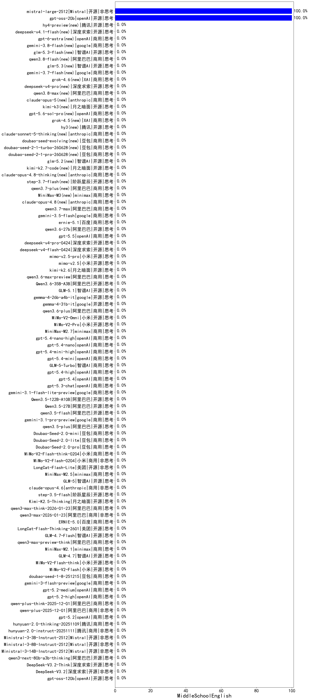

|类别|机构|大模型|【MiddleSchoolEnglish】准确率|平均耗时|平均消耗token|花费/千次（元）|排名（准确率）|
|---|---|-----|-------------------|-------|-----------|-----------|-----------|
|开源|openAI|gpt-oss-20b|100.0%|309s|473|0.5|1|
|开源|Mistral|mistral-large-2512|100.0%|13s|462|4.5|2|
|开源|小米|mimo-v2.5-pro|0.0%|14s|887|14.3|3|
|商用|阿里巴巴|qwen3.7-plus(new)|0.0%|15s|791|5.9|4|
|商用|minimax|MiniMax-M3(new)|0.0%|21s|662|8.1|5|
|商用|anthropic|claude-opus-4.8(new)|0.0%|8s|425|61.8|6|
|商用|阿里巴巴|qwen3.7-max|0.0%|46s|942|32.2|7|
|商用|google|gemini-3.5-flash|0.0%|8s|1294|78.0|8|
|商用|百度|ernie-5.1|0.0%|55s|2417|42.6|9|
|开源|阿里巴巴|qwen3.6-27b|0.0%|31s|1627|28.2|10|
|商用|openAI|gpt-5.5|0.0%|6s|310|53.4|11|
|开源|深度求索|deepseek-v4-pro-0424|0.0%|22s|593|13.5|12|
|开源|深度求索|deepseek-v4-flash-0424|0.0%|7s|403|0.7|13|
|开源|小米|mimo-v2.5|0.0%|12s|1293|14.7|14|
|商用|anthropic|claude-opus-4.8-thinking(new)|0.0%|11s|543|82.4|15|
|开源|月之暗面|kimi-k2.6|0.0%|42s|801|20.3|16|
|商用|阿里巴巴|qwen3.6-max-preview|0.0%|43s|1552|80.6|17|
|开源|阿里巴巴|Qwen3.6-35B-A3B|0.0%|8s|1178|12.1|18|
|开源|智谱AI|GLM-5.1|0.0%|168s|996|22.7|19|
|开源|google|gemma-4-26b-a4b-it|0.0%|29s|565|1.4|20|
|开源|google|gemma-4-31b-it|0.0%|37s|485|1.2|21|
|商用|阿里巴巴|qwen3.6-plus|0.0%|18s|1220|13.9|22|
|开源|小米|MiMo-V2-Omni|0.0%|250s|642|5.5|23|
|开源|小米|MiMo-V2-Pro|0.0%|255s|827|13.0|24|
|商用|minimax|MiniMax-M2.7|0.0%|38s|1401|11.1|25|
|开源|阶跃星辰|step-3.7-flash(new)|0.0%|10s|910|6.9|26|
|开源|openAI|gpt-oss-120b|0.0%|1s|362|0.9|27|
|商用|openAI|gpt-5.4-nano-high|0.0%|28s|157|0.9|28|
|开源|智谱AI|glm-5.2(new)|0.0%|34s|1439|38.9|29|
|开源|小米|mimo-v2.6-pro(new)|0.0%|13s|547|3.1|30|
|开源|腾讯|hy4-preview(new)|0.0%|146s|10983|196.7|31|
|开源|深度求索|deepseek-v4.1-flash(new)|0.0%|29s|5511|43.5|32|
|商用|openAI|gpt-6-astra(new)|0.0%|7s|162|37.9|33|
|商用|google|gemini-3.8-flash(new)|0.0%|15s|830|40.8|34|
|开源|智谱AI|glm-5.3-flash(new)|0.0%|29s|1157|3.1|35|
|商用|阿里巴巴|qwen3.8-flash(new)|0.0%|73s|2535|6.6|36|
|开源|智谱AI|glm-5.3(new)|0.0%|18s|584|14.9|37|
|商用|google|gemini-3.7-flash(new)|0.0%|15s|846|20.8|38|
|商用|XAI|grok-4.6(new)|0.0%|47s|862|28.6|39|
|开源|深度求索|deepseek-v4-pro(new)|0.0%|26s|745|17.5|40|
|商用|阿里巴巴|qwen3.8-max(new)|0.0%|9s|387|11.3|41|
|商用|anthropic|claude-opus-5(new)|0.0%|11s|482|71.8|42|
|开源|月之暗面|kimi-k3(new)|0.0%|77s|2223|210.7|43|
|商用|openAI|gpt-5.6-sol-pro(new)|0.0%|21s|2759|201.6|44|
|商用|XAI|grok-4.5(new)|0.0%|83s|837|27.6|45|
|开源|腾讯|hy3(new)|0.0%|130s|228|0.7|46|
|商用|anthropic|claude-sonnet-5-thinking(new)|0.0%|11s|530|32.1|47|
|商用|豆包|doubao-seed-evolving(new)|0.0%|179s|9153|272.0|48|
|商用|豆包|doubao-seed-2-1-turbo-260628(new)|0.0%|211s|12985|193.5|49|
|商用|豆包|doubao-seed-2-1-pro-260628(new)|0.0%|292s|16899|504.4|50|
|开源|月之暗面|kimi-k2.7-code(new)|0.0%|10s|492|11.9|51|
|商用|openAI|gpt-5.4-mini-high|0.0%|21s|318|8.3|52|
|商用|openAI|gpt-5.4-nano|0.0%|86s|131|0.7|53|
|商用|百度|ERNIE-5.0|0.0%|59s|1111|25.5|54|
|开源|智谱AI|GLM-4.7-Flash|0.0%|4039s|1799|0.0|55|
|商用|阿里巴巴|qwen3-max-preview-think|0.0%|173s|1687|39.2|56|
|商用|minimax|MiniMax-M2.1|0.0%|169s|1643|13.2|57|
|开源|智谱AI|GLM-4.7|0.0%|37s|1387|18.7|58|
|开源|小米|MiMo-V2-Flash-think|0.0%|42s|2018|0.0|59|
|开源|小米|MiMo-V2-Flash|0.0%|6s|376|0.0|60|
|商用|豆包|doubao-seed-1-8-251215|0.0%|19s|557|3.7|61|
|商用|google|gemini-3-flash-preview|0.0%|50s|964|19.3|62|
|商用|openAI|gpt-5.2-medium|0.0%|16s|539|47.7|63|
|商用|openAI|gpt-5.2-high|0.0%|7s|363|30.3|64|
|商用|阿里巴巴|qwen-plus-think-2025-12-01|0.0%|40s|2195|17.1|65|
|商用|阿里巴巴|qwen-plus-2025-12-01|0.0%|25s|830|1.6|66|
|商用|openAI|gpt-5.2|0.0%|4s|181|12.2|67|
|商用|腾讯|hunyuan-2.0-thinking-20251109|0.0%|25s|562|2.1|68|
|商用|腾讯|hunyuan-2.0-instruct-20251111|0.0%|4s|424|0.7|69|
|开源|Mistral|Ministral-3-3B-Instruct-2512|0.0%|1s|261|0.2|70|
|开源|Mistral|Ministral-3-8B-Instruct-2512|0.0%|1s|247|0.3|71|
|开源|Mistral|Ministral-3-14B-Instruct-2512|0.0%|4s|357|0.5|72|
|开源|阿里巴巴|qwen3-next-80b-a3b-thinking|0.0%|245s|3449|13.6|73|
|开源|深度求索|DeepSeek-V3.2-Think|0.0%|24s|756|2.2|74|
|开源|深度求索|DeepSeek-V3.2|0.0%|5s|187|0.5|75|
|开源|美团|LongCat-Flash-Thinking-2601|0.0%|51s|762|0.0|76|
|商用|阿里巴巴|qwen3-max-2026-01-23|0.0%|530s|451|4.0|77|
|商用|openAI|gpt-5.4-mini|0.0%|18s|276|6.9|78|
|商用|阿里巴巴|qwen3-max-think-2026-01-23|0.0%|279s|6406|63.5|79|
|商用|智谱AI|GLM-5-Turbo|0.0%|41s|1164|24.5|80|
|商用|openAI|gpt-5.4-high|0.0%|6s|367|32.7|81|
|商用|openAI|gpt-5.4|0.0%|5s|322|27.9|82|
|商用|openAI|gpt-5.3-chat|0.0%|98s|294|23.1|83|
|商用|google|gemini-3.1-flash-lite-preview|0.0%|3s|319|2.8|84|
|开源|阿里巴巴|Qwen3.5-122B-A10B|0.0%|39s|1072|6.5|85|
|开源|阿里巴巴|Qwen3.5-27B|0.0%|305s|2224|10.4|86|
|开源|阿里巴巴|qwen3.5-flash|0.0%|62s|1322|2.5|87|
|商用|google|gemini-3.1-pro-preview|0.0%|39s|1216|98.8|88|
|开源|阿里巴巴|qwen3.5-plus|0.0%|16s|1256|5.7|89|
|商用|豆包|Doubao-Seed-2.0-mini|0.0%|272s|1627|3.1|90|
|商用|豆包|Doubao-Seed-2.0-lite|0.0%|203s|653|2.0|91|
|商用|豆包|Doubao-Seed-2.0-pro|0.0%|794s|3607|56.3|92|
|商用|小米|MiMo-V2-Flash-think-0204|0.0%|71s|1428|2.9|93|
|商用|小米|MiMo-V2-Flash-0204|0.0%|106s|512|1.0|94|
|开源|美团|LongCat-Flash-Lite|0.0%|407s|364|0.0|95|
|商用|minimax|MiniMax-M2.5|0.0%|14s|749|5.7|96|
|开源|智谱AI|GLM-5|0.0%|32s|1535|26.7|97|
|商用|anthropic|claude-opus-4.6|0.0%|25s|302|41.9|98|
|开源|阶跃星辰|step-3.5-flash|0.0%|30s|1925|3.9|99|
|开源|月之暗面|Kimi-K2.5-Thinking|0.0%|271s|1391|28.1|100|
|开源|小米|mimo-v2.6-flash(new)|0.0%|191s|556|1.0|101|

