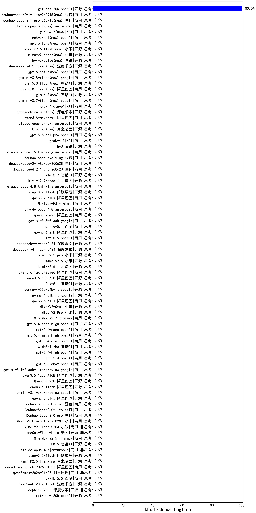

|类别|机构|大模型|【MiddleSchoolEnglish】准确率|平均耗时|平均消耗token|花费/千次（元）|排名（准确率）|
|---|---|-----|-------------------|-------|-----------|-----------|-----------|
|开源|openAI|gpt-oss-20b|100.0%|309s|473|0.5|1|
|商用|openAI|gpt-5.6-sol-pro|0.0%|21s|2759|201.6|2|
|商用|XAI|grok-4.5|0.0%|83s|837|27.6|3|
|开源|腾讯|hy3|0.0%|130s|228|0.7|4|
|商用|anthropic|claude-sonnet-5-thinking|0.0%|11s|530|32.1|5|
|商用|豆包|doubao-seed-evolving|0.0%|179s|9153|272.0|6|
|商用|豆包|doubao-seed-2-1-turbo-260628|0.0%|211s|12985|193.5|7|
|商用|豆包|doubao-seed-2-1-pro-260628|0.0%|292s|16899|504.4|8|
|开源|智谱AI|glm-5.2|0.0%|34s|1439|38.9|9|
|开源|月之暗面|kimi-k2.7-code|0.0%|10s|492|11.9|10|
|商用|anthropic|claude-opus-4.8-thinking|0.0%|11s|543|82.4|11|
|开源|openAI|gpt-oss-120b|0.0%|1s|362|0.9|12|
|商用|阿里巴巴|qwen3.7-plus|0.0%|15s|791|5.9|13|
|商用|minimax|MiniMax-M3|0.0%|21s|662|8.1|14|
|商用|anthropic|claude-opus-4.8|0.0%|8s|425|61.8|15|
|商用|阿里巴巴|qwen3.7-max|0.0%|46s|942|32.2|16|
|商用|google|gemini-3.5-flash|0.0%|8s|1294|78.0|17|
|商用|百度|ernie-5.1|0.0%|55s|2417|42.6|18|
|开源|阿里巴巴|qwen3.6-27b|0.0%|31s|1627|28.2|19|
|商用|openAI|gpt-5.5|0.0%|6s|310|53.4|20|
|开源|深度求索|deepseek-v4-pro-0424|0.0%|22s|593|13.5|21|
|开源|阶跃星辰|step-3.7-flash|0.0%|10s|910|6.9|22|
|开源|月之暗面|kimi-k3(new)|0.0%|77s|2223|210.7|23|
|商用|anthropic|claude-opus-5(new)|0.0%|11s|482|71.8|24|
|商用|阿里巴巴|qwen3.8-max(new)|0.0%|9s|387|11.3|25|
|商用|豆包|doubao-seed-2-1-pro-260915(new)|0.0%|45s|1462|41.3|26|
|商用|anthropic|claude-opus-5.5(new)|0.0%|10s|561|68.2|27|
|商用|XAI|grok-4.7(new)|0.0%|42s|2183|55.1|28|
|商用|openAI|gpt-6-sol(new)|0.0%|2174s|431|26.4|29|
|商用|openAI|gpt-6-luna(new)|0.0%|221s|188|0.5|30|
|开源|小米|mimo-v2.6-flash(new)|0.0%|191s|556|1.0|31|
|开源|小米|mimo-v2.6-pro(new)|0.0%|13s|547|3.1|32|
|开源|腾讯|hy4-preview(new)|0.0%|146s|10983|196.7|33|
|开源|深度求索|deepseek-v4.1-flash(new)|0.0%|29s|5511|43.5|34|
|商用|openAI|gpt-6-astra(new)|0.0%|7s|162|37.9|35|
|商用|google|gemini-3.8-flash(new)|0.0%|15s|830|40.8|36|
|开源|智谱AI|glm-5.3-flash(new)|0.0%|29s|1157|3.1|37|
|商用|阿里巴巴|qwen3.8-flash(new)|0.0%|73s|2535|6.6|38|
|开源|智谱AI|glm-5.3(new)|0.0%|18s|584|14.9|39|
|商用|google|gemini-3.7-flash(new)|0.0%|15s|846|20.8|40|
|商用|XAI|grok-4.6(new)|0.0%|47s|862|28.6|41|
|开源|深度求索|deepseek-v4-pro(new)|0.0%|26s|745|17.5|42|
|开源|深度求索|deepseek-v4-flash-0424|0.0%|7s|403|0.7|43|
|开源|小米|mimo-v2.5-pro|0.0%|14s|887|14.3|44|
|开源|小米|mimo-v2.5|0.0%|12s|1293|14.7|45|
|商用|minimax|MiniMax-M2.5|0.0%|14s|749|5.7|46|
|商用|google|gemini-3.1-pro-preview|0.0%|39s|1216|98.8|47|
|开源|阿里巴巴|qwen3.5-plus|0.0%|16s|1256|5.7|48|
|商用|豆包|Doubao-Seed-2.0-mini|0.0%|272s|1627|3.1|49|
|商用|豆包|Doubao-Seed-2.0-lite|0.0%|203s|653|2.0|50|
|商用|豆包|Doubao-Seed-2.0-pro|0.0%|794s|3607|56.3|51|
|商用|小米|MiMo-V2-Flash-think-0204|0.0%|71s|1428|2.9|52|
|商用|小米|MiMo-V2-Flash-0204|0.0%|106s|512|1.0|53|
|开源|美团|LongCat-Flash-Lite|0.0%|407s|364|0.0|54|
|开源|智谱AI|GLM-5|0.0%|32s|1535|26.7|55|
|开源|月之暗面|kimi-k2.6|0.0%|42s|801|20.3|56|
|商用|anthropic|claude-opus-4.6|0.0%|25s|302|41.9|57|
|开源|阶跃星辰|step-3.5-flash|0.0%|30s|1925|3.9|58|
|开源|月之暗面|Kimi-K2.5-Thinking|0.0%|271s|1391|28.1|59|
|商用|阿里巴巴|qwen3-max-think-2026-01-23|0.0%|279s|6406|63.5|60|
|商用|阿里巴巴|qwen3-max-2026-01-23|0.0%|530s|451|4.0|61|
|商用|百度|ERNIE-5.0|0.0%|59s|1111|25.5|62|
|开源|深度求索|DeepSeek-V3.2-Think|0.0%|24s|756|2.2|63|
|开源|深度求索|DeepSeek-V3.2|0.0%|5s|187|0.5|64|
|开源|阿里巴巴|qwen3.5-flash|0.0%|62s|1322|2.5|65|
|开源|阿里巴巴|Qwen3.5-27B|0.0%|305s|2224|10.4|66|
|开源|阿里巴巴|Qwen3.5-122B-A10B|0.0%|39s|1072|6.5|67|
|商用|google|gemini-3.1-flash-lite-preview|0.0%|3s|319|2.8|68|
|商用|阿里巴巴|qwen3.6-max-preview|0.0%|43s|1552|80.6|69|
|开源|阿里巴巴|Qwen3.6-35B-A3B|0.0%|8s|1178|12.1|70|
|开源|智谱AI|GLM-5.1|0.0%|168s|996|22.7|71|
|开源|google|gemma-4-26b-a4b-it|0.0%|29s|565|1.4|72|
|开源|google|gemma-4-31b-it|0.0%|37s|485|1.2|73|
|商用|阿里巴巴|qwen3.6-plus|0.0%|18s|1220|13.9|74|
|开源|小米|MiMo-V2-Omni|0.0%|250s|642|5.5|75|
|开源|小米|MiMo-V2-Pro|0.0%|255s|827|13.0|76|
|商用|minimax|MiniMax-M2.7|0.0%|38s|1401|11.1|77|
|商用|openAI|gpt-5.4-nano-high|0.0%|28s|157|0.9|78|
|商用|openAI|gpt-5.4-nano|0.0%|86s|131|0.7|79|
|商用|openAI|gpt-5.4-mini-high|0.0%|21s|318|8.3|80|
|商用|openAI|gpt-5.4-mini|0.0%|18s|276|6.9|81|
|商用|智谱AI|GLM-5-Turbo|0.0%|41s|1164|24.5|82|
|商用|openAI|gpt-5.4-high|0.0%|6s|367|32.7|83|
|商用|openAI|gpt-5.4|0.0%|5s|322|27.9|84|
|商用|openAI|gpt-5.3-chat|0.0%|98s|294|23.1|85|
|商用|豆包|doubao-seed-2-1-lite-260915(new)|0.0%|108s|5010|13.4|86|

