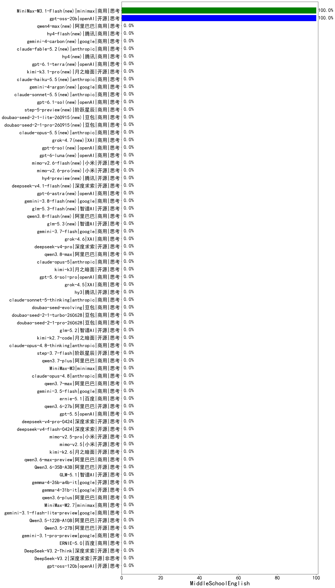

|类别|机构|大模型|【MiddleSchoolEnglish】准确率|平均耗时|平均消耗token|花费/千次（元）|排名（准确率）|
|---|---|-----|-------------------|-------|-----------|-----------|-----------|
|商用|minimax|MiniMax-M3.1-Flash(new)|100.0%|53s|2847|10.6|1|
|开源|openAI|gpt-oss-20b|100.0%|309s|473|0.5|2|
|开源|月之暗面|kimi-k3|0.0%|77s|2223|210.7|3|
|商用|anthropic|claude-opus-5|0.0%|11s|482|71.8|4|
|商用|openAI|gpt-6-luna|0.0%|221s|188|0.5|5|
|开源|小米|mimo-v2.6-flash|0.0%|191s|556|1.0|6|
|开源|小米|mimo-v2.6-pro|0.0%|13s|547|3.1|7|
|开源|腾讯|hy4-preview|0.0%|146s|10983|196.7|8|
|开源|深度求索|deepseek-v4.1-flash|0.0%|29s|5511|43.5|9|
|商用|openAI|gpt-6-astra|0.0%|7s|162|37.9|10|
|商用|google|gemini-3.8-flash|0.0%|15s|830|40.8|11|
|开源|智谱AI|glm-5.3-flash|0.0%|29s|1157|3.1|12|
|商用|openAI|gpt-6-sol|0.0%|2174s|431|26.4|13|
|商用|阿里巴巴|qwen3.8-flash|0.0%|73s|2535|6.6|14|
|开源|智谱AI|glm-5.3|0.0%|18s|584|14.9|15|
|商用|google|gemini-3.7-flash|0.0%|15s|846|20.8|16|
|商用|XAI|grok-4.6|0.0%|47s|862|28.6|17|
|开源|深度求索|deepseek-v4-pro|0.0%|26s|745|17.5|18|
|商用|阿里巴巴|qwen3.8-max|0.0%|9s|387|11.3|19|
|开源|openAI|gpt-oss-120b|0.0%|1s|362|0.9|20|
|商用|XAI|grok-4.7|0.0%|42s|2183|55.1|21|
|商用|anthropic|claude-opus-5.5(new)|0.0%|10s|561|68.2|22|
|商用|openAI|gpt-6.1-terra(new)|0.0%|14s|334|9.8|23|
|商用|openAI|gpt-6.2-astra(new)|0.0%|7s|159|29.5|24|
|商用|阿里巴巴|qwen4-max(new)|0.0%|15s|505|13.5|25|
|商用|腾讯|hy4-flash(new)|0.0%|6s|680|1.2|26|
|商用|google|gemini-4-carbon(new)|0.0%|25s|1139|148.7|27|
|商用|anthropic|claude-fable-5.2(new)|0.0%|30s|770|195.0|28|
|商用|腾讯|hy4(new)|0.0%|108s|5285|94.2|29|
|开源|月之暗面|kimi-k3.1-pro(new)|0.0%|69s|2315|149.4|30|
|商用|豆包|doubao-seed-2-1-pro-260915(new)|0.0%|45s|1462|41.3|31|
|商用|anthropic|claude-haiku-5.5(new)|0.0%|5s|504|1.5|32|
|商用|google|gemini-4-argon(new)|0.0%|29s|335|36.1|33|
|商用|anthropic|claude-sonnet-5.5(new)|0.0%|6s|330|17.9|34|
|商用|openAI|gpt-6.1-sol(new)|0.0%|5s|170|8.1|35|
|商用|阶跃星辰|step-5-preview(new)|0.0%|50s|3110|61.3|36|
|商用|豆包|doubao-seed-2-1-lite-260915(new)|0.0%|108s|5010|13.4|37|
|商用|openAI|gpt-5.6-sol-pro|0.0%|21s|2759|201.6|38|
|商用|XAI|grok-4.5|0.0%|83s|837|27.6|39|
|开源|腾讯|hy3|0.0%|130s|228|0.7|40|
|开源|小米|mimo-v2.5-pro|0.0%|14s|887|14.3|41|
|开源|月之暗面|kimi-k2.6|0.0%|42s|801|20.3|42|
|商用|阿里巴巴|qwen3.6-max-preview|0.0%|43s|1552|80.6|43|
|开源|阿里巴巴|Qwen3.6-35B-A3B|0.0%|8s|1178|12.1|44|
|开源|智谱AI|GLM-5.1|0.0%|168s|996|22.7|45|
|开源|google|gemma-4-26b-a4b-it|0.0%|29s|565|1.4|46|
|开源|google|gemma-4-31b-it|0.0%|37s|485|1.2|47|
|商用|阿里巴巴|qwen3.6-plus|0.0%|18s|1220|13.9|48|
|商用|minimax|MiniMax-M2.7|0.0%|38s|1401|11.1|49|
|商用|google|gemini-3.1-flash-lite-preview|0.0%|3s|319|2.8|50|
|开源|阿里巴巴|Qwen3.5-122B-A10B|0.0%|39s|1072|6.5|51|
|开源|阿里巴巴|Qwen3.5-27B|0.0%|305s|2224|10.4|52|
|商用|google|gemini-3.1-pro-preview|0.0%|39s|1216|98.8|53|
|商用|百度|ERNIE-5.0|0.0%|59s|1111|25.5|54|
|开源|深度求索|DeepSeek-V3.2-Think|0.0%|24s|756|2.2|55|
|开源|深度求索|DeepSeek-V3.2|0.0%|5s|187|0.5|56|
|开源|小米|mimo-v2.5|0.0%|12s|1293|14.7|57|
|开源|深度求索|deepseek-v4-flash-0424|0.0%|7s|403|0.7|58|
|商用|anthropic|claude-sonnet-5-thinking|0.0%|11s|530|32.1|59|
|开源|深度求索|deepseek-v4-pro-0424|0.0%|22s|593|13.5|60|
|商用|豆包|doubao-seed-evolving|0.0%|179s|9153|272.0|61|
|商用|豆包|doubao-seed-2-1-turbo-260628|0.0%|211s|12985|193.5|62|
|商用|豆包|doubao-seed-2-1-pro-260628|0.0%|292s|16899|504.4|63|
|开源|智谱AI|glm-5.2|0.0%|34s|1439|38.9|64|
|开源|月之暗面|kimi-k2.7-code|0.0%|10s|492|11.9|65|
|商用|anthropic|claude-opus-4.8-thinking|0.0%|11s|543|82.4|66|
|开源|阶跃星辰|step-3.7-flash|0.0%|10s|910|6.9|67|
|商用|阿里巴巴|qwen3.7-plus|0.0%|15s|791|5.9|68|
|商用|minimax|MiniMax-M3|0.0%|21s|662|8.1|69|
|商用|anthropic|claude-opus-4.8|0.0%|8s|425|61.8|70|
|商用|阿里巴巴|qwen3.7-max|0.0%|46s|942|32.2|71|
|商用|google|gemini-3.5-flash|0.0%|8s|1294|78.0|72|
|商用|百度|ernie-5.1|0.0%|55s|2417|42.6|73|
|开源|阿里巴巴|qwen3.6-27b|0.0%|31s|1627|28.2|74|
|商用|openAI|gpt-5.5|0.0%|6s|310|53.4|75|
|商用|openAI|gpt-6.2-sol(new)|0.0%|6s|149|6.7|76|

