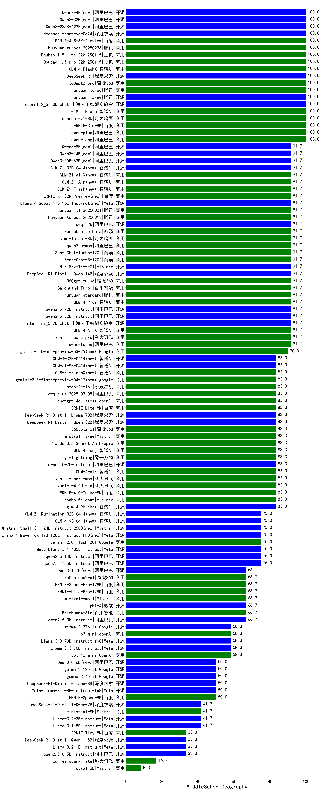

| 类别 |机构| 大模型                         | MiddleSchoolGeography | 排名 |
|-----|----|--------------------------|---------|----|
|商用|商汤|SenseChat-Turbo-1202|100.0%|1|
|商用|豆包|Doubao-1.5-pro-32k-250115|93.3%|2|
|商用|腾讯|hunyuan-turbos-20250313|93.3%|3|
|商用|豆包|doubao-seed-1-6-250615(new)|92.6%|4|
|商用|豆包|doubao-seed-1-6-thinking-250615(new)|90.7%|5|
|开源|深度求索|DeepSeek-R1|90.0%|6|
|开源|minimax|MiniMax-Text-01|90.0%|7|
|开源|阿里巴巴|qwq-32b|90.0%|8|
|开源|百度|ERNIE-4.5-300B-A47B(new)|90.0%|9|
|商用|智谱AI|GLM-Z1-AirX|90.0%|10|
|商用|阿里巴巴|qwen-plus-think-2025-04-28|89.7%|11|
|商用|阿里巴巴|qwen-turbo-think-2025-04-28|89.7%|12|
|商用|腾讯|hunyuan-turbos-20250604(new)|88.9%|13|
|商用|百度|ERNIE-4.5-Turbo-32K|87.0%|14|
|商用|豆包|Doubao-1.5-thinking-pro|87.0%|15|
|商用|豆包|doubao-seed-1-6-flash-thinking-250615(new)|87.0%|16|
|商用|豆包|doubao-seed-1-6-flash-250615(new)|87.0%|17|
|商用|腾讯|hunyuan-t1-20250529(new)|87.0%|18|
|商用|腾讯|hunyuan-t1-20250321|86.7%|19|
|商用|阿里巴巴|qwen-plus-2025-01-25|86.7%|20|
|商用|百川智能|Baichuan4-Turbo|86.7%|21|
|商用|阿里巴巴|qwen-long-2025-01-25|86.7%|22|
|商用|腾讯|hunyuan-turbo|86.7%|23|
|开源|腾讯|hunyuan-large|86.7%|24|
|商用|腾讯|hunyuan-standard|86.7%|25|
|商用|阿里巴巴|qwq-plus-2025-03-05|86.7%|26|
|商用|阿里巴巴|qwen-plus-2025-04-28|86.2%|27|
|开源|minimax|MiniMax-M1(new)|86.2%|28|
|商用|豆包|Doubao-1.5-lite-32k-250115|83.3%|29|
|商用|阿里巴巴|qwen2.5-max|83.3%|30|
|开源|深度求索|deepseek-chat-v3-0324|83.3%|31|
|开源|智谱AI|GLM-4-32B-0414|83.3%|32|
|商用|月之暗面|kimi-latest-8k|83.3%|33|
|商用|百度|ERNIE-3.5-8K|83.3%|34|
|商用|科大讯飞|xunfei-spark-pro|83.3%|35|
|开源|深度求索|DeepSeek-R1-0528|81.5%|36|
|开源|阿里巴巴|qwen2.5-32b-instruct|80.0%|37|
|商用|奇虎360|360zhinao2-o1|80.0%|38|
|开源|智谱AI|GLM-Z1-32B-0414|80.0%|39|
|开源|Meta|Llama-4-Maverick-17B-128E-Instruct-FP8|80.0%|40|
|开源|腾讯|Hunyuan-A13B-Instruct(new)|80.0%|41|
|商用|奇虎360|360gpt2-pro|80.0%|42|
|商用|奇虎360|360gpt2-o1|80.0%|43|
|开源|深度求索|DeepSeek-R1-Distill-Qwen-32B|80.0%|44|
|商用|奇虎360|360gpt-turbo|80.0%|45|
|商用|科大讯飞|xunfei-4.0Ultra|80.0%|46|
|商用|商汤|SenseChat-5-1202|80.0%|47|
|商用|科大讯飞|xunfei-spark-max|80.0%|48|
|开源|阿里巴巴|Qwen3-235B-A22B|79.6%|49|
|商用|智谱AI|GLM-Z1-Air|79.6%|50|
|商用|百度|ERNIE-X1-Turbo-32K|79.6%|51|
|商用|智谱AI|GLM-4-Plus|77.8%|52|
|商用|阶跃星辰|step-r1-v-mini|77.8%|53|
|开源|深度求索|DeepSeek-R1-Distill-Qwen-14B|76.7%|54|
|开源|Meta|Llama-4-Scout-17B-16E-Instruct|76.7%|55|
|开源|阿里巴巴|qwen2.5-72b-instruct|76.7%|56|
|商用|百川智能|Baichuan4-Air|76.7%|57|
|商用|商汤|SenseChat-5-beta|76.7%|58|
|开源|阿里巴巴|qwen2.5-7b-instruct|76.7%|59|
|商用|阿里巴巴|qwen-turbo-2025-04-28|75.9%|60|
|开源|阿里巴巴|Qwen3-14B|75.9%|61|
|开源|阿里巴巴|Qwen3-32B|75.9%|62|
|商用|科大讯飞|xunfei-spark-x1|75.9%|63|
|商用|google|gemini-2.5-pro-preview-05-06|75.9%|64|
|开源|阿里巴巴|Qwen3-30B-A3B|75.9%|65|
|商用|零一万物|yi-lightning|73.3%|66|
|开源|阿里巴巴|qwen2.5-14b-instruct|73.3%|67|
|商用|openAI|chatgpt-4o-latest|73.3%|68|
|商用|google|gemini-2.5-flash-preview-05-20|72.2%|69|
|商用|anthropic|claude-4-sonnet|72.2%|70|
|商用|月之暗面|moonshot-v1-8k|70.0%|71|
|开源|上海人工智能实验室|internlm2_5-7b-chat|70.0%|72|
|开源|百度|ERNIE-4.5-21B-A3B(new)|70.0%|73|
|商用|Mistral|mistral-large|70.0%|74|
|商用|智谱AI|GLM-4-Air|69.6%|75|
|商用|openAI|gpt-4.1|68.5%|76|
|开源|深度求索|DeepSeek-R1-0528-Qwen3-8B|66.7%|77|
|商用|阿里巴巴|qwen-turbo-2025-02-11|66.7%|78|
|商用|Mistral|mistral-small|66.7%|79|
|商用|智谱AI|GLM-4-FlashX|66.7%|80|
|开源|Mistral|Mistral-Small-3.1-24B-Instruct-2503|66.7%|81|
|开源|智谱AI|GLM-Z1-9B-0414|66.7%|82|
|商用|智谱AI|GLM-4-AirX|65.2%|83|
|开源|智谱AI|GLM-4-9B-0414|63.3%|84|
|开源|阿里巴巴|Qwen3-8B|61.1%|85|
|商用|智谱AI|GLM-Z1-FlashX|60.9%|86|
|商用|智谱AI|GLM-Z1-Flash|59.3%|87|
|开源|阿里巴巴|Qwen3-4B|59.3%|88|
|商用|智谱AI|GLM-4-Long|56.5%|89|
|商用|openAI|o4-mini|53.7%|90|
|商用|OpenAI|gpt-4o-mini|53.3%|91|
|商用|百度|ERNIE-Lite-8K|53.3%|92|
|开源|微软|phi-4|53.3%|93|
|商用|阶跃星辰|step-2-mini|53.3%|94|
|开源|Google|gemma-3-12b-it|53.3%|95|
|商用|智谱AI|GLM-4-Flash|51.9%|96|
|商用|openAI|gpt-4.1-mini|51.9%|97|
|商用|anthropic|claude-4-sonnet-thinking|50.0%|98|
|开源|Google|gemma-3-27b-it|43.3%|99|
|开源|阿里巴巴|Qwen3-1.7B|42.6%|100|
|商用|Mistral|ministral-8b|40.0%|101|
|开源|智谱AI|GLM-Z1-Rumination-32B-0414|36.7%|102|
|开源|阿里巴巴|Qwen3-0.6B|35.2%|103|
|开源|阿里巴巴|qwen2.5-1.5b-instruct|33.3%|104|
|开源|阿里巴巴|qwen2.5-3b-instruct|30.0%|105|
|开源|百度|ERNIE-4.5-0.3B(new)|30.0%|106|
|开源|阿里巴巴|qwen2.5-0.5b-instruct|26.7%|107|
|开源|Google|gemma-3-4b-it|23.3%|108|
|商用|百度|ERNIE-Speed-8K|20.4%|109|
|商用|Mistral|ministral-3b|20.0%|110|
|商用|百度|ERNIE-Tiny-8K|20.0%|111|
|商用|科大讯飞|xunfei-spark-lite|11.1%|112|

