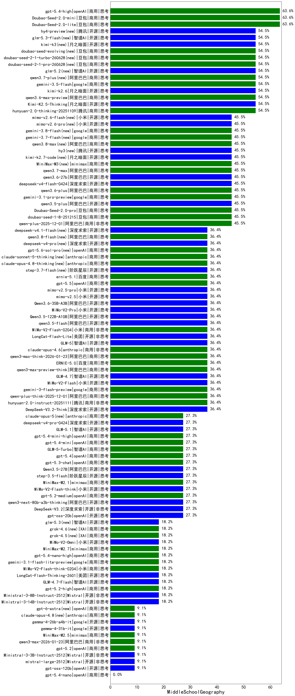

|类别|机构|大模型|【MiddleSchoolGeography】准确率|平均耗时|平均消耗token|花费/千次（元）|排名（准确率）|
|---|---|-----|-------------------|-------|-----------|-----------|-----------|
|商用|豆包|Doubao-Seed-2.0-lite|63.6%|170s|807|2.6|1|
|商用|豆包|Doubao-Seed-2.0-mini|63.6%|239s|1271|2.4|2|
|商用|openAI|gpt-5.4-high|63.6%|12s|492|45.9|3|
|开源|月之暗面|kimi-k2.6|54.5%|36s|818|21.0|4|
|商用|腾讯|hunyuan-2.0-thinking-20251109|54.5%|25s|587|2.2|5|
|商用|豆包|doubao-seed-2-1-turbo-260628(new)|54.5%|91s|4123|60.7|6|
|商用|豆包|doubao-seed-2-1-pro-260628(new)|54.5%|142s|5446|161.1|7|
|开源|月之暗面|kimi-k3(new)|54.5%|25s|459|35.5|8|
|开源|智谱AI|glm-5.2(new)|54.5%|69s|1174|31.7|9|
|开源|月之暗面|Kimi-K2.5-Thinking|54.5%|204s|1065|21.5|10|
|商用|阿里巴巴|qwen3.7-plus(new)|54.5%|32s|1578|12.3|11|
|商用|google|gemini-3.5-flash|54.5%|7s|1065|64.0|12|
|开源|智谱AI|glm-5.3-flash(new)|54.5%|33s|1249|3.4|13|
|开源|腾讯|hy4-preview(new)|54.5%|108s|3581|63.7|14|
|商用|阿里巴巴|qwen3.6-max-preview|54.5%|38s|1133|58.6|15|
|商用|豆包|doubao-seed-evolving(new)|54.5%|89s|4304|126.8|16|
|商用|minimax|MiniMax-M3(new)|45.5%|58s|1164|16.8|17|
|商用|阿里巴巴|qwen3.7-max|45.5%|17s|749|25.6|18|
|开源|月之暗面|kimi-k2.7-code(new)|45.5%|17s|653|16.6|19|
|商用|google|gemini-3.1-pro-preview|45.5%|35s|1076|87.5|20|
|开源|阿里巴巴|qwen3.5-plus|45.5%|42s|3304|15.6|21|
|开源|阿里巴巴|qwen3.6-27b|45.5%|23s|1143|19.7|22|
|商用|阿里巴巴|qwen3.6-plus|45.5%|22s|1140|13.1|23|
|商用|豆包|Doubao-Seed-2.0-pro|45.5%|153s|820|11.9|24|
|开源|深度求索|deepseek-v4-flash-0424|45.5%|33s|763|1.5|25|
|开源|小米|mimo-v2.6-flash(new)|45.5%|11s|259|0.5|26|
|开源|小米|mimo-v2.6-pro(new)|45.5%|43s|495|2.8|27|
|开源|腾讯|hy3(new)|45.5%|30s|156|0.5|28|
|商用|阿里巴巴|qwen-plus-2025-12-01|45.5%|27s|633|1.2|29|
|商用|阿里巴巴|qwen3.8-max(new)|45.5%|12s|539|17.1|30|
|商用|google|gemini-3.7-flash(new)|45.5%|6s|549|13.2|31|
|商用|豆包|doubao-seed-1-8-251215|45.5%|19s|424|2.7|32|
|商用|google|gemini-3.8-flash(new)|45.5%|13s|796|39.3|33|
|商用|anthropic|claude-sonnet-5-thinking(new)|36.4%|10s|399|23.2|34|
|商用|百度|ernie-5.1|36.4%|15s|592|10.0|35|
|商用|腾讯|hunyuan-2.0-instruct-20251111|36.4%|12s|239|0.4|36|
|商用|阿里巴巴|qwen3.8-flash(new)|36.4%|30s|481|1.1|37|
|开源|小米|MiMo-V2-Pro|36.4%|10s|770|12.0|38|
|开源|阶跃星辰|step-3.7-flash(new)|36.4%|19s|1373|10.7|39|
|商用|openAI|gpt-5.5|36.4%|7s|341|60.2|40|
|开源|深度求索|deepseek-v4.1-flash(new)|36.4%|5s|777|5.8|41|
|开源|深度求索|DeepSeek-V3.2-Think|36.4%|30s|855|2.5|42|
|开源|小米|mimo-v2.5-pro|36.4%|23s|784|12.2|43|
|开源|阿里巴巴|Qwen3.6-35B-A3B|36.4%|8s|1100|11.4|44|
|商用|阿里巴巴|qwen-plus-think-2025-12-01|36.4%|38s|1748|13.6|45|
|开源|深度求索|deepseek-v4-pro(new)|36.4%|450s|891|21.7|46|
|商用|anthropic|claude-opus-4.8-thinking(new)|36.4%|7s|421|62.0|47|
|商用|阿里巴巴|qwen3-max-think-2026-01-23|36.4%|607s|2661|26.2|48|
|商用|百度|ERNIE-5.0|36.4%|118s|1167|27.2|49|
|商用|anthropic|claude-opus-4.6|36.4%|25s|349|49.0|50|
|开源|小米|mimo-v2.5|36.4%|22s|580|4.8|51|
|商用|openAI|gpt-5.6-sol-pro(new)|36.4%|10s|2642|179.5|52|
|开源|美团|LongCat-Flash-Lite|36.4%|181s|255|0.0|53|
|商用|小米|MiMo-V2-Flash-0204|36.4%|146s|280|0.5|54|
|商用|阿里巴巴|qwen3-max-preview-think|36.4%|100s|1349|31.3|55|
|开源|智谱AI|GLM-4.7|36.4%|55s|1993|27.3|56|
|开源|小米|MiMo-V2-Flash|36.4%|12s|229|0.0|57|
|商用|google|gemini-3-flash-preview|36.4%|12s|741|14.7|58|
|开源|阿里巴巴|qwen3.5-flash|36.4%|554s|3374|6.6|59|
|开源|阿里巴巴|Qwen3.5-122B-A10B|36.4%|158s|3179|20.0|60|
|开源|智谱AI|GLM-5|36.4%|244s|1750|30.8|61|
|商用|anthropic|claude-opus-5(new)|27.3%|11s|582|90.1|62|
|开源|深度求索|deepseek-v4-pro-0424|27.3%|32s|608|14.0|63|
|商用|openAI|gpt-5.4-mini-high|27.3%|48s|621|17.8|64|
|开源|智谱AI|GLM-5.1|27.3%|109s|2575|60.9|65|
|商用|openAI|gpt-5.4-mini|27.3%|2s|151|3.1|66|
|商用|openAI|gpt-5.2-medium|27.3%|8s|258|20.0|67|
|开源|小米|MiMo-V2-Flash-think|27.3%|31s|1064|0.0|68|
|商用|minimax|MiniMax-M2.1|27.3%|56s|863|6.7|69|
|开源|阶跃星辰|step-3.5-flash|27.3%|13s|1006|2.0|70|
|商用|openAI|gpt-5.3-chat|27.3%|4s|257|19.7|71|
|商用|openAI|gpt-5.4|27.3%|2s|150|10.1|72|
|商用|智谱AI|GLM-5-Turbo|27.3%|30s|1504|32.2|73|
|开源|阿里巴巴|Qwen3.5-27B|27.3%|382s|2177|10.2|74|
|开源|阿里巴巴|qwen3-next-80b-a3b-thinking|27.3%|156s|2259|8.9|75|
|开源|深度求索|DeepSeek-V3.2|27.3%|132s|193|0.5|76|
|开源|openAI|gpt-oss-20b|27.3%|6s|1098|1.1|77|
|开源|美团|LongCat-Flash-Thinking-2601|18.2%|93s|1445|0.0|78|
|开源|智谱AI|GLM-4.7-Flash|18.2%|263s|1276|0.0|79|
|开源|Mistral|Ministral-3-8B-Instruct-2512|18.2%|13s|447|0.5|80|
|商用|XAI|grok-4.6(new)|18.2%|20s|1151|41.2|81|
|商用|openAI|gpt-5.2-high|18.2%|5s|285|22.7|82|
|开源|小米|MiMo-V2-Omni|18.2%|6s|958|10.1|83|
|商用|minimax|MiniMax-M2.7|18.2%|25s|946|7.4|84|
|开源|智谱AI|glm-5.3(new)|18.2%|68s|1426|38.8|85|
|商用|XAI|grok-4.5(new)|18.2%|71s|1546|57.7|86|
|开源|Mistral|Ministral-3-14B-Instruct-2512|18.2%|4s|318|0.5|87|
|商用|openAI|gpt-5.4-nano-high|18.2%|84s|373|2.8|88|
|商用|小米|MiMo-V2-Flash-think-0204|18.2%|542s|1057|2.1|89|
|商用|google|gemini-3.1-flash-lite-preview|18.2%|86s|162|1.2|90|
|商用|openAI|gpt-6-astra(new)|9.1%|9s|185|46.6|91|
|开源|Mistral|Ministral-3-3B-Instruct-2512|9.1%|10s|461|0.3|92|
|开源|Mistral|mistral-large-2512|9.1%|12s|350|3.2|93|
|商用|阿里巴巴|qwen3-max-2026-01-23|9.1%|16s|539|5.0|94|
|商用|openAI|gpt-5.2|9.1%|3s|143|8.6|95|
|开源|google|gemma-4-26b-a4b-it|9.1%|28s|305|0.7|96|
|商用|minimax|MiniMax-M2.5|9.1%|16s|570|4.2|97|
|商用|anthropic|claude-opus-4.8(new)|9.1%|6s|355|50.4|98|
|开源|google|gemma-4-31b-it|9.1%|20s|237|0.5|99|
|开源|openAI|gpt-oss-120b|9.1%|4s|608|1.6|100|
|商用|openAI|gpt-5.4-nano|0.0%|9s|159|0.9|101|

