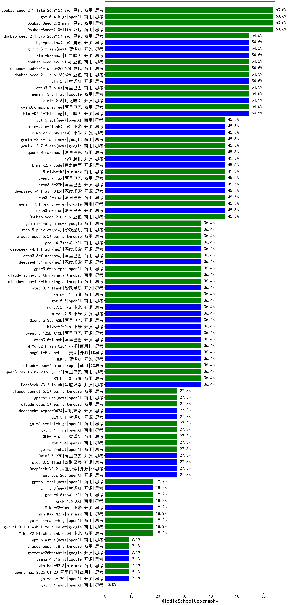

|类别|机构|大模型|【MiddleSchoolGeography】准确率|平均耗时|平均消耗token|花费/千次（元）|排名（准确率）|
|---|---|-----|-------------------|-------|-----------|-----------|-----------|
|商用|豆包|doubao-seed-2-1-lite-260915(new)|63.6%|32s|1400|3.6|1|
|商用|豆包|doubao-seed-2-1-turbo-260628|54.5%|91s|4123|60.7|2|
|商用|阿里巴巴|qwen3.6-max-preview|54.5%|38s|1133|58.6|3|
|商用|豆包|doubao-seed-2-1-pro-260915(new)|54.5%|111s|1501|42.8|4|
|商用|阿里巴巴|qwen3.7-plus|54.5%|32s|1578|12.3|5|
|开源|腾讯|hy4-preview(new)|54.5%|108s|3581|63.7|6|
|开源|智谱AI|glm-5.2|54.5%|69s|1174|31.7|7|
|开源|智谱AI|glm-5.3-flash(new)|54.5%|33s|1249|3.4|8|
|商用|豆包|doubao-seed-2-1-pro-260628|54.5%|142s|5446|161.1|9|
|商用|google|gemini-3.5-flash|54.5%|7s|1065|64.0|10|
|开源|月之暗面|kimi-k3|54.5%|25s|459|35.5|11|
|开源|月之暗面|kimi-k2.6|54.5%|36s|818|21.0|12|
|商用|豆包|doubao-seed-evolving|54.5%|89s|4304|126.8|13|
|商用|minimax|MiniMax-M3|45.5%|58s|1164|16.8|14|
|开源|月之暗面|kimi-k2.7-code|45.5%|17s|653|16.6|15|
|商用|阿里巴巴|qwen3.8-max|45.5%|12s|539|17.1|16|
|开源|腾讯|hy3|45.5%|30s|156|0.5|17|
|商用|google|gemini-3.7-flash|45.5%|6s|549|13.2|18|
|商用|google|gemini-3.8-flash(new)|45.5%|13s|796|39.3|19|
|开源|小米|mimo-v2.6-pro(new)|45.5%|43s|495|2.8|20|
|开源|小米|mimo-v2.6-flash(new)|45.5%|11s|259|0.5|21|
|商用|openAI|gpt-6-sol(new)|45.5%|60s|192|9.8|22|
|商用|阿里巴巴|qwen3.7-max|45.5%|17s|749|25.6|23|
|开源|月之暗面|kimi-k3.1-pro(new)|45.5%|25s|875|52.4|24|
|商用|google|gemini-3.1-pro-preview|45.5%|35s|1076|87.5|25|
|开源|深度求索|deepseek-v4-flash-0424|45.5%|33s|763|1.5|26|
|开源|阿里巴巴|qwen3.6-27b|45.5%|23s|1143|19.7|27|
|商用|阿里巴巴|qwen3.6-plus|45.5%|22s|1140|13.1|28|
|商用|百度|ernie-5.1|36.4%|15s|592|10.0|29|
|商用|openAI|gpt-5.6-sol-pro|36.4%|10s|2642|179.5|30|
|商用|百度|ERNIE-5.0|36.4%|118s|1167|27.2|31|
|开源|阿里巴巴|Qwen3.5-122B-A10B|36.4%|158s|3179|20.0|32|
|开源|深度求索|deepseek-v4.1-flash(new)|36.4%|5s|777|5.8|33|
|开源|深度求索|DeepSeek-V3.2-Think|36.4%|30s|855|2.5|34|
|商用|阶跃星辰|step-5-preview(new)|36.4%|17s|1012|19.5|35|
|商用|阿里巴巴|qwen3.8-flash(new)|36.4%|30s|481|1.1|36|
|开源|深度求索|deepseek-v4-pro|36.4%|450s|891|21.7|37|
|商用|anthropic|claude-opus-5.5(new)|36.4%|12s|446|52.8|38|
|商用|google|gemini-4-argon(new)|36.4%|15s|246|25.0|39|
|商用|XAI|grok-4.7(new)|36.4%|77s|4306|144.7|40|
|开源|阶跃星辰|step-3.7-flash|36.4%|19s|1373|10.7|41|
|商用|anthropic|claude-sonnet-5-thinking|36.4%|10s|399|23.2|42|
|商用|openAI|gpt-5.5|36.4%|7s|341|60.2|43|
|开源|阿里巴巴|Qwen3.6-35B-A3B|36.4%|8s|1100|11.4|44|
|开源|小米|mimo-v2.5|36.4%|22s|580|4.8|45|
|开源|小米|mimo-v2.5-pro|36.4%|23s|784|12.2|46|
|商用|anthropic|claude-opus-4.8-thinking|36.4%|7s|421|62.0|47|
|商用|anthropic|claude-haiku-5.5(new)|27.3%|5s|501|1.5|48|
|商用|openAI|gpt-6-luna(new)|27.3%|156s|309|0.9|49|
|开源|阿里巴巴|Qwen3.5-27B|27.3%|382s|2177|10.2|50|
|开源|深度求索|deepseek-v4-pro-0424|27.3%|32s|608|14.0|51|
|开源|深度求索|DeepSeek-V3.2|27.3%|132s|193|0.5|52|
|开源|智谱AI|GLM-5.1|27.3%|109s|2575|60.9|53|
|开源|openAI|gpt-oss-20b|27.3%|6s|1098|1.1|54|
|商用|anthropic|claude-sonnet-5.5(new)|27.3%|6s|363|20.6|55|
|商用|anthropic|claude-opus-5|27.3%|11s|582|90.1|56|
|商用|openAI|gpt-6.1-sol(new)|18.2%|6s|182|9.1|57|
|商用|minimax|MiniMax-M3.1-Flash(new)|18.2%|12s|795|2.4|58|
|开源|智谱AI|glm-5.3(new)|18.2%|68s|1426|38.8|59|
|商用|google|gemini-3.1-flash-lite-preview|18.2%|86s|162|1.2|60|
|商用|minimax|MiniMax-M2.7|18.2%|25s|946|7.4|61|
|商用|XAI|grok-4.6|18.2%|20s|1151|41.2|62|
|商用|XAI|grok-4.5|18.2%|71s|1546|57.7|63|
|商用|openAI|gpt-6-astra(new)|9.1%|9s|185|46.6|64|
|开源|google|gemma-4-31b-it|9.1%|20s|237|0.5|65|
|开源|google|gemma-4-26b-a4b-it|9.1%|28s|305|0.7|66|
|商用|anthropic|claude-opus-4.8|9.1%|6s|355|50.4|67|
|开源|openAI|gpt-oss-120b|9.1%|4s|608|1.6|68|

