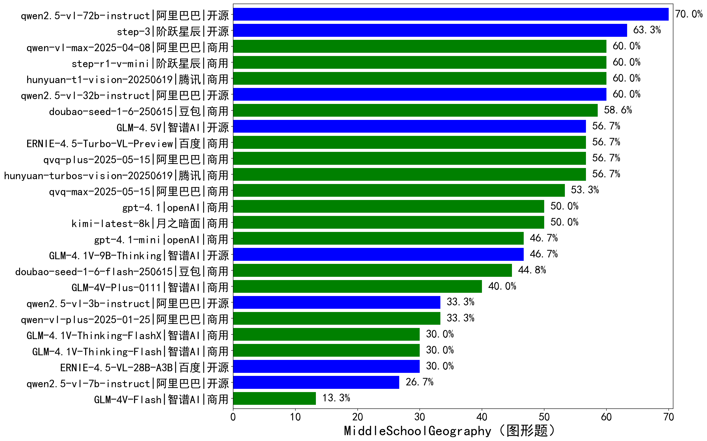

|类别|机构|大模型|【MiddleSchoolGeography（图形题）】准确率|平均耗时|平均消耗token|花费/千次（元）|排名（准确率）|
|---|---|-----|-------------------|-------|-----------|-----------|-----------|
|商用|google|gemini-2.5-flash|76.7%|120s|1822|27.2|1|
|商用|openAI|gpt-5-2025-08-07|76.7%|124s|1584|80.7|2|
|商用|google|gemini-2.5-pro|73.3%|173s|1994|121.3|3|
|开源|阿里巴巴|qwen2.5-vl-72b-instruct|70.0%|493s|717|3.0|4|
|开源|阶跃星辰|step-3|63.3%|452s|2077|7.6|5|
|商用|阿里巴巴|qwen-vl-max-2025-08-13|60.0%|32s|1189|3.6|6|
|商用|阿里巴巴|qwen-vl-max-2025-04-08|60.0%|634s|854|4.4|7|
|商用|阶跃星辰|step-r1-v-mini|60.0%|610s|2734|19.1|8|
|商用|腾讯|hunyuan-t1-vision-20250619|60.0%|351s|1607|10.4|9|
|商用|openAI|gpt-5-mini-2025-08-07|60.0%|136s|1243|12.5|10|
|开源|阿里巴巴|qwen2.5-vl-32b-instruct|60.0%|589s|1076|2.0|11|
|商用|豆包|doubao-seed-1-6-250615|58.6%|/|718|1.5|12|
|商用|阿里巴巴|qvq-plus-2025-05-15|56.7%|829s|1657|6.6|13|
|开源|智谱AI|GLM-4.5V|56.7%|618s|1158|4.3|14|
|商用|百度|ERNIE-4.5-Turbo-VL-Preview|56.7%|520s|1765|6.9|15|
|商用|腾讯|hunyuan-turbos-vision-20250619|56.7%|636s|851|4.0|16|
|商用|阿里巴巴|qvq-max-2025-05-15|53.3%|799s|1414|32.1|17|
|商用|月之暗面|kimi-latest-8k|50.0%|464s|1231|13.8|18|
|开源|智谱AI|GLM-4.6V-Flash|50.0%|15s|1861|0.0|19|
|商用|openAI|gpt-4.1|50.0%|368s|689|17.3|20|
|商用|openAI|gpt-4.1-mini|46.7%|672s|597|3.1|21|
|开源|智谱AI|GLM-4.1V-9B-Thinking|46.7%|449s|1800|1.3|22|
|商用|豆包|doubao-seed-1-6-flash-250615|44.8%|/|746|0.4|23|
|商用|openAI|gpt-5-nano-2025-08-07|43.3%|163s|2137|5.1|24|
|商用|阿里巴巴|qwen-vl-plus-2025-08-15|40.0%|7s|815|1.1|25|
|商用|智谱AI|GLM-4V-Plus-0111|40.0%|137s|820|3.1|26|
|商用|google|gemini-2.5-flash-lite|36.7%|123s|1430|3.4|27|
|开源|智谱AI|GLM-4.6V|36.7%|21s|1406|3.1|28|
|开源|阿里巴巴|qwen2.5-vl-3b-instruct|33.3%|588s|611|0.9|29|
|商用|阿里巴巴|qwen-vl-plus-2025-01-25|33.3%|538s|647|1.3|30|
|商用|智谱AI|GLM-4.1V-Thinking-FlashX|30.0%|293s|1452|2.7|31|
|开源|百度|ERNIE-4.5-VL-28B-A3B|30.0%|639s|865|1.6|32|
|商用|智谱AI|GLM-4.1V-Thinking-Flash|30.0%|20s|1127|0.0|33|
|开源|阿里巴巴|qwen2.5-vl-7b-instruct|26.7%|17s|634|0.2|34|
|商用|智谱AI|GLM-4V-Flash|13.3%|16s|700|0.0|35|

