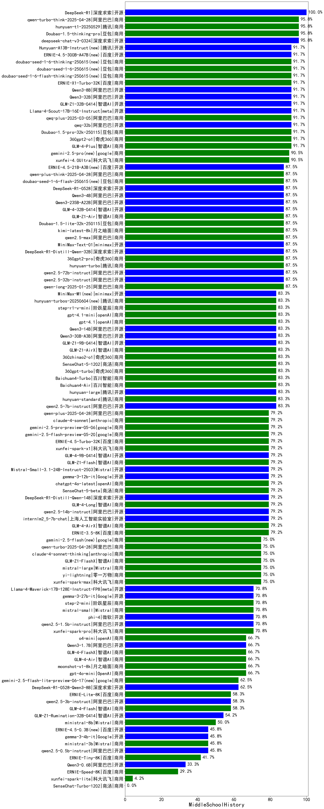

|类别|机构|大模型|【MiddleSchoolHistory】准确率|平均耗时|平均消耗token|花费/千次（元）|排名（准确率）|
|---|---|-----|-------------------|-------|-----------|-----------|-----------|
|商用|anthropic|claude-opus-4.5(new)|75.0%|25s|1048|153.8|1|
|商用|阿里巴巴|qwen-turbo-2025-07-15|75.0%|8s|428|0.2|2|
|开源|智谱AI|GLM-4.6(new)|75.0%|49s|2267|30.3|3|
|商用|腾讯|hunyuan-turbos-20250926(new)|75.0%|10s|505|0.8|4|
|商用|Mistral|mistral-medium-2508|75.0%|21s|485|5.2|5|
|商用|阿里巴巴|qwen-flash-2025-07-28|75.0%|7s|596|0.7|6|
|商用|openAI|gpt-5-nano-2025-08-07|75.0%|113s|1662|4.5|7|
|商用|腾讯|hunyuan-t1-20250711|75.0%|14s|896|3.1|8|
|开源|openAI|gpt-oss-20b|75.0%|8s|1126|1.1|9|
|商用|openAI|gpt-5.1(new)|75.0%|667s|283|9.9|10|
|商用|科大讯飞|xunfei-spark-x1-0725|75.0%|/|1049|11.0|11|
|开源|阿里巴巴|Qwen3-0.6B-nothink|75.0%|8s|317|0.6|12|
|开源|阿里巴巴|Qwen3-1.7B-nothink|75.0%|9s|523|1.2|13|
|开源|智谱AI|GLM-4.5-nothink|75.0%|36s|1118|13.8|14|
|开源|阿里巴巴|Qwen3-30B-A3B-Instruct-2507|75.0%|8s|595|1.5|15|
|商用|百川智能|Baichuan4-Air|75.0%|17s|312|0.3|16|
|开源|minimax|MiniMax-M2(new)|75.0%|25s|1512|11.7|17|
|开源|阿里巴巴|qwen3-next-80b-a3b-instruct|75.0%|7s|647|2.1|18|
|开源|阿里巴巴|Qwen3-1.7B|75.0%|31s|2106|6.0|19|
|商用|百度|ERNIE-X1.1-Preview(new)|75.0%|137s|1049|3.8|20|
|开源|meta|Llama-4-Scout-17B-16E-Instruct|75.0%|33s|616|1.2|21|
|开源|月之暗面|kimi-k2-0905(new)|75.0%|98s|417|4.9|22|
|商用|anthropic|claude-sonnet-4.5-thinking(new)|75.0%|49s|3226|328.3|23|
|商用|anthropic|claude-sonnet-4.5(new)|75.0%|13s|768|63.6|24|
|开源|阿里巴巴|Qwen3-8B|75.0%|132s|2949|0.0|25|
|商用|百川智能|Baichuan4-Turbo|75.0%|18s|314|4.7|26|
|开源|阿里巴巴|Qwen3-4B|75.0%|28s|1429|3.9|27|
|开源|阶跃星辰|step-3|50.0%|86s|1603|6.1|28|
|商用|百度|ERNIE-5.0-Thinking-Preview(new)|50.0%|180s|836|17.9|29|
|商用|XAI|grok-4-1-fast-non-reasoning(new)|50.0%|5s|658|1.7|30|
|商用|openAI|gpt-5.1-high(new)|50.0%|159s|1742|113.5|31|
|开源|智谱AI|GLM-4.5-Air-nothink|50.0%|15s|844|4.3|32|
|商用|智谱AI|GLM-4.5-Flash-nothink|50.0%|17s|810|0.0|33|
|开源|openAI|gpt-oss-120b|50.0%|8s|642|1.6|34|
|商用|google|gemini-3-pro-preview(new)|50.0%|28s|1832|145.4|35|
|商用|openAI|gpt-5-2025-08-07|50.0%|21s|383|19.3|36|
|开源|深度求索|DeepSeek-V3.1|50.0%|15s|356|3.4|37|
|商用|XAI|grok-4-1-fast-reasoning(new)|50.0%|99s|1038|3.1|38|
|开源|月之暗面|Kimi-K2-Thinking(new)|50.0%|168s|2588|39.9|39|
|开源|深度求索|DeepSeek-V3.1-Think|50.0%|46s|949|10.5|40|
|商用|anthropic|claude-haiku-4.5-thinking(new)|50.0%|40s|2347|77.1|41|
|开源|Mistral|Magistral-Small-2507|50.0%|716s|4008|42.4|42|
|开源|Mistral|Mistral-Small-3.2-24B-Instruct-2506|50.0%|14s|555|1.0|43|
|商用|阿里巴巴|qwen-plus-2025-07-28|50.0%|15s|593|1.0|44|
|商用|阿里巴巴|qwen-turbo-think-2025-07-15|50.0%|/|1945|5.5|45|
|商用|阿里巴巴|qwen3-max-preview|50.0%|10s|518|10.2|46|
|开源|豆包|Seed-OSS-36B-Instruct|50.0%|51s|1156|4.3|47|
|开源|智谱AI|GLM-4.5-Air|50.0%|32s|1897|10.4|48|
|开源|深度求索|DeepSeek-V3.2-Exp-Think(new)|50.0%|34s|954|2.8|49|
|商用|openAI|gpt-5.1-medium(new)|50.0%|41s|848|50.0|50|
|商用|豆包|doubao-seed-1-6-251015(new)|50.0%|14s|760|4.9|51|
|商用|豆包|doubao-seed-1-6-lite-251015(new)|50.0%|18s|781|1.5|52|
|开源|智谱AI|GLM-4.5|50.0%|79s|1813|23.1|53|
|商用|阿里巴巴|qwen-long-2025-01-25|50.0%|10s|398|0.7|54|
|商用|智谱AI|GLM-4.5-Flash|50.0%|33s|1830|0.0|55|
|开源|深度求索|DeepSeek-R1-0528|50.0%|210s|1633|24.7|56|
|开源|minimax|MiniMax-M1|50.0%|70s|1432|8.1|57|
|商用|豆包|doubao-seed-1-6-250615|50.0%|154s|175|0.3|58|
|开源|阿里巴巴|Qwen3-14B-nothink|50.0%|12s|541|0.9|59|
|商用|anthropic|claude-4-sonnet-thinking|50.0%|29s|1141|106.3|60|
|商用|anthropic|claude-4-sonnet|50.0%|24s|743|62.9|61|
|开源|深度求索|DeepSeek-R1-0528-Qwen3-8B|50.0%|214s|1517|0.0|62|
|商用|百度|ERNIE-X1-Turbo-32K|50.0%|56s|1350|5.1|63|
|开源|阿里巴巴|Qwen3-32B|50.0%|59s|2084|8.0|64|
|开源|百度|ERNIE-4.5-21B-A3B|50.0%|37s|395|0.0|65|
|开源|智谱AI|GLM-4-9B-0414|50.0%|19s|469|0.0|66|
|开源|google|gemma-3-12b-it|50.0%|40s|442|0.0|67|
|开源|google|gemma-3-4b-it|50.0%|22s|455|0.0|68|
|开源|google|gemma-3-27b-it|50.0%|31s|457|0.6|69|
|商用|豆包|Doubao-1.5-lite-32k-250115|50.0%|11s|273|0.1|70|
|商用|百度|ERNIE-Lite-8K|50.0%|13s|361|0.0|71|
|开源|minimax|MiniMax-Text-01|50.0%|14s|934|7.5|72|
|开源|百度|ERNIE-4.5-0.3B|50.0%|34s|398|0.0|73|
|商用|豆包|doubao-seed-1-6-flash-thinking-250615|50.0%|8s|577|0.6|74|
|开源|百度|ERNIE-4.5-300B-A47B|50.0%|71s|395|2.4|75|
|开源|腾讯|Hunyuan-A13B-Instruct|50.0%|24s|804|2.9|76|
|开源|阿里巴巴|Qwen3-8B-nothink|50.0%|24s|534|0.0|77|
|开源|阿里巴巴|Qwen3-4B-nothink|50.0%|12s|467|1.1|78|
|商用|XAI|grok-4-0709|50.0%|55s|1048|103.1|79|
|开源|阿里巴巴|qwen3-235b-a22b-thinking-2507|50.0%|78s|2083|39.4|80|
|商用|XAI|grok-3-mini|50.0%|242s|1086|3.8|81|
|商用|google|gemini-2.5-pro|50.0%|30s|2194|150.6|82|
|商用|豆包|doubao-seed-1-6-thinking-250715|50.0%|12s|813|5.6|83|
|开源|阿里巴巴|qwen3-235b-a22b-instruct-2507|50.0%|14s|624|4.2|84|
|商用|anthropic|claude-haiku-4.5(new)|25.0%|10s|760|20.5|85|
|开源|阿里巴巴|Qwen3-30B-A3B-Thinking-2507|25.0%|47s|2102|5.6|86|
|商用|360|360zhinao2-o1|25.0%|55s|1356|12.1|87|
|开源|meta|Llama-4-Maverick-17B-128E-Instruct-FP8|25.0%|22s|733|2.9|88|
|开源|腾讯|Hunyuan-A13B-Instruct-nothink|25.0%|52s|467|1.5|89|
|开源|月之暗面|kimi-k2-0711-preview|25.0%|27s|505|6.8|90|
|开源|阿里巴巴|Qwen3-0.6B|25.0%|19s|1366|3.8|91|
|开源|阿里巴巴|Qwen3-14B|25.0%|61s|2193|4.2|92|
|商用|阿里巴巴|qwen-plus-think-2025-07-28|25.0%|/|2184|16.6|93|
|商用|openAI|o4-mini|25.0%|29s|692|18.8|94|
|商用|openAI|gpt-5-mini-2025-08-07|25.0%|27s|766|9.3|95|
|商用|百度|ERNIE-4.5-Turbo-32K|25.0%|19s|512|1.4|96|
|商用|阿里巴巴|qwen-flash-think-2025-07-28|25.0%|21s|2215|3.2|97|
|开源|深度求索|DeepSeek-V3.2-Exp(new)|25.0%|386s|341|0.9|98|
|商用|豆包|doubao-seed-1-6-flash-250615|25.0%|4s|374|0.4|99|
|商用|google|gemini-2.5-flash-lite|25.0%|5s|579|1.4|100|
|开源|阿里巴巴|Qwen3-32B-nothink|25.0%|75s|570|1.9|101|
|商用|google|gemini-2.5-flash|/%|14s|1906|32.4|102|

