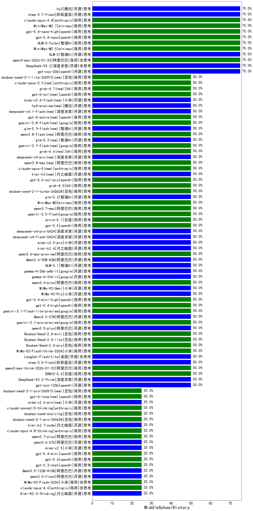

|类别|机构|大模型|【MiddleSchoolHistory】准确率|平均耗时|平均消耗token|花费/千次（元）|排名（准确率）|
|---|---|-----|-------------------|-------|-----------|-----------|-----------|
|商用|minimax|MiniMax-M2.5|75.0%|27s|1492|11.5|1|
|商用|openAI|gpt-5.4-nano-high|75.0%|10s|376|2.1|2|
|开源|深度求索|DeepSeek-V3.2|75.0%|13s|391|1.0|3|
|开源|腾讯|hy3|75.0%|57s|308|0.8|4|
|开源|openAI|gpt-oss-20b|75.0%|8s|1126|1.1|5|
|商用|阿里巴巴|qwen3-max-2026-01-23|75.0%|61s|662|5.6|6|
|商用|智谱AI|GLM-5-Turbo|75.0%|33s|1681|34.8|7|
|商用|anthropic|claude-opus-4.8|75.0%|10s|703|91.2|8|
|开源|智谱AI|GLM-5|75.0%|76s|2110|36.2|9|
|开源|阶跃星辰|step-3.7-flash|75.0%|19s|1568|11.8|10|
|商用|openAI|gpt-5.4-nano|75.0%|5s|300|1.4|11|
|商用|minimax|MiniMax-M2.7|75.0%|30s|1196|9.1|12|
|商用|豆包|doubao-seed-2-1-turbo-260628|50.0%|176s|7318|107.6|13|
|开源|智谱AI|glm-5.2|50.0%|107s|1889|50.1|14|
|开源|openAI|gpt-oss-120b|50.0%|8s|642|1.6|15|
|商用|minimax|MiniMax-M3|50.0%|27s|753|9.0|16|
|商用|openAI|gpt-5.6-sol-pro|50.0%|18s|3714|283.0|17|
|商用|阿里巴巴|qwen3.7-max|50.0%|28s|1308|43.8|18|
|商用|google|gemini-3.5-flash|50.0%|13s|1671|97.3|19|
|商用|百度|ernie-5.1|50.0%|22s|845|13.3|20|
|商用|openAI|gpt-5.5|50.0%|23s|582|93.5|21|
|开源|深度求索|deepseek-v4-pro-0424|50.0%|25s|734|16.1|22|
|商用|XAI|grok-4.5|50.0%|82s|3151|122.8|23|
|商用|阿里巴巴|qwen3.8-max(new)|50.0%|11s|543|15.4|24|
|开源|月之暗面|kimi-k3(new)|50.0%|63s|686|52.4|25|
|商用|openAI|gpt-6-astra(new)|50.0%|13s|328|69.1|26|
|商用|anthropic|claude-opus-5.5(new)|50.0%|13s|853|93.6|27|
|商用|XAI|grok-4.7(new)|50.0%|125s|9020|340.3|28|
|商用|openAI|gpt-6-sol(new)|50.0%|292s|310|12.5|29|
|开源|小米|mimo-v2.6-flash(new)|50.0%|362s|826|1.5|30|
|开源|腾讯|hy4-preview(new)|50.0%|27s|1724|29.3|31|
|开源|深度求索|deepseek-v4.1-flash(new)|50.0%|25s|2249|17.1|32|
|商用|google|gemini-3.8-flash(new)|50.0%|14s|760|33.6|33|
|商用|anthropic|claude-opus-5(new)|50.0%|13s|748|99.0|34|
|开源|智谱AI|glm-5.3-flash(new)|50.0%|64s|2489|6.7|35|
|商用|阿里巴巴|qwen3.8-flash(new)|50.0%|54s|4053|10.6|36|
|开源|智谱AI|glm-5.3(new)|50.0%|1513s|7905|218.6|37|
|商用|google|gemini-3.7-flash(new)|50.0%|4s|745|16.4|38|
|商用|XAI|grok-4.6(new)|50.0%|161s|2375|90.2|39|
|开源|深度求索|deepseek-v4-pro(new)|50.0%|740s|956|22.1|40|
|开源|深度求索|deepseek-v4-flash-0424|50.0%|17s|885|1.6|41|
|开源|小米|mimo-v2.5-pro|50.0%|223s|17113|354.0|42|
|商用|google|gemini-3.1-flash-lite-preview|50.0%|5s|601|5.0|43|
|商用|openAI|gpt-5.4-high|50.0%|15s|877|77.8|44|
|开源|深度求索|DeepSeek-V3.2-Think|50.0%|207s|1107|3.2|45|
|商用|百度|ERNIE-5.0|50.0%|61s|1177|26.1|46|
|商用|阿里巴巴|qwen3-max-think-2026-01-23|50.0%|156s|3429|33.2|47|
|开源|阶跃星辰|step-3.5-flash|50.0%|22s|1332|2.6|48|
|开源|美团|LongCat-Flash-Lite|50.0%|59s|475|0.0|49|
|商用|小米|MiMo-V2-Flash-think-0204|50.0%|1154s|2188|4.4|50|
|商用|豆包|Doubao-Seed-2.0-pro|50.0%|204s|1080|15.0|51|
|商用|豆包|Doubao-Seed-2.0-lite|50.0%|232s|1018|3.1|52|
|商用|豆包|Doubao-Seed-2.0-mini|50.0%|617s|2804|5.3|53|
|开源|阿里巴巴|qwen3.5-plus|50.0%|42s|3244|15.0|54|
|商用|google|gemini-3.1-pro-preview|50.0%|23s|1516|118.4|55|
|开源|阿里巴巴|Qwen3.5-27B|50.0%|146s|3485|16.2|56|
|开源|月之暗面|kimi-k2.6|50.0%|66s|1670|42.5|57|
|商用|豆包|doubao-seed-2-1-lite-260915(new)|50.0%|69s|3098|8.1|58|
|商用|阿里巴巴|qwen3.6-plus|50.0%|60s|1762|19.8|59|
|商用|阿里巴巴|qwen3.6-max-preview|50.0%|52s|1940|98.6|60|
|开源|阿里巴巴|Qwen3.6-35B-A3B|50.0%|134s|1690|17.0|61|
|开源|智谱AI|GLM-5.1|50.0%|204s|1517|34.1|62|
|商用|openAI|gpt-5.4-mini-high|50.0%|23s|1161|32.3|63|
|开源|小米|MiMo-V2-Pro|50.0%|198s|1328|22.5|64|
|开源|小米|MiMo-V2-Omni|50.0%|57s|1923|22.6|65|
|开源|google|gemma-4-26b-a4b-it|50.0%|65s|737|1.8|66|
|开源|google|gemma-4-31b-it|50.0%|33s|763|1.8|67|
|商用|小米|MiMo-V2-Flash-0204|25.0%|382s|643|1.1|68|
|商用|豆包|doubao-seed-2-1-pro-260915(new)|25.0%|178s|3219|92.3|69|
|商用|openAI|gpt-6-luna(new)|25.0%|441s|411|1.0|70|
|开源|月之暗面|Kimi-K2.5-Thinking|25.0%|365s|1877|37.3|71|
|开源|小米|mimo-v2.6-pro(new)|25.0%|83s|3689|21.7|72|
|开源|阿里巴巴|qwen3.6-27b|25.0%|37s|2228|38.1|73|
|商用|anthropic|claude-opus-4.6|25.0%|30s|1030|148.0|74|
|商用|豆包|doubao-seed-2-1-pro-260628|25.0%|223s|9106|268.9|75|
|商用|openAI|gpt-5.4-mini|25.0%|37s|350|6.7|76|
|商用|阿里巴巴|qwen3.7-plus|25.0%|95s|5167|40.5|77|
|开源|阿里巴巴|qwen3.5-flash|25.0%|424s|3588|6.9|78|
|商用|anthropic|claude-opus-4.8-thinking|25.0%|16s|985|140.4|79|
|开源|阿里巴巴|Qwen3.5-122B-A10B|25.0%|504s|5076|31.7|80|
|开源|月之暗面|kimi-k2.7-code|25.0%|18s|620|14.2|81|
|商用|openAI|gpt-5.3-chat|25.0%|50s|503|35.2|82|
|商用|openAI|gpt-5.4|25.0%|4s|332|20.5|83|
|商用|anthropic|claude-sonnet-5-thinking|25.0%|15s|909|50.8|84|
|商用|豆包|doubao-seed-evolving|25.0%|290s|13005|385.9|85|
|开源|小米|mimo-v2.5|25.0%|20s|1377|15.0|86|

