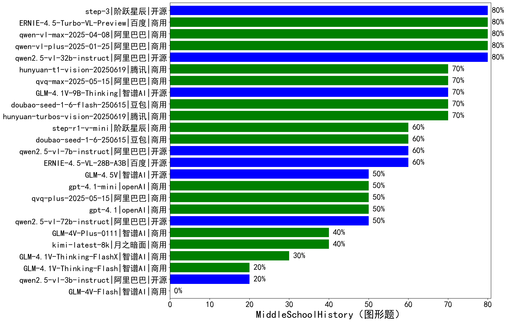

|类别|机构|大模型|【MiddleSchoolHistory（图形题）】准确率|平均耗时|平均消耗token|花费/千次（元）|排名（准确率）|
|---|---|-----|-------------------|-------|-----------|-----------|-----------|
|开源|阶跃星辰|step-3|80.0%|756s|2067|7.6|1|
|商用|百度|ERNIE-4.5-Turbo-VL-Preview|80.0%|306s|1761|7.0|2|
|开源|阿里巴巴|qwen2.5-vl-32b-instruct|80.0%|426s|942|1.8|3|
|商用|阿里巴巴|qwen-vl-plus-2025-01-25|80.0%|537s|450|1.1|4|
|商用|阿里巴巴|qwen-vl-max-2025-04-08|80.0%|555s|646|3.9|5|
|商用|腾讯|hunyuan-turbos-vision-20250619|70.0%|573s|798|4.6|6|
|商用|google|gemini-2.5-pro|70.0%|166s|2874|186.4|7|
|开源|智谱AI|GLM-4.1V-9B-Thinking|70.0%|509s|1253|1.0|8|
|商用|阿里巴巴|qvq-max-2025-05-15|70.0%|643s|2331|66.9|9|
|商用|腾讯|hunyuan-t1-vision-20250619|70.0%|615s|1386|9.5|10|
|商用|豆包|doubao-seed-1-6-flash-250615|70.0%|/|588|0.4|11|
|商用|豆包|doubao-seed-1-6-250615|60.0%|/|356|0.3|12|
|商用|google|gemini-2.5-flash-lite|60.0%|96s|1341|3.1|13|
|商用|阶跃星辰|step-r1-v-mini|60.0%|672s|2377|16.2|14|
|开源|智谱AI|GLM-4.6V|60.0%|18s|1141|2.7|15|
|开源|阿里巴巴|qwen2.5-vl-7b-instruct|60.0%|16s|437|0.2|16|
|开源|百度|ERNIE-4.5-VL-28B-A3B|60.0%|354s|649|1.6|17|
|开源|智谱AI|GLM-4.5V|50.0%|275s|1098|4.6|18|
|商用|阿里巴巴|qwen-vl-plus-2025-08-15|50.0%|8s|723|1.1|19|
|商用|google|gemini-2.5-flash|50.0%|98s|2328|36.7|20|
|商用|openAI|gpt-5-nano-2025-08-07|50.0%|146s|2239|5.7|21|
|商用|openAI|gpt-5-mini-2025-08-07|50.0%|161s|1201|13.6|22|
|商用|openAI|gpt-5-2025-08-07|50.0%|281s|1313|65.2|23|
|开源|阿里巴巴|qwen2.5-vl-72b-instruct|50.0%|423s|530|2.2|24|
|商用|openAI|gpt-4.1|50.0%|296s|669|19.7|25|
|商用|openAI|gpt-4.1-mini|50.0%|1243s|529|3.5|26|
|商用|阿里巴巴|qvq-plus-2025-05-15|50.0%|839s|2883|13.4|27|
|商用|月之暗面|kimi-latest-8k|40.0%|667s|1215|14.6|28|
|商用|阿里巴巴|qwen-vl-max-2025-08-13|40.0%|37s|1429|4.5|29|
|商用|智谱AI|GLM-4V-Plus-0111|40.0%|627s|610|2.2|30|
|开源|智谱AI|GLM-4.6V-Flash|40.0%|12s|1357|0.0|31|
|商用|智谱AI|GLM-4.1V-Thinking-FlashX|30.0%|439s|1231|2.2|32|
|开源|阿里巴巴|qwen2.5-vl-3b-instruct|20.0%|474s|431|0.8|33|
|商用|智谱AI|GLM-4.1V-Thinking-Flash|20.0%|18s|911|0.0|34|
|商用|智谱AI|GLM-4V-Flash|/%|14s|501|0.0|35|

