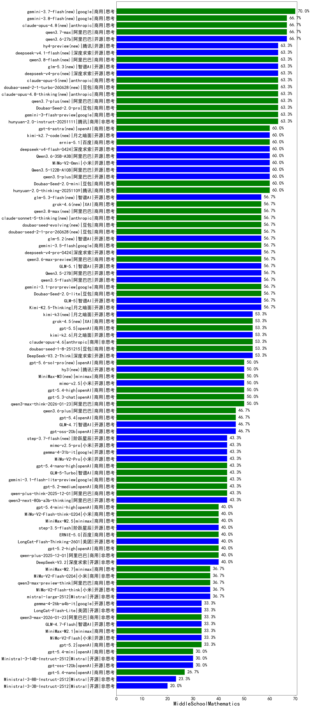

|类别|机构|大模型|【MiddleSchoolMathematics】准确率|平均耗时|平均消耗token|花费/千次（元）|排名（准确率）|
|---|---|-----|-------------------|-------|-----------|-----------|-----------|
|商用|google|gemini-3.7-flash(new)|70.0%|6s|1443|35.5|1|
|商用|anthropic|claude-opus-4.8(new)|66.7%|15s|1147|177.6|2|
|商用|google|gemini-3.8-flash(new)|66.7%|22s|1856|92.6|3|
|商用|阿里巴巴|qwen3.7-max|66.7%|76s|4126|145.7|4|
|开源|阿里巴巴|qwen3.6-27b|66.7%|171s|11389|203.2|5|
|开源|深度求索|deepseek-v4-pro(new)|63.3%|129s|5701|150.7|6|
|商用|豆包|Doubao-Seed-2.0-pro|63.3%|382s|1716|25.5|7|
|商用|anthropic|claude-opus-4.8-thinking(new)|63.3%|18s|1507|240.7|8|
|商用|豆包|doubao-seed-2-1-turbo-260628(new)|63.3%|224s|10792|160.0|9|
|商用|阿里巴巴|qwen3.7-plus(new)|63.3%|110s|5886|46.4|10|
|商用|anthropic|claude-opus-5(new)|63.3%|12s|967|146.2|11|
|商用|google|gemini-3-flash-preview|63.3%|154s|4319|89.9|12|
|商用|腾讯|hunyuan-2.0-instruct-20251111|63.3%|32s|1528|2.9|13|
|开源|智谱AI|glm-5.3(new)|63.3%|269s|7533|208.6|14|
|商用|阿里巴巴|qwen3.8-flash(new)|63.3%|117s|7756|20.6|15|
|开源|深度求索|deepseek-v4-flash-0424|60.0%|74s|3722|7.3|16|
|商用|腾讯|hunyuan-2.0-thinking-20251109|60.0%|58s|3520|13.8|17|
|开源|阿里巴巴|Qwen3.6-35B-A3B|60.0%|185s|9270|99.1|18|
|商用|豆包|Doubao-Seed-2.0-mini|60.0%|448s|3862|7.4|19|
|开源|月之暗面|kimi-k2.7-code(new)|60.0%|72s|2893|75.9|20|
|开源|阿里巴巴|qwen3.5-plus|60.0%|106s|9403|44.7|21|
|商用|openAI|gpt-6-astra(new)|60.0%|16s|528|150.9|22|
|开源|阿里巴巴|Qwen3.5-122B-A10B|60.0%|168s|7627|48.2|23|
|商用|百度|ernie-5.1|60.0%|74s|3132|54.8|24|
|开源|小米|MiMo-V2-Omni|60.0%|675s|4648|61.0|25|
|开源|阿里巴巴|Qwen3.5-27B|56.7%|615s|8259|39.2|26|
|商用|google|gemini-3.1-pro-preview|56.7%|68s|3910|324.4|27|
|商用|google|gemini-3.5-flash|56.7%|22s|3159|193.0|28|
|商用|豆包|Doubao-Seed-2.0-lite|56.7%|410s|1907|6.4|29|
|开源|智谱AI|GLM-5.1|56.7%|350s|5833|138.0|30|
|开源|深度求索|deepseek-v4-pro-0424|56.7%|89s|2444|57.4|31|
|开源|阿里巴巴|qwen3.5-flash|56.7%|167s|10064|19.9|32|
|开源|智谱AI|GLM-5|56.7%|202s|5678|100.7|33|
|商用|阿里巴巴|qwen3.6-max-preview|56.7%|170s|3664|192.6|34|
|商用|豆包|doubao-seed-2-1-pro-260628(new)|56.7%|313s|14871|442.4|35|
|商用|阿里巴巴|qwen3.8-max(new)|56.7%|149s|6700|237.5|36|
|商用|XAI|grok-4.6(new)|56.7%|465s|3341|131.5|37|
|开源|智谱AI|glm-5.3-flash(new)|56.7%|144s|4227|11.6|38|
|商用|豆包|doubao-seed-evolving(new)|56.7%|286s|13764|409.3|39|
|商用|anthropic|claude-sonnet-5-thinking(new)|56.7%|23s|2252|148.4|40|
|开源|智谱AI|glm-5.2(new)|56.7%|114s|5249|144.6|41|
|开源|月之暗面|Kimi-K2.5-Thinking|56.7%|206s|6570|136.2|42|
|开源|深度求索|DeepSeek-V3.2-Think|53.3%|249s|3884|11.6|43|
|商用|anthropic|claude-opus-4.6|53.3%|15s|944|143.4|44|
|开源|月之暗面|kimi-k2.6|53.3%|248s|8000|213.8|45|
|开源|月之暗面|kimi-k3(new)|53.3%|123s|3145|299.7|46|
|商用|openAI|gpt-5.5|53.3%|17s|1229|236.8|47|
|商用|XAI|grok-4.5(new)|53.3%|86s|3666|145.2|48|
|商用|豆包|doubao-seed-1-8-251215|53.3%|42s|1352|9.7|49|
|商用|openAI|gpt-5.6-sol-pro(new)|50.0%|25s|5999|579.5|50|
|开源|小米|mimo-v2.5|50.0%|53s|4500|59.0|51|
|商用|openAI|gpt-5.4-high|50.0%|31s|2043|203.9|52|
|商用|minimax|MiniMax-M3(new)|50.0%|115s|3977|63.4|53|
|商用|openAI|gpt-5.3-chat|50.0%|69s|948|82.5|54|
|开源|腾讯|hy3(new)|50.0%|23s|1203|4.5|55|
|商用|阿里巴巴|qwen3-max-think-2026-01-23|50.0%|343s|7669|75.8|56|
|开源|openAI|gpt-oss-20b|46.7%|218s|2356|2.6|57|
|商用|openAI|gpt-5.4|46.7%|9s|682|61.1|58|
|商用|阿里巴巴|qwen3.6-plus|46.7%|172s|10476|124.6|59|
|开源|智谱AI|GLM-4.7|46.7%|119s|5079|69.9|60|
|开源|小米|mimo-v2.5-pro|43.3%|145s|9414|192.6|61|
|开源|阶跃星辰|step-3.7-flash(new)|43.3%|2192s|16170|130.2|62|
|商用|智谱AI|GLM-5-Turbo|43.3%|64s|5975|129.6|63|
|商用|openAI|gpt-5.2-medium|43.3%|29s|1368|125.5|64|
|商用|openAI|gpt-5.4-nano-high|43.3%|145s|2414|20.2|65|
|商用|google|gemini-3.1-flash-lite-preview|43.3%|5s|769|7.1|66|
|开源|阿里巴巴|qwen3-next-80b-a3b-thinking|43.3%|233s|5545|21.8|67|
|开源|google|gemma-4-31b-it|43.3%|157s|813|2.0|68|
|商用|阿里巴巴|qwen-plus-think-2025-12-01|43.3%|98s|4902|38.3|69|
|开源|小米|MiMo-V2-Pro|43.3%|286s|2425|45.9|70|
|开源|深度求索|DeepSeek-V3.2|40.0%|43s|1443|4.2|71|
|商用|openAI|gpt-5.4-mini-high|40.0%|104s|2395|72.3|72|
|商用|openAI|gpt-5.2-high|40.0%|31s|1737|162.2|73|
|商用|minimax|MiniMax-M2.5|40.0%|80s|5029|41.4|74|
|开源|阶跃星辰|step-3.5-flash|40.0%|52s|7281|15.1|75|
|商用|阿里巴巴|qwen-plus-2025-12-01|40.0%|61s|2744|5.3|76|
|商用|百度|ERNIE-5.0|40.0%|368s|8503|202.2|77|
|开源|美团|LongCat-Flash-Thinking-2601|40.0%|289s|9461|0.0|78|
|商用|小米|MiMo-V2-Flash-think-0204|40.0%|260s|6541|13.5|79|
|商用|阿里巴巴|qwen3-max-preview-think|36.7%|338s|4312|101.3|80|
|开源|小米|MiMo-V2-Flash-think|36.7%|203s|8124|0.0|81|
|开源|Mistral|mistral-large-2512|36.7%|27s|1425|14.3|82|
|商用|小米|MiMo-V2-Flash-0204|36.7%|221s|1744|3.5|83|
|商用|minimax|MiniMax-M2.7|36.7%|122s|5342|44.0|84|
|商用|openAI|gpt-5.2|33.3%|11s|523|41.5|85|
|开源|google|gemma-4-26b-a4b-it|33.3%|37s|987|2.5|86|
|开源|智谱AI|GLM-4.7-Flash|33.3%|1674s|12739|0.0|87|
|开源|小米|MiMo-V2-Flash|33.3%|80s|2366|0.0|88|
|商用|minimax|MiniMax-M2.1|33.3%|184s|5009|41.2|89|
|商用|阿里巴巴|qwen3-max-2026-01-23|33.3%|51s|2300|22.1|90|
|开源|美团|LongCat-Flash-Lite|33.3%|352s|2547|0.0|91|
|开源|Mistral|Ministral-3-14B-Instruct-2512|30.0%|54s|5922|8.4|92|
|商用|openAI|gpt-5.4-mini|30.0%|131s|553|14.2|93|
|开源|openAI|gpt-oss-120b|30.0%|253s|1658|4.9|94|
|商用|openAI|gpt-5.4-nano|26.7%|11s|579|4.2|95|
|开源|Mistral|Ministral-3-8B-Instruct-2512|23.3%|38s|3604|3.9|96|
|开源|Mistral|Ministral-3-3B-Instruct-2512|20.0%|43s|6318|4.5|97|

