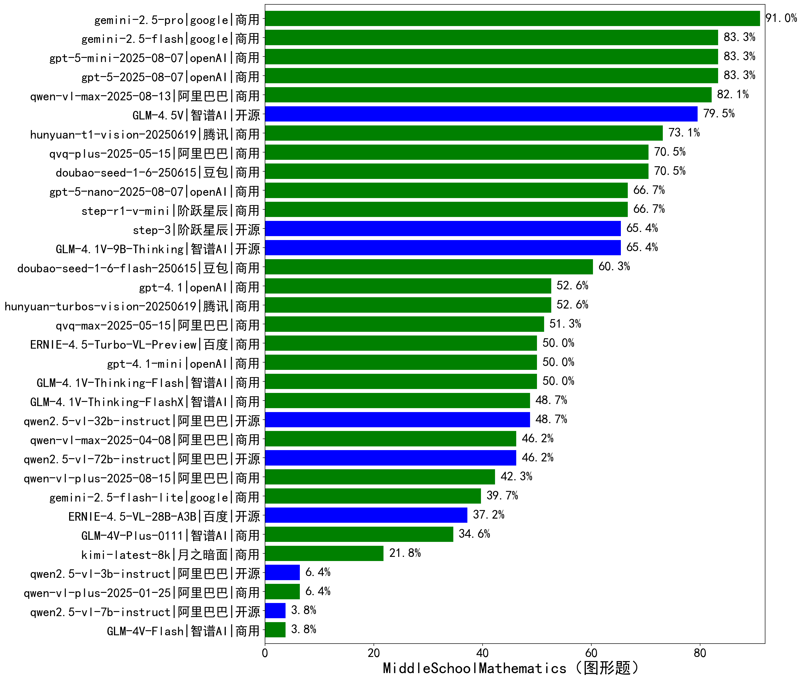

|类别|机构|大模型|【MiddleSchoolMathematics（图形题）】准确率|平均耗时|平均消耗token|花费/千次（元）|排名（准确率）|
|---|---|-----|-------------------|-------|-----------|-----------|-----------|
|商用|google|gemini-2.5-pro|91.0%|163s|5780|392.2|1|
|商用|openAI|gpt-5-mini-2025-08-07|83.3%|131s|2525|27.6|2|
|商用|openAI|gpt-5-2025-08-07|83.3%|86s|3583|212.7|3|
|商用|google|gemini-2.5-flash|83.3%|132s|5287|89.1|4|
|商用|阿里巴巴|qwen-vl-max-2025-08-13|82.1%|110s|3365|11.6|5|
|开源|智谱AI|GLM-4.5V|79.5%|483s|3493|16.5|6|
|商用|腾讯|hunyuan-t1-vision-20250619|73.1%|169s|2987|21.9|7|
|商用|豆包|doubao-seed-1-6-250615|70.5%|/|1896|8.4|8|
|商用|阿里巴巴|qvq-plus-2025-05-15|70.5%|775s|5357|24.1|9|
|开源|智谱AI|GLM-4.6V-Flash|70.0%|29s|4003|0.0|10|
|商用|openAI|gpt-5-nano-2025-08-07|66.7%|149s|5184|13.2|11|
|商用|阶跃星辰|step-r1-v-mini|66.7%|328s|7309|54.7|12|
|开源|智谱AI|GLM-4.1V-9B-Thinking|65.4%|753s|4511|3.7|13|
|开源|阶跃星辰|step-3|65.4%|595s|6522|25.3|14|
|商用|豆包|doubao-seed-1-6-flash-250615|60.3%|/|2073|1.9|15|
|商用|openAI|gpt-4.1|52.6%|351s|1593|60.6|16|
|商用|腾讯|hunyuan-turbos-vision-20250619|52.6%|160s|1404|8.0|17|
|商用|阿里巴巴|qvq-max-2025-05-15|51.3%|627s|4044|107.7|18|
|商用|百度|ERNIE-4.5-Turbo-VL-Preview|50.0%|467s|2406|12.1|19|
|商用|智谱AI|GLM-4.1V-Thinking-Flash|50.0%|49s|2429|0.0|20|
|商用|openAI|gpt-4.1-mini|50.0%|219s|1684|13.3|21|
|商用|智谱AI|GLM-4.1V-Thinking-FlashX|48.7%|268s|2575|5.2|22|
|开源|阿里巴巴|qwen2.5-vl-32b-instruct|48.7%|577s|1946|3.7|23|
|商用|阿里巴巴|qwen-vl-max-2025-04-08|46.2%|560s|1619|9.1|24|
|开源|阿里巴巴|qwen2.5-vl-72b-instruct|46.2%|489s|1502|6.2|25|
|开源|智谱AI|GLM-4.6V|44.0%|24s|2240|4.2|26|
|商用|阿里巴巴|qwen-vl-plus-2025-08-15|42.3%|13s|1821|2.7|27|
|商用|google|gemini-2.5-flash-lite|39.7%|160s|14509|41.2|28|
|开源|百度|ERNIE-4.5-VL-28B-A3B|37.2%|468s|1893|4.3|29|
|商用|智谱AI|GLM-4V-Plus-0111|34.6%|122s|1434|5.7|30|
|商用|月之暗面|kimi-latest-8k|21.8%|203s|1670|20.0|31|
|开源|阿里巴巴|qwen2.5-vl-3b-instruct|6.4%|529s|1519|3.3|32|
|商用|阿里巴巴|qwen-vl-plus-2025-01-25|6.4%|518s|1377|3.5|33|
|开源|阿里巴巴|qwen2.5-vl-7b-instruct|3.8%|21s|1551|0.5|34|
|商用|智谱AI|GLM-4V-Flash|3.8%|20s|1499|0.0|35|

