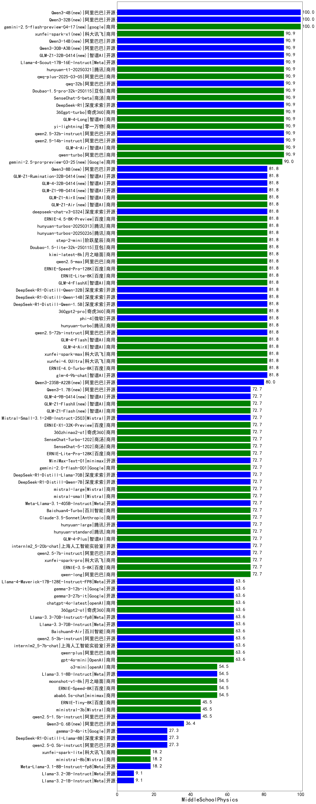

| 类别 | 大模型                         | MiddleSchoolPhysics | 排名 |
|-----|------------------------------|---------|----|
|开源|Qwen3-4B(new)|100.0|1|
|开源|Qwen3-32B(new)|100.0|2|
|商用|gemini-2.5-flash-preview-04-17(new)|100.0|3|
|开源|qwen2.5-14b-instruct|90.9|4|
|商用|qwen-turbo|90.9|5|
|商用|360gpt-turbo|90.9|6|
|商用|yi-lightning|90.9|7|
|开源|qwq-32b|90.9|8|
|商用|Doubao-1.5-pro-32k-250115|90.9|9|
|开源|DeepSeek-R1|90.9|10|
|开源|qwen2.5-32b-instruct|90.9|11|
|商用|GLM-4-Long|90.9|12|
|商用|GLM-4-Air|90.9|13|
|商用|SenseChat-5-beta|90.9|14|
|商用|qwq-plus-2025-03-05|90.9|15|
|商用|xunfei-spark-x1(new)|90.9|16|
|商用|hunyuan-t1-20250321|90.9|17|
|开源|Qwen3-14B(new)|90.9|18|
|开源|GLM-Z1-32B-0414(new)|90.9|19|
|开源|Llama-4-Scout-17B-16E-Instruct|90.9|20|
|开源|Qwen3-30B-A3B(new)|90.9|21|
|商用|gemini-2.5-pro-preview-03-25(new)|90.0|22|
|商用|360gpt2-pro|81.8|23|
|商用|GLM-Z1-Air(new)|81.8|24|
|开源|GLM-Z1-9B-0414(new)|81.8|25|
|商用|ERNIE-4.5-8K-Preview|81.8|26|
|商用|hunyuan-turbos-20250313|81.8|27|
|开源|deepseek-chat-v3-0324|81.8|28|
|商用|GLM-Z1-AirX(new)|81.8|29|
|开源|DeepSeek-R1-Distill-Qwen-14B|81.8|30|
|开源|phi-4|81.8|31|
|商用|hunyuan-turbo|81.8|32|
|开源|qwen2.5-72b-instruct|81.8|33|
|商用|Doubao-1.5-lite-32k-250115|81.8|34|
|商用|ERNIE-Speed-Pro-128K|81.8|35|
|商用|qwen2.5-max|81.8|36|
|商用|kimi-latest-8k|81.8|37|
|开源|DeepSeek-R1-Distill-Qwen-1.5B|81.8|38|
|开源|DeepSeek-R1-Distill-Qwen-32B|81.8|39|
|商用|GLM-4-AirX|81.8|40|
|商用|GLM-4-Flash|81.8|41|
|开源|glm-4-9b-chat|81.8|42|
|商用|xunfei-spark-max|81.8|43|
|商用|xunfei-4.0Ultra|81.8|44|
|商用|ERNIE-4.0-Turbo-8K|81.8|45|
|开源|GLM-4-32B-0414(new)|81.8|46|
|开源|Qwen3-8B(new)|81.8|47|
|开源|GLM-Z1-Rumination-32B-0414(new)|81.8|48|
|商用|step-2-mini|81.8|49|
|商用|GLM-4-FlashX|81.8|50|
|商用|ERNIE-Lite-8K|81.8|51|
|商用|hunyuan-turbos-20250226|81.8|52|
|开源|Qwen3-235B-A22B(new)|80.0|53|
|商用|gemini-2.0-flash-001|72.7|54|
|开源|DeepSeek-R1-Distill-Llama-70B|72.7|55|
|开源|MiniMax-Text-01|72.7|56|
|开源|DeepSeek-R1-Distill-Qwen-7B|72.7|57|
|商用|ERNIE-X1-32K-Preview|72.7|58|
|商用|GLM-Z1-FlashX(new)|72.7|59|
|商用|SenseChat-Turbo-1202|72.7|60|
|商用|360zhinao2-o1|72.7|61|
|开源|Qwen3-1.7B(new)|72.7|62|
|商用|hunyuan-standard|72.7|63|
|开源|internlm2_5-20b-chat|72.7|64|
|商用|GLM-4-Plus|72.7|65|
|开源|hunyuan-large|72.7|66|
|开源|Meta-Llama-3.1-405B-Instruct|72.7|67|
|商用|Claude-3.5-Sonnet|72.7|68|
|商用|Baichuan4-Turbo|72.7|69|
|商用|xunfei-spark-pro|72.7|70|
|商用|ERNIE-3.5-8K|72.7|71|
|商用|qwen-long|72.7|72|
|开源|qwen2.5-7b-instruct|72.7|73|
|商用|ERNIE-Lite-Pro-128K|72.7|74|
|商用|SenseChat-5-1202|72.7|75|
|商用|mistral-small|72.7|76|
|商用|mistral-large|72.7|77|
|开源|Mistral-Small-3.1-24B-Instruct-2503|72.7|78|
|开源|GLM-4-9B-0414(new)|72.7|79|
|商用|GLM-Z1-Flash(new)|72.7|80|
|商用|gpt-4o-mini|63.6|81|
|商用|360gpt2-o1|63.6|82|
|商用|chatgpt-4o-latest|63.6|83|
|开源|gemma-3-27b-it|63.6|84|
|开源|gemma-3-12b-it|63.6|85|
|开源|Llama-4-Maverick-17B-128E-Instruct-FP8|63.6|86|
|开源|internlm2_5-7b-chat|63.6|87|
|开源|qwen2.5-3b-instruct|63.6|88|
|开源|Llama-3.3-70B-Instruct|63.6|89|
|商用|qwen-plus|63.6|90|
|开源|Llama-3.3-70B-Instruct-fp8|63.6|91|
|商用|Baichuan4-Air|63.6|92|
|商用|abab6.5s-chat|54.5|93|
|商用|ERNIE-Speed-8K|54.5|94|
|商用|o3-mini|54.5|95|
|开源|Llama-3.1-8B-Instruct|54.5|96|
|商用|moonshot-v1-8k|54.5|97|
|开源|qwen2.5-1.5b-instruct|45.5|98|
|商用|ministral-3b|45.5|99|
|商用|ERNIE-Tiny-8K|45.5|100|
|开源|Qwen3-0.6B(new)|36.4|101|
|开源|gemma-3-4b-it|27.3|102|
|开源|DeepSeek-R1-Distill-Llama-8B|27.3|103|
|开源|qwen2.5-0.5b-instruct|27.3|104|
|开源|Meta-Llama-3.1-8B-Instruct-fp8|18.2|105|
|商用|ministral-8b|18.2|106|
|商用|xunfei-spark-lite|18.2|107|
|开源|Llama-3.2-1B-Instruct|9.1|108|
|开源|Llama-3.2-3B-Instruct|9.1|109|

