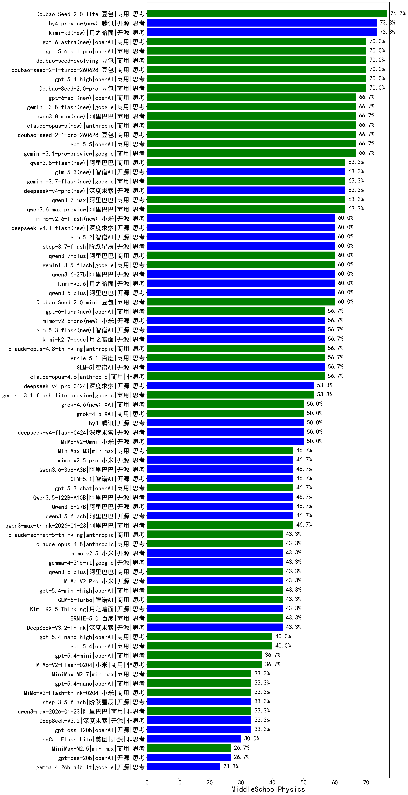

|类别|机构|大模型|【MiddleSchoolPhysics】准确率|平均耗时|平均消耗token|花费/千次（元）|排名（准确率）|
|---|---|-----|-------------------|-------|-----------|-----------|-----------|
|商用|豆包|Doubao-Seed-2.0-lite|76.7%|285s|1375|4.5|1|
|开源|腾讯|hy4-preview(new)|73.3%|80s|4372|77.4|2|
|开源|月之暗面|kimi-k3(new)|73.3%|47s|1171|103.6|3|
|商用|豆包|doubao-seed-evolving|70.0%|272s|11067|328.8|4|
|商用|豆包|doubao-seed-2-1-turbo-260628|70.0%|300s|9251|137.1|5|
|商用|openAI|gpt-6-astra(new)|70.0%|14s|315|77.5|6|
|商用|openAI|gpt-5.4-high|70.0%|21s|1171|112.8|7|
|商用|openAI|gpt-5.6-sol-pro|70.0%|31s|4199|361.6|8|
|商用|豆包|Doubao-Seed-2.0-pro|70.0%|302s|1494|22.1|9|
|商用|openAI|gpt-6-sol(new)|66.7%|222s|319|15.8|10|
|商用|openAI|gpt-5.5|66.7%|15s|899|168.4|11|
|商用|阿里巴巴|qwen3.8-max(new)|66.7%|93s|3707|130.2|12|
|商用|豆包|doubao-seed-2-1-pro-260628|66.7%|290s|13219|393.3|13|
|商用|google|gemini-3.1-pro-preview|66.7%|47s|2367|194.2|14|
|商用|google|gemini-3.8-flash(new)|66.7%|12s|1195|58.3|15|
|商用|anthropic|claude-opus-5(new)|66.7%|12s|761|112.6|16|
|商用|google|gemini-3.7-flash(new)|63.3%|6s|987|23.7|17|
|商用|阿里巴巴|qwen3.7-max|63.3%|81s|3887|137.6|18|
|开源|深度求索|deepseek-v4-pro(new)|63.3%|52s|2983|77.5|19|
|商用|阿里巴巴|qwen3.6-max-preview|63.3%|118s|2263|117.8|20|
|开源|智谱AI|glm-5.3(new)|63.3%|305s|6426|177.9|21|
|商用|阿里巴巴|qwen3.8-flash(new)|63.3%|103s|5959|15.8|22|
|开源|智谱AI|glm-5.2|60.0%|85s|3022|82.6|23|
|开源|阿里巴巴|qwen3.5-plus|60.0%|62s|5305|25.1|24|
|开源|阿里巴巴|qwen3.6-27b|60.0%|41s|2606|45.4|25|
|商用|google|gemini-3.5-flash|60.0%|18s|2062|124.4|26|
|开源|小米|mimo-v2.6-flash(new)|60.0%|270s|1617|3.1|27|
|商用|阿里巴巴|qwen3.7-plus|60.0%|134s|7124|56.4|28|
|开源|阶跃星辰|step-3.7-flash|60.0%|42s|4152|33.0|29|
|开源|月之暗面|kimi-k2.6|60.0%|161s|4549|121.0|30|
|开源|深度求索|deepseek-v4.1-flash(new)|60.0%|18s|1755|13.3|31|
|商用|豆包|Doubao-Seed-2.0-mini|60.0%|458s|3226|6.2|32|
|开源|小米|mimo-v2.6-pro(new)|56.7%|52s|2381|14.0|33|
|开源|月之暗面|kimi-k2.7-code|56.7%|64s|2054|53.6|34|
|商用|anthropic|claude-opus-4.8-thinking|56.7%|18s|1207|190.6|35|
|商用|anthropic|claude-opus-4.6|56.7%|10s|627|89.2|36|
|开源|智谱AI|GLM-5|56.7%|142s|3727|65.8|37|
|开源|智谱AI|glm-5.3-flash(new)|56.7%|120s|2924|8.0|38|
|商用|百度|ernie-5.1|56.7%|58s|2191|38.1|39|
|商用|openAI|gpt-6-luna(new)|56.7%|45s|789|2.4|40|
|开源|深度求索|deepseek-v4-pro-0424|53.3%|104s|3567|84.5|41|
|商用|XAI|grok-4.7(new)|53.3%|71s|5424|190.4|42|
|商用|google|gemini-3.1-flash-lite-preview|53.3%|4s|451|3.8|43|
|开源|腾讯|hy3|50.0%|94s|351|1.1|44|
|开源|深度求索|deepseek-v4-flash-0424|50.0%|66s|2530|5.0|45|
|商用|XAI|grok-4.5|50.0%|52s|2662|103.4|46|
|商用|XAI|grok-4.6(new)|50.0%|68s|2667|103.6|47|
|开源|小米|MiMo-V2-Omni|50.0%|22s|2969|37.7|48|
|商用|minimax|MiniMax-M3|46.7%|70s|2302|35.4|49|
|商用|openAI|gpt-5.3-chat|46.7%|7s|539|42.9|50|
|开源|阿里巴巴|Qwen3.5-122B-A10B|46.7%|166s|5765|36.4|51|
|开源|阿里巴巴|Qwen3.5-27B|46.7%|498s|6873|32.6|52|
|开源|阿里巴巴|qwen3.5-flash|46.7%|161s|6451|12.7|53|
|商用|阿里巴巴|qwen3-max-think-2026-01-23|46.7%|334s|5156|50.8|54|
|开源|智谱AI|GLM-5.1|46.7%|347s|3589|84.4|55|
|开源|阿里巴巴|Qwen3.6-35B-A3B|46.7%|15s|2452|25.6|56|
|开源|小米|mimo-v2.5-pro|46.7%|50s|2533|48.3|57|
|商用|anthropic|claude-sonnet-5-thinking|43.3%|31s|2307|153.2|58|
|开源|月之暗面|Kimi-K2.5-Thinking|43.3%|529s|4564|94.3|59|
|商用|百度|ERNIE-5.0|43.3%|164s|3211|75.5|60|
|开源|深度求索|DeepSeek-V3.2-Think|43.3%|114s|3546|10.5|61|
|开源|小米|mimo-v2.5|43.3%|56s|2755|34.7|62|
|商用|智谱AI|GLM-5-Turbo|43.3%|56s|2448|52.2|63|
|商用|openAI|gpt-5.4-mini-high|43.3%|138s|1487|43.8|64|
|开源|google|gemma-4-31b-it|43.3%|64s|575|1.4|65|
|商用|阿里巴巴|qwen3.6-plus|43.3%|66s|2374|27.5|66|
|开源|小米|MiMo-V2-Pro|43.3%|545s|1376|24.1|67|
|商用|anthropic|claude-opus-4.8|43.3%|7s|541|74.0|68|
|商用|openAI|gpt-5.4|40.0%|4s|331|24.6|69|
|商用|openAI|gpt-5.4-nano-high|40.0%|92s|1548|12.7|70|
|商用|openAI|gpt-5.4-mini|36.7%|6s|296|6.3|71|
|商用|小米|MiMo-V2-Flash-0204|36.7%|124s|937|1.8|72|
|商用|小米|MiMo-V2-Flash-think-0204|33.3%|788s|3669|7.5|73|
|开源|阶跃星辰|step-3.5-flash|33.3%|49s|5894|12.2|74|
|商用|minimax|MiniMax-M2.7|33.3%|67s|2909|23.6|75|
|商用|openAI|gpt-5.4-nano|33.3%|39s|337|2.1|76|
|商用|阿里巴巴|qwen3-max-2026-01-23|33.3%|34s|1217|11.4|77|
|开源|深度求索|DeepSeek-V3.2|33.3%|107s|709|2.0|78|
|开源|openAI|gpt-oss-120b|33.3%|75s|915|2.5|79|
|开源|美团|LongCat-Flash-Lite|30.0%|254s|964|0.0|80|
|商用|minimax|MiniMax-M2.5|26.7%|57s|2751|22.3|81|
|开源|openAI|gpt-oss-20b|26.7%|147s|1359|1.4|82|
|开源|google|gemma-4-26b-a4b-it|23.3%|43s|626|1.5|83|

