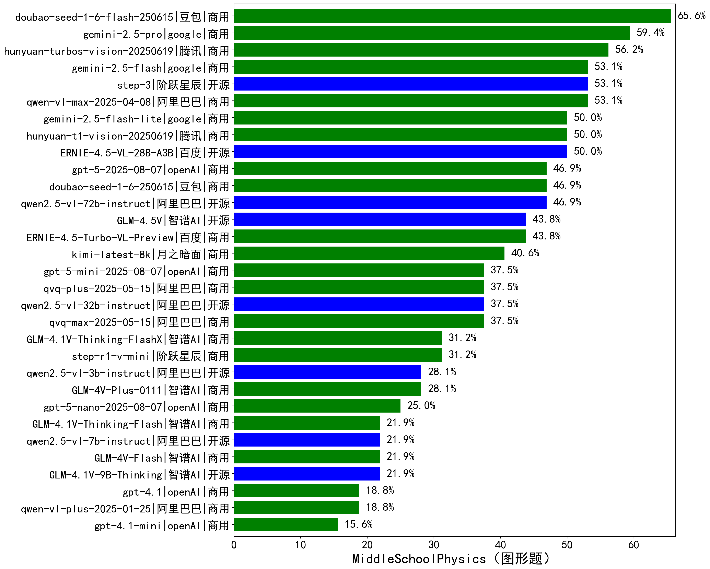

|类别|机构|大模型|【MiddleSchoolPhysics（图形题）】准确率|平均耗时|平均消耗token|花费/千次（元）|排名（准确率）|
|---|---|-----|-------------------|-------|-----------|-----------|-----------|
|商用|豆包|doubao-seed-1-6-flash-250615|65.6%|/|515|0.3|1|
|商用|腾讯|hunyuan-turbos-vision-20250619|56.2%|257s|748|3.9|2|
|商用|阿里巴巴|qwen-vl-max-2025-04-08|53.1%|758s|639|3.7|3|
|开源|阶跃星辰|step-3|53.1%|421s|1974|7.2|4|
|开源|百度|ERNIE-4.5-VL-28B-A3B|50.0%|449s|605|1.3|5|
|商用|腾讯|hunyuan-t1-vision-20250619|50.0%|273s|1309|8.5|6|
|商用|豆包|doubao-seed-1-6-250615|46.9%|/|560|1.9|7|
|开源|阿里巴巴|qwen2.5-vl-72b-instruct|46.9%|689s|470|1.9|8|
|商用|百度|ERNIE-4.5-Turbo-VL-Preview|43.8%|584s|2080|9.1|9|
|开源|智谱AI|GLM-4.5V|43.8%|538s|1281|6.3|10|
|商用|月之暗面|kimi-latest-8k|40.6%|248s|1279|15.4|11|
|商用|阿里巴巴|qvq-max-2025-05-15|37.5%|769s|1549|41.5|12|
|开源|阿里巴巴|qwen2.5-vl-32b-instruct|37.5%|689s|841|1.6|13|
|商用|阿里巴巴|qvq-plus-2025-05-15|37.5%|864s|2172|9.9|14|
|商用|阶跃星辰|step-r1-v-mini|31.2%|522s|4224|30.8|15|
|商用|智谱AI|GLM-4.1V-Thinking-FlashX|31.2%|391s|1322|2.6|16|
|商用|智谱AI|GLM-4V-Plus-0111|28.1%|229s|581|2.3|17|
|开源|阿里巴巴|qwen2.5-vl-3b-instruct|28.1%|619s|442|0.8|18|
|开源|智谱AI|GLM-4.1V-9B-Thinking|21.9%|888s|2032|1.8|19|
|商用|智谱AI|GLM-4V-Flash|21.9%|17s|639|0.0|20|
|开源|阿里巴巴|qwen2.5-vl-7b-instruct|21.9%|17s|566|0.2|21|
|商用|智谱AI|GLM-4.1V-Thinking-Flash|21.9%|21s|1094|0.0|22|
|商用|阿里巴巴|qwen-vl-plus-2025-01-25|18.8%|572s|713|2.2|23|
|商用|openAI|gpt-4.1|18.8%|561s|664|18.4|24|
|商用|openAI|gpt-4.1-mini|15.6%|557s|538|3.6|25|

