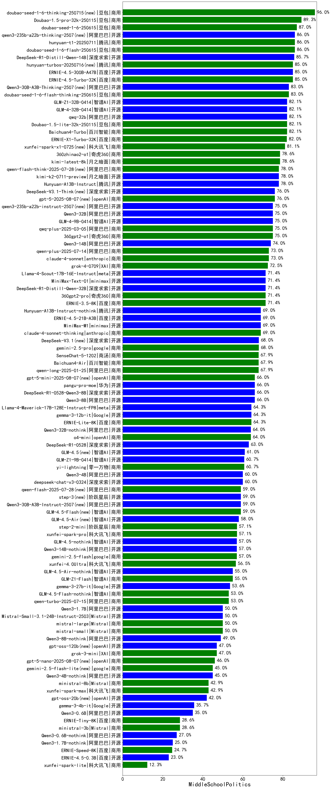

|类别|机构|大模型|【MiddleSchoolPolitics】准确率|平均耗时|平均消耗token|花费/千次（元）|排名（准确率）|
|---|---|-----|-------------------|-------|-----------|-----------|-----------|
|商用|anthropic|claude-opus-4.5(new)|90.0%|9s|575|89.0|1|
|商用|豆包|doubao-seed-1-6-thinking-250715|86.7%|11s|651|4.7|2|
|商用|豆包|doubao-seed-1-6-251015(new)|86.7%|4s|437|2.9|3|
|商用|腾讯|hunyuan-2.0-thinking-20251109(new)|80.0%|29s|448|1.6|4|
|商用|豆包|doubao-seed-1-8-251215(new)|80.0%|18s|418|2.6|5|
|商用|百度|ERNIE-4.5-Turbo-32K|80.0%|10s|306|0.9|6|
|商用|豆包|doubao-seed-1-6-lite-251015(new)|76.7%|10s|492|1.0|7|
|商用|豆包|doubao-seed-1-6-flash-250615|76.7%|3s|204|0.2|8|
|商用|google|gemini-3-pro-preview(new)|76.7%|53s|1568|129.2|9|
|商用|阿里巴巴|qwen-plus-think-2025-07-28|76.7%|/|1736|13.1|10|
|开源|阿里巴巴|qwen3-235b-a22b-thinking-2507|73.3%|44s|1730|32.7|11|
|商用|anthropic|claude-sonnet-4.5-thinking(new)|73.3%|21s|1427|144.5|12|
|开源|百度|ERNIE-4.5-300B-A47B|70.0%|199s|234|1.5|13|
|开源|月之暗面|Kimi-K2-Thinking(new)|70.0%|238s|3951|62.5|14|
|商用|百度|ERNIE-X1.1-Preview(new)|70.0%|106s|718|2.7|15|
|商用|腾讯|hunyuan-2.0-instruct-20251111(new)|70.0%|17s|243|0.4|16|
|商用|anthropic|claude-sonnet-4.5(new)|66.7%|8s|492|45.4|17|
|商用|豆包|doubao-seed-1-6-250615|66.7%|130s|147|0.5|18|
|商用|腾讯|hunyuan-t1-20250711|66.7%|12s|721|2.6|19|
|商用|百度|ERNIE-X1-Turbo-32K|66.7%|35s|867|3.3|20|
|开源|豆包|Seed-OSS-36B-Instruct|66.7%|74s|1054|4.0|21|
|开源|阿里巴巴|qwen3-next-80b-a3b-thinking(new)|66.7%|30s|2614|10.3|22|
|商用|阿里巴巴|qwen-plus-think-2025-12-01(new)|66.7%|47s|2140|16.6|23|
|商用|阿里巴巴|qwen-plus-2025-12-01(new)|63.3%|15s|536|1.0|24|
|商用|阿里巴巴|qwen3-max-preview|63.3%|8s|351|7.0|25|
|商用|豆包|doubao-seed-1-6-flash-thinking-250615|63.3%|7s|588|0.7|26|
|商用|豆包|Doubao-1.5-lite-32k-250115|62.5%|11s|269|0.1|27|
|开源|google|gemma-3-12b-it|62.5%|37s|445|0.0|28|
|开源|智谱AI|GLM-4-9B-0414|62.5%|18s|399|0.0|29|
|开源|智谱AI|GLM-4.7(new)|62.1%|56s|1597|21.7|30|
|开源|百度|ERNIE-4.5-21B-A3B|60.0%|163s|240|0.0|31|
|商用|anthropic|claude-haiku-4.5-thinking(new)|60.0%|45s|1689|57.2|32|
|商用|腾讯|hunyuan-turbos-20250926(new)|60.0%|5s|289|0.5|33|
|开源|阿里巴巴|Qwen3-30B-A3B-Thinking-2507|60.0%|42s|1658|4.5|34|
|商用|百度|ERNIE-5.0-Thinking-Preview(new)|60.0%|204s|787|18.0|35|
|商用|google|gemini-3-flash-preview(new)|60.0%|93s|1048|21.2|36|
|开源|深度求索|DeepSeek-V3.2-Think(new)|60.0%|162s|849|2.5|37|
|商用|anthropic|claude-haiku-4.5(new)|56.7%|12s|507|15.2|38|
|开源|腾讯|Hunyuan-A13B-Instruct|56.7%|221s|543|2.0|39|
|开源|阿里巴巴|Qwen3-14B|56.7%|34s|1519|2.9|40|
|开源|阿里巴巴|qwen3-235b-a22b-instruct-2507|56.7%|7s|309|2.1|41|
|开源|深度求索|DeepSeek-V3.2-Exp(new)|53.3%|9s|210|0.6|42|
|商用|openAI|gpt-5.2-medium(new)|53.3%|5s|250|19.0|43|
|商用|阿里巴巴|qwen-flash-think-2025-07-28|53.3%|18s|1674|2.4|44|
|商用|XAI|grok-4-0709|52.0%|188s|736|74.1|45|
|商用|百川智能|Baichuan4-Turbo|50.0%|17s|359|5.4|46|
|商用|openAI|gpt-5.1-high(new)|50.0%|18s|1041|69.7|47|
|商用|百度|ERNIE-Lite-8K|50.0%|18s|346|0.0|48|
|商用|openAI|gpt-5-2025-08-07|50.0%|20s|236|12.7|49|
|商用|openAI|gpt-5.2-high(new)|50.0%|8s|269|20.9|50|
|商用|openAI|gpt-5-mini-high(new)|50.0%|39s|1451|20.2|51|
|商用|openAI|gpt-5.1-medium(new)|50.0%|37s|487|30.4|52|
|开源|meta|Llama-4-Scout-17B-16E-Instruct|50.0%|22s|558|1.0|53|
|开源|meta|Llama-4-Maverick-17B-128E-Instruct-FP8|50.0%|24s|661|2.5|54|
|商用|anthropic|claude-4-sonnet-thinking|50.0%|7s|464|42.3|55|
|商用|科大讯飞|xunfei-spark-x1-0725|46.7%|/|634|6.8|56|
|开源|腾讯|Hunyuan-A13B-Instruct-nothink|46.7%|12s|255|0.8|57|
|开源|阿里巴巴|Qwen3-32B|46.7%|37s|1161|4.4|58|
|开源|深度求索|DeepSeek-V3.2(new)|46.7%|120s|194|0.5|59|
|商用|anthropic|claude-4-sonnet|46.7%|11s|442|40.6|60|
|商用|阿里巴巴|qwen3-max-2025-09-23(new)|46.7%|9s|275|5.4|61|
|商用|阿里巴巴|qwen-plus-2025-07-28|46.7%|8s|315|0.5|62|
|开源|minimax|MiniMax-M1|43.3%|158s|2501|19.2|63|
|开源|智谱AI|GLM-4.5|43.3%|77s|1458|19.1|64|
|商用|XAI|grok-4-1-fast-non-reasoning(new)|43.3%|125s|429|1.0|65|
|商用|openAI|gpt-5-mini-2025-08-07|43.3%|26s|685|9.0|66|
|开源|月之暗面|kimi-k2-0711-preview|43.3%|35s|219|2.8|67|
|开源|深度求索|DeepSeek-V3.1|43.3%|10s|202|1.9|68|
|开源|深度求索|DeepSeek-V3.1-Think|43.3%|35s|626|7.0|69|
|商用|阿里巴巴|qwen-turbo-think-2025-07-15|40.0%|16s|1434|4.0|70|
|开源|Mistral|Magistral-Small-2507|40.0%|43s|3280|35.0|71|
|商用|阿里巴巴|qwen-long-2025-01-25|37.5%|7s|418|0.7|72|
|商用|360|360zhinao2-o1|37.5%|113s|1786|17.0|73|
|开源|google|gemma-3-27b-it|37.5%|28s|468|0.6|74|
|商用|百川智能|Baichuan4-Air|37.5%|17s|331|0.3|75|
|开源|深度求索|DeepSeek-R1-0528-Qwen3-8B|36.7%|65s|1022|0.0|76|
|开源|阿里巴巴|Qwen3-8B|36.7%|61s|1594|0.0|77|
|开源|智谱AI|GLM-4.6(new)|36.7%|42s|1563|21.4|78|
|商用|XAI|grok-4-1-fast-reasoning(new)|36.7%|118s|1020|3.2|79|
|开源|阿里巴巴|qwen3-next-80b-a3b-instruct|33.3%|5s|429|1.5|80|
|开源|小米|MiMo-V2-Flash(new)|33.3%|145s|281|0.0|81|
|开源|小米|MiMo-V2-Flash-think(new)|33.3%|82s|1470|0.0|82|
|开源|深度求索|DeepSeek-R1-0528|33.3%|80s|1247|19.3|83|
|开源|月之暗面|kimi-k2-0905(new)|33.3%|112s|199|2.3|84|
|商用|google|gemini-2.5-pro|33.3%|23s|1850|129.7|85|
|商用|openAI|gpt-5-nano-high(new)|30.0%|51s|2630|7.5|86|
|开源|阿里巴巴|Qwen3-32B-nothink|30.0%|28s|339|1.1|87|
|商用|阿里巴巴|qwen-flash-2025-07-28|30.0%|6s|386|0.5|88|
|开源|阶跃星辰|step-3|30.0%|71s|1319|5.1|89|
|商用|openAI|gpt-5.2(new)|30.0%|7s|122|6.2|90|
|商用|google|gemini-2.5-flash-lite|30.0%|6s|1036|2.9|91|
|开源|minimax|MiniMax-M2(new)|26.7%|16s|842|6.5|92|
|开源|阿里巴巴|Qwen3-4B|26.7%|18s|1042|3.0|93|
|商用|openAI|gpt-5.1(new)|26.7%|96s|152|6.6|94|
|开源|阿里巴巴|Qwen3-30B-A3B-Instruct-2507|26.7%|4s|387|1.0|95|
|开源|深度求索|DeepSeek-V3.2-Exp-Think(new)|26.7%|241s|662|1.9|96|
|开源|minimax|MiniMax-Text-01|25.0%|12s|938|7.5|97|
|开源|阿里巴巴|Qwen3-1.7B|23.3%|12s|1137|3.2|98|
|商用|openAI|o4-mini|23.3%|9s|543|15.9|99|
|商用|google|gemini-2.5-flash|23.3%|9s|1475|25.6|100|
|商用|Mistral|mistral-medium-2508|23.3%|233s|325|3.7|101|
|开源|阿里巴巴|Qwen3-0.6B-nothink|23.3%|5s|156|0.3|102|
|开源|openAI|gpt-oss-20b|23.3%|4s|773|0.8|103|
|开源|Mistral|Ministral-3-3B-Instruct-2512(new)|20.0%|3s|339|0.2|104|
|商用|阿里巴巴|qwen-turbo-2025-07-15|20.0%|5s|260|0.1|105|
|开源|智谱AI|GLM-4.5-Air-nothink|20.0%|8s|573|2.9|106|
|商用|智谱AI|GLM-4.5-Flash|20.0%|37s|1416|0.0|107|
|开源|Mistral|mistral-large-2512(new)|20.0%|8s|274|2.4|108|
|开源|智谱AI|GLM-4.5-nothink|16.7%|17s|554|6.6|109|
|开源|阿里巴巴|Qwen3-14B-nothink|16.7%|7s|346|0.6|110|
|商用|XAI|grok-3-mini|16.7%|160s|766|2.7|111|
|开源|Mistral|Ministral-3-14B-Instruct-2512(new)|16.7%|13s|333|0.5|112|
|开源|Mistral|Ministral-3-8B-Instruct-2512(new)|13.3%|2s|328|0.4|113|
|开源|百度|ERNIE-4.5-0.3B|13.3%|148s|218|0.0|114|
|开源|智谱AI|GLM-4.5-Air|13.3%|22s|1454|7.6|115|
|开源|Mistral|Mistral-Small-3.2-24B-Instruct-2506|13.3%|9s|314|0.6|116|
|商用|智谱AI|GLM-4.5-Flash-nothink|13.3%|20s|561|0.0|117|
|商用|openAI|gpt-5-nano-2025-08-07|13.3%|22s|1216|3.3|118|
|开源|google|gemma-3-4b-it|12.5%|21s|459|0.0|119|
|开源|阿里巴巴|Qwen3-0.6B|10.0%|7s|743|2.1|120|
|开源|openAI|gpt-oss-120b|10.0%|12s|461|1.2|121|
|开源|阿里巴巴|Qwen3-4B-nothink|6.7%|8s|301|0.7|122|
|开源|阿里巴巴|Qwen3-1.7B-nothink|6.7%|5s|289|0.7|123|
|开源|阿里巴巴|Qwen3-8B-nothink|6.7%|12s|300|0.0|124|

