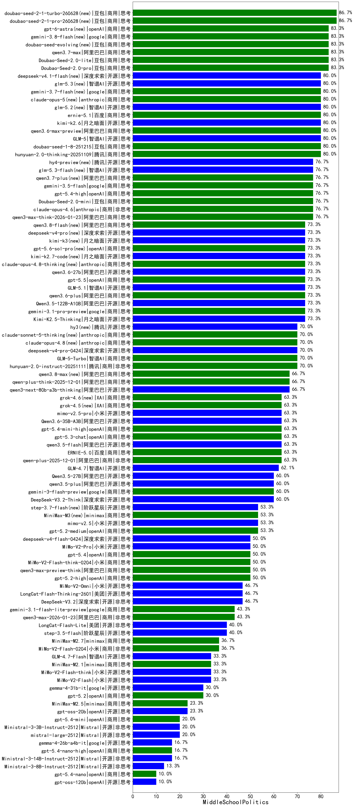

|类别|机构|大模型|【MiddleSchoolPolitics】准确率|平均耗时|平均消耗token|花费/千次（元）|排名（准确率）|
|---|---|-----|-------------------|-------|-----------|-----------|-----------|
|商用|豆包|doubao-seed-2-1-pro-260628(new)|86.7%|101s|4063|119.5|1|
|商用|豆包|doubao-seed-2-1-turbo-260628(new)|86.7%|105s|3576|52.4|2|
|商用|openAI|gpt-6-astra(new)|83.3%|9s|217|56.9|3|
|商用|google|gemini-3.8-flash(new)|83.3%|13s|604|29.1|4|
|商用|豆包|Doubao-Seed-2.0-lite|83.3%|107s|656|2.0|5|
|商用|豆包|Doubao-Seed-2.0-pro|83.3%|143s|686|9.6|6|
|商用|豆包|doubao-seed-evolving(new)|83.3%|161s|4625|136.3|7|
|商用|阿里巴巴|qwen3.7-max|83.3%|17s|801|27.3|8|
|开源|智谱AI|GLM-5|80.0%|55s|1526|26.8|9|
|商用|百度|ernie-5.1|80.0%|22s|589|9.8|10|
|开源|智谱AI|glm-5.2(new)|80.0%|29s|1194|32.2|11|
|商用|豆包|doubao-seed-1-8-251215|80.0%|18s|418|2.6|12|
|开源|月之暗面|kimi-k2.6|80.0%|68s|1096|28.5|13|
|商用|腾讯|hunyuan-2.0-thinking-20251109|80.0%|29s|448|1.6|14|
|商用|阿里巴巴|qwen3.6-max-preview|80.0%|39s|1220|63.0|15|
|商用|anthropic|claude-opus-5(new)|80.0%|14s|743|117.2|16|
|商用|google|gemini-3.7-flash(new)|80.0%|4s|527|12.5|17|
|开源|智谱AI|glm-5.3(new)|80.0%|219s|3556|94.9|18|
|商用|anthropic|claude-opus-4.6|76.7%|9s|462|67.7|19|
|商用|阿里巴巴|qwen3-max-think-2026-01-23|76.7%|250s|2279|22.3|20|
|商用|豆包|Doubao-Seed-2.0-mini|76.7%|314s|1384|2.6|21|
|商用|google|gemini-3.5-flash|76.7%|6s|1098|65.9|22|
|商用|阿里巴巴|qwen3.7-plus(new)|76.7%|22s|1108|8.5|23|
|商用|openAI|gpt-5.4-high|76.7%|14s|502|46.8|24|
|开源|智谱AI|glm-5.3-flash(new)|76.7%|48s|2074|5.7|25|
|商用|anthropic|claude-opus-4.8-thinking(new)|73.3%|12s|692|108.1|26|
|开源|阿里巴巴|qwen3.6-27b|73.3%|23s|1395|24.2|27|
|开源|月之暗面|kimi-k2.7-code(new)|73.3%|19s|608|15.3|28|
|开源|月之暗面|Kimi-K2.5-Thinking|73.3%|257s|1224|24.7|29|
|商用|openAI|gpt-5.5|73.3%|8s|366|65.0|30|
|商用|google|gemini-3.1-pro-preview|73.3%|21s|1116|90.7|31|
|商用|阿里巴巴|qwen3.6-plus|73.3%|49s|1207|13.9|32|
|开源|阿里巴巴|Qwen3.5-122B-A10B|73.3%|363s|2468|15.4|33|
|商用|openAI|gpt-5.6-sol-pro(new)|73.3%|12s|2987|223.5|34|
|开源|月之暗面|kimi-k3(new)|73.3%|34s|744|63.6|35|
|开源|智谱AI|GLM-5.1|73.3%|50s|1075|24.8|36|
|开源|深度求索|deepseek-v4-pro(new)|73.3%|274s|1068|26.5|37|
|商用|阿里巴巴|qwen3.8-flash(new)|73.3%|38s|652|1.5|38|
|商用|anthropic|claude-opus-4.8(new)|70.0%|7s|395|56.2|39|
|开源|腾讯|hy3(new)|70.0%|93s|156|0.4|40|
|商用|anthropic|claude-sonnet-5-thinking(new)|70.0%|24s|739|46.5|41|
|开源|深度求索|deepseek-v4-pro-0424|70.0%|31s|708|16.3|42|
|商用|智谱AI|GLM-5-Turbo|70.0%|30s|1197|25.4|43|
|商用|腾讯|hunyuan-2.0-instruct-20251111|70.0%|17s|243|0.4|44|
|开源|阿里巴巴|qwen3-next-80b-a3b-thinking|66.7%|30s|2614|10.3|45|
|商用|阿里巴巴|qwen3.8-max(new)|66.7%|21s|953|31.9|46|
|商用|阿里巴巴|qwen-plus-think-2025-12-01|66.7%|47s|2140|16.6|47|
|商用|XAI|grok-4.5(new)|63.3%|50s|2067|79.5|48|
|商用|阿里巴巴|qwen-plus-2025-12-01|63.3%|15s|536|1.0|49|
|商用|openAI|gpt-5.3-chat|63.3%|53s|256|19.3|50|
|商用|百度|ERNIE-5.0|63.3%|201s|866|19.9|51|
|开源|阿里巴巴|qwen3.5-flash|63.3%|425s|3129|6.1|52|
|商用|openAI|gpt-5.4-mini-high|63.3%|11s|783|22.9|53|
|商用|XAI|grok-4.6(new)|63.3%|54s|1678|63.1|54|
|开源|小米|mimo-v2.5-pro|63.3%|23s|998|16.7|55|
|开源|阿里巴巴|Qwen3.6-35B-A3B|63.3%|8s|1262|13.1|56|
|开源|智谱AI|GLM-4.7|62.1%|56s|1597|21.7|57|
|商用|google|gemini-3-flash-preview|60.0%|93s|1048|21.2|58|
|开源|阿里巴巴|Qwen3.5-27B|60.0%|116s|2616|12.3|59|
|开源|阿里巴巴|qwen3.5-plus|60.0%|35s|2737|12.9|60|
|开源|深度求索|DeepSeek-V3.2-Think|60.0%|162s|849|2.5|61|
|开源|小米|mimo-v2.5|53.3%|21s|949|9.9|62|
|商用|openAI|gpt-5.2-medium|53.3%|5s|250|19.0|63|
|开源|阶跃星辰|step-3.7-flash(new)|53.3%|23s|1720|13.5|64|
|商用|minimax|MiniMax-M3(new)|53.3%|29s|591|7.2|65|
|商用|小米|MiMo-V2-Flash-think-0204|50.0%|227s|1231|2.5|66|
|商用|阿里巴巴|qwen3-max-preview-think|50.0%|183s|1832|42.9|67|
|商用|openAI|gpt-5.2-high|50.0%|8s|269|20.9|68|
|开源|小米|MiMo-V2-Pro|50.0%|331s|841|13.4|69|
|开源|深度求索|deepseek-v4-flash-0424|50.0%|34s|832|1.6|70|
|商用|openAI|gpt-5.4|50.0%|2s|153|10.2|71|
|开源|深度求索|DeepSeek-V3.2|46.7%|120s|194|0.5|72|
|开源|美团|LongCat-Flash-Thinking-2601|46.7%|69s|1636|0.0|73|
|开源|小米|MiMo-V2-Omni|46.7%|284s|1029|11.0|74|
|商用|google|gemini-3.1-flash-lite-preview|43.3%|5s|236|1.9|75|
|商用|阿里巴巴|qwen3-max-2026-01-23|43.3%|12s|304|2.6|76|
|开源|阶跃星辰|step-3.5-flash|40.0%|12s|911|1.8|77|
|开源|美团|LongCat-Flash-Lite|40.0%|27s|311|0.0|78|
|商用|minimax|MiniMax-M2.7|36.7%|31s|1316|10.5|79|
|商用|小米|MiMo-V2-Flash-0204|36.7%|44s|358|0.6|80|
|开源|智谱AI|GLM-4.7-Flash|33.3%|1227s|1586|0.0|81|
|商用|minimax|MiniMax-M2.1|33.3%|25s|784|6.0|82|
|开源|小米|MiMo-V2-Flash-think|33.3%|82s|1470|0.0|83|
|开源|小米|MiMo-V2-Flash|33.3%|145s|281|0.0|84|
|商用|openAI|gpt-5.2|30.0%|7s|122|6.2|85|
|开源|google|gemma-4-31b-it|30.0%|65s|349|0.8|86|
|商用|minimax|MiniMax-M2.5|23.3%|22s|905|7.1|87|
|开源|openAI|gpt-oss-20b|23.3%|4s|773|0.8|88|
|开源|Mistral|Ministral-3-3B-Instruct-2512|20.0%|3s|339|0.2|89|
|开源|Mistral|mistral-large-2512|20.0%|8s|274|2.4|90|
|商用|openAI|gpt-5.4-mini|20.0%|53s|144|2.8|91|
|开源|google|gemma-4-26b-a4b-it|16.7%|34s|374|0.9|92|
|商用|openAI|gpt-5.4-nano-high|16.7%|15s|317|2.3|93|
|开源|Mistral|Ministral-3-14B-Instruct-2512|16.7%|13s|333|0.5|94|
|开源|Mistral|Ministral-3-8B-Instruct-2512|13.3%|2s|328|0.4|95|
|商用|openAI|gpt-5.4-nano|10.0%|18s|134|0.7|96|
|开源|openAI|gpt-oss-120b|10.0%|12s|461|1.2|97|

