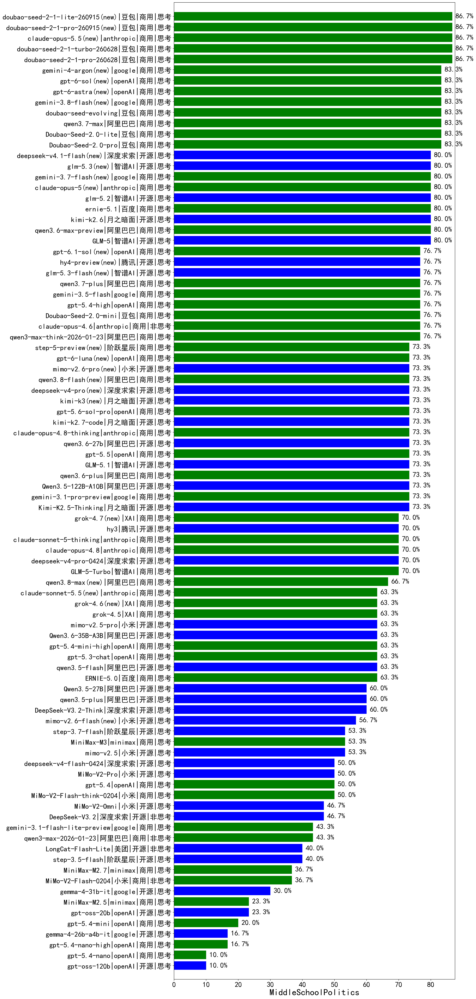

|类别|机构|大模型|【MiddleSchoolPolitics】准确率|平均耗时|平均消耗token|花费/千次（元）|排名（准确率）|
|---|---|-----|-------------------|-------|-----------|-----------|-----------|
|商用|豆包|doubao-seed-2-1-pro-260628|86.7%|101s|4063|119.5|1|
|商用|豆包|doubao-seed-2-1-turbo-260628|86.7%|105s|3576|52.4|2|
|商用|豆包|doubao-seed-2-1-lite-260915(new)|86.7%|50s|2435|6.4|3|
|商用|豆包|doubao-seed-2-1-pro-260915(new)|86.7%|54s|883|24.1|4|
|商用|anthropic|claude-opus-5.5(new)|86.7%|17s|543|65.5|5|
|商用|豆包|doubao-seed-evolving|83.3%|161s|4625|136.3|6|
|商用|openAI|gpt-6-sol(new)|83.3%|84s|256|14.1|7|
|商用|阿里巴巴|qwen3.7-max|83.3%|17s|801|27.3|8|
|商用|google|gemini-4-argon(new)|83.3%|15s|283|29.5|9|
|商用|openAI|gpt-6-astra(new)|83.3%|9s|217|56.9|10|
|商用|google|gemini-3.8-flash(new)|83.3%|13s|604|29.1|11|
|商用|anthropic|claude-opus-5|80.0%|14s|743|117.2|12|
|开源|智谱AI|glm-5.2|80.0%|29s|1194|32.2|13|
|商用|百度|ernie-5.1|80.0%|22s|589|9.8|14|
|商用|google|gemini-3.7-flash|80.0%|4s|527|12.5|15|
|开源|智谱AI|glm-5.3(new)|80.0%|219s|3556|94.9|16|
|开源|深度求索|deepseek-v4.1-flash(new)|80.0%|9s|803|5.9|17|
|商用|阿里巴巴|qwen3.6-max-preview|80.0%|39s|1220|63.0|18|
|开源|月之暗面|kimi-k2.6|80.0%|68s|1096|28.5|19|
|商用|阿里巴巴|qwen3.7-plus|76.7%|22s|1108|8.5|20|
|商用|google|gemini-3.5-flash|76.7%|6s|1098|65.9|21|
|开源|智谱AI|glm-5.3-flash(new)|76.7%|48s|2074|5.7|22|
|商用|openAI|gpt-6.1-sol(new)|76.7%|6s|183|9.0|23|
|开源|腾讯|hy4-preview(new)|76.7%|75s|5046|90.0|24|
|开源|阿里巴巴|qwen3.6-27b|73.3%|23s|1395|24.2|25|
|开源|月之暗面|kimi-k2.7-code|73.3%|19s|608|15.3|26|
|商用|openAI|gpt-6-luna(new)|73.3%|161s|322|0.9|27|
|开源|深度求索|deepseek-v4-pro|73.3%|274s|1068|26.5|28|
|商用|google|gemini-3.1-pro-preview|73.3%|21s|1116|90.7|29|
|开源|小米|mimo-v2.6-pro(new)|73.3%|34s|856|4.9|30|
|开源|阿里巴巴|Qwen3.5-122B-A10B|73.3%|363s|2468|15.4|31|
|商用|anthropic|claude-opus-4.8-thinking|73.3%|12s|692|108.1|32|
|商用|openAI|gpt-5.5|73.3%|8s|366|65.0|33|
|商用|阿里巴巴|qwen3.6-plus|73.3%|49s|1207|13.9|34|
|商用|阶跃星辰|step-5-preview(new)|73.3%|27s|2018|39.6|35|
|开源|智谱AI|GLM-5.1|73.3%|50s|1075|24.8|36|
|商用|openAI|gpt-5.6-sol-pro|73.3%|12s|2987|223.5|37|
|商用|阿里巴巴|qwen3.8-flash(new)|73.3%|38s|652|1.5|38|
|开源|月之暗面|kimi-k3|73.3%|34s|744|63.6|39|
|商用|XAI|grok-4.7(new)|70.0%|58s|4428|149.6|40|
|开源|腾讯|hy3|70.0%|93s|156|0.4|41|
|商用|anthropic|claude-sonnet-5-thinking|70.0%|24s|739|46.5|42|
|商用|anthropic|claude-opus-4.8|70.0%|7s|395|56.2|43|
|开源|深度求索|deepseek-v4-pro-0424|70.0%|31s|708|16.3|44|
|商用|阿里巴巴|qwen3.8-max|66.7%|21s|953|31.9|45|
|商用|XAI|grok-4.5|63.3%|50s|2067|79.5|46|
|商用|百度|ERNIE-5.0|63.3%|201s|866|19.9|47|
|商用|anthropic|claude-sonnet-5.5(new)|63.3%|7s|502|29.9|48|
|开源|阿里巴巴|Qwen3.6-35B-A3B|63.3%|8s|1262|13.1|49|
|开源|小米|mimo-v2.5-pro|63.3%|23s|998|16.7|50|
|商用|XAI|grok-4.6|63.3%|54s|1678|63.1|51|
|开源|阿里巴巴|Qwen3.5-27B|60.0%|116s|2616|12.3|52|
|开源|深度求索|DeepSeek-V3.2-Think|60.0%|162s|849|2.5|53|
|开源|小米|mimo-v2.6-flash(new)|56.7%|33s|658|1.3|54|
|开源|小米|mimo-v2.5|53.3%|21s|949|9.9|55|
|商用|minimax|MiniMax-M3|53.3%|29s|591|7.2|56|
|开源|阶跃星辰|step-3.7-flash|53.3%|23s|1720|13.5|57|
|开源|深度求索|deepseek-v4-flash-0424|50.0%|34s|832|1.6|58|
|商用|minimax|MiniMax-M3.1-Flash(new)|46.7%|25s|1759|6.3|59|
|开源|深度求索|DeepSeek-V3.2|46.7%|120s|194|0.5|60|
|商用|google|gemini-3.1-flash-lite-preview|43.3%|5s|236|1.9|61|
|商用|anthropic|claude-haiku-5.5(new)|43.3%|6s|676|2.1|62|
|商用|minimax|MiniMax-M2.7|36.7%|31s|1316|10.5|63|
|开源|google|gemma-4-31b-it|30.0%|65s|349|0.8|64|
|开源|openAI|gpt-oss-20b|23.3%|4s|773|0.8|65|
|开源|google|gemma-4-26b-a4b-it|16.7%|34s|374|0.9|66|
|开源|openAI|gpt-oss-120b|10.0%|12s|461|1.2|67|

