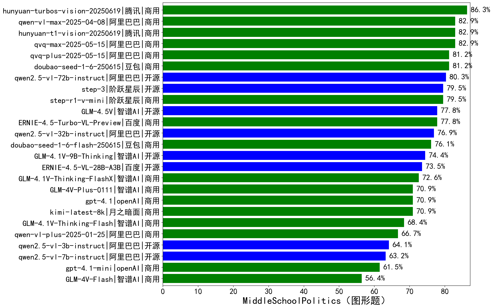

|类别|机构|大模型|【MiddleSchoolPolitics（图形题）】准确率|平均耗时|平均消耗token|花费/千次（元）|排名（准确率）|
|---|---|-----|-------------------|-------|-----------|-----------|-----------|
|商用|腾讯|hunyuan-turbos-vision-20250619|86.3%|131s|726|3.7|1|
|商用|google|gemini-2.5-flash|86.3%|112s|2156|33.1|2|
|商用|google|gemini-2.5-pro|85.5%|140s|2123|130.1|3|
|商用|阿里巴巴|qvq-max-2025-05-15|82.9%|413s|1360|37.4|4|
|商用|阿里巴巴|qwen-vl-max-2025-04-08|82.9%|394s|567|3.6|5|
|商用|腾讯|hunyuan-t1-vision-20250619|82.9%|183s|1311|8.6|6|
|商用|豆包|doubao-seed-1-6-250615|81.2%|/|390|1.1|7|
|商用|阿里巴巴|qvq-plus-2025-05-15|81.2%|406s|1395|6.2|8|
|开源|阿里巴巴|qwen2.5-vl-72b-instruct|80.3%|283s|358|1.5|9|
|开源|阶跃星辰|step-3|79.5%|188s|1739|6.3|10|
|商用|openAI|gpt-5-2025-08-07|79.5%|56s|1371|74.4|11|
|商用|阶跃星辰|step-r1-v-mini|79.5%|98s|2356|16.4|12|
|商用|百度|ERNIE-4.5-Turbo-VL-Preview|77.8%|381s|1809|7.0|13|
|开源|智谱AI|GLM-4.5V|77.8%|273s|955|4.7|14|
|开源|阿里巴巴|qwen2.5-vl-32b-instruct|76.9%|315s|717|1.4|15|
|商用|豆包|doubao-seed-1-6-flash-250615|76.1%|/|468|0.4|16|
|商用|openAI|gpt-5-mini-2025-08-07|76.1%|88s|1001|11.4|17|
|开源|智谱AI|GLM-4.1V-9B-Thinking|74.4%|500s|1258|1.1|18|
|开源|百度|ERNIE-4.5-VL-28B-A3B|73.5%|304s|551|1.4|19|
|商用|智谱AI|GLM-4.1V-Thinking-FlashX|72.6%|125s|1060|2.1|20|
|商用|智谱AI|GLM-4V-Plus-0111|70.9%|79s|488|2.0|21|
|商用|月之暗面|kimi-latest-8k|70.9%|85s|1272|15.3|22|
|商用|openAI|gpt-4.1|70.9%|321s|558|15.5|23|
|商用|智谱AI|GLM-4.1V-Thinking-Flash|68.4%|141s|1041|0.0|24|
|商用|google|gemini-2.5-flash-lite|67.5%|111s|986|2.0|25|
|商用|阿里巴巴|qwen-vl-plus-2025-01-25|66.7%|337s|354|0.8|26|
|开源|阿里巴巴|qwen2.5-vl-3b-instruct|64.1%|290s|325|0.5|27|
|开源|阿里巴巴|qwen2.5-vl-7b-instruct|63.2%|127s|485|0.2|28|
|商用|openAI|gpt-5-nano-2025-08-07|62.4%|112s|1911|4.9|29|
|商用|openAI|gpt-4.1-mini|61.5%|185s|433|2.9|30|
|商用|智谱AI|GLM-4V-Flash|56.4%|132s|553|0.0|31|

