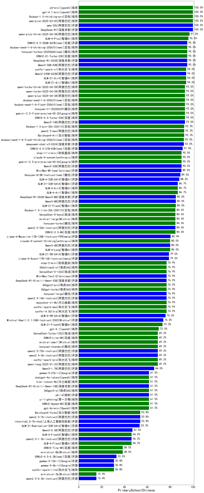

|类别|机构|大模型|【PrimarySchoolChinese】准确率|平均耗时|平均消耗token|花费/千次（元）|排名（准确率）|
|---|---|-----|-------------------|-------|-----------|-----------|-----------|
|商用|anthropic|claude-4-sonnet-thinking|100.0%|51s|1054|105.3|1|
|商用|anthropic|claude-4-sonnet|100.0%|41s|438|38.1|2|
|商用|openAI|o4-mini|100.0%|39s|938|27.9|3|
|开源|Mistral|Magistral-Small-2507|71.4%|48s|3637|39.1|4|
|开源|阿里巴巴|Qwen3-14B|57.1%|259s|2473|4.9|5|
|开源|深度求索|DeepSeek-R1-0528|57.1%|110s|1324|20.5|6|
|商用|anthropic|claude-opus-4.5(new)|43.3%|22s|451|67.9|7|
|开源|阿里巴巴|qwen3-235b-a22b-instruct-2507|43.3%|143s|373|2.6|8|
|商用|百度|ERNIE-X1.1-Preview(new)|43.3%|109s|639|2.4|9|
|商用|google|gemini-3-pro-preview(new)|43.3%|44s|2029|168.5|10|
|开源|Mistral|Mistral-Small-3.2-24B-Instruct-2506|42.9%|239s|376|0.7|11|
|商用|百度|ERNIE-X1-Turbo-32K|42.9%|282s|1334|5.2|12|
|商用|百度|ERNIE-4.5-Turbo-32K|42.9%|278s|353|1.0|13|
|开源|阿里巴巴|Qwen3-0.6B|42.9%|138s|983|2.8|14|
|开源|深度求索|DeepSeek-R1-0528-Qwen3-8B|42.9%|81s|1245|0.0|15|
|商用|360|360zhinao2-o1|42.9%|/|/|/|16|
|商用|腾讯|hunyuan-turbos-20250926(new)|40.0%|9s|405|0.7|17|
|开源|智谱AI|GLM-4.5|40.0%|57s|1361|18.4|18|
|开源|深度求索|DeepSeek-V3.2-Exp-Think(new)|40.0%|180s|788|2.3|19|
|开源|深度求索|DeepSeek-V3.1-Think|40.0%|38s|760|8.7|20|
|商用|阿里巴巴|qwen-plus-think-2025-07-28|40.0%|1098s|1568|12.1|21|
|商用|google|gemini-2.5-pro|40.0%|25s|1739|122.4|22|
|商用|腾讯|hunyuan-t1-20250711|40.0%|181s|1273|4.1|23|
|商用|openAI|gpt-5.1-medium(new)|40.0%|18s|720|46.9|24|
|开源|月之暗面|Kimi-K2-Thinking(new)|40.0%|128s|1396|21.7|25|
|商用|百度|ERNIE-5.0-Thinking-Preview(new)|40.0%|114s|1062|24.6|26|
|商用|豆包|doubao-seed-1-6-lite-251015(new)|40.0%|14s|583|1.2|27|
|商用|豆包|doubao-seed-1-6-thinking-250715|40.0%|13s|716|5.3|28|
|开源|阿里巴巴|qwen3-235b-a22b-thinking-2507|40.0%|222s|1807|32.1|29|
|商用|XAI|grok-4-0709|40.0%|506s|1735|183.3|30|
|商用|google|gemini-2.5-flash|36.7%|150s|1214|21.1|31|
|商用|阿里巴巴|qwen-flash-think-2025-07-28|36.7%|205s|1721|2.5|32|
|开源|阶跃星辰|step-3|36.7%|121s|1456|5.7|33|
|开源|百度|ERNIE-4.5-21B-A3B|36.7%|231s|247|0.1|34|
|商用|anthropic|claude-sonnet-4.5-thinking(new)|36.7%|26s|1668|171.3|35|
|开源|百度|ERNIE-4.5-300B-A47B|36.7%|169s|234|1.5|36|
|商用|阿里巴巴|qwen-plus-2025-07-28|36.7%|188s|459|0.8|37|
|商用|阿里巴巴|qwen3-max-preview|36.7%|167s|357|7.5|38|
|开源|豆包|Seed-OSS-36B-Instruct|36.7%|246s|1008|3.9|39|
|商用|豆包|doubao-seed-1-6-251015(new)|36.7%|96s|564|3.9|40|
|开源|智谱AI|GLM-4.6(new)|36.7%|32s|1652|22.5|41|
|商用|anthropic|claude-haiku-4.5(new)|33.3%|15s|467|14.0|42|
|商用|openAI|gpt-5-2025-08-07|33.3%|155s|344|21.1|43|
|商用|智谱AI|GLM-4.5-Flash-nothink|33.3%|19s|599|0.0|44|
|开源|minimax|MiniMax-M2(new)|33.3%|72s|2817|23.1|45|
|开源|深度求索|DeepSeek-V3.2-Exp(new)|33.3%|178s|205|0.6|46|
|开源|阿里巴巴|Qwen3-30B-A3B-Thinking-2507|33.3%|75s|1667|4.5|47|
|开源|阿里巴巴|Qwen3-32B-nothink|33.3%|210s|352|1.2|48|
|商用|豆包|doubao-seed-1-6-250615|33.3%|102s|261|1.5|49|
|商用|豆包|doubao-seed-1-6-flash-250615|33.3%|3s|272|0.3|50|
|开源|深度求索|DeepSeek-V3.1|30.0%|13s|238|2.4|51|
|商用|阿里巴巴|qwen-turbo-think-2025-07-15|30.0%|1059s|1534|4.4|52|
|商用|豆包|doubao-seed-1-6-flash-thinking-250615|30.0%|7s|495|0.6|53|
|商用|openAI|gpt-5-mini-2025-08-07|30.0%|39s|958|13.1|54|
|商用|阿里巴巴|qwen-turbo-2025-07-15|30.0%|12s|282|0.2|55|
|开源|阿里巴巴|qwen3-next-80b-a3b-instruct|30.0%|13s|454|1.6|56|
|开源|腾讯|Hunyuan-A13B-Instruct-nothink|30.0%|423s|281|0.9|57|
|开源|智谱AI|GLM-4.5-Air-nothink|30.0%|163s|582|3.2|58|
|开源|月之暗面|kimi-k2-0711-preview|30.0%|26s|417|6.0|59|
|开源|智谱AI|GLM-4.5-Air|30.0%|178s|1457|8.5|60|
|商用|anthropic|claude-haiku-4.5-thinking(new)|30.0%|26s|3329|116.9|61|
|商用|openAI|gpt-5.1-high(new)|30.0%|27s|2026|139.6|62|
|商用|anthropic|claude-sonnet-4.5(new)|30.0%|13s|456|42.0|63|
|商用|科大讯飞|xunfei-spark-x1-0725|28.6%|/|657|7.9|64|
|开源|阿里巴巴|Qwen3-8B|28.6%|79s|2148|0.0|65|
|开源|阿里巴巴|Qwen3-32B|28.6%|234s|1561|6.1|66|
|开源|阿里巴巴|Qwen3-1.7B|28.6%|185s|2346|6.9|67|
|开源|google|gemma-3-12b-it|27.6%|/|/|/|68|
|商用|阿里巴巴|qwen-long-2025-01-25|27.6%|118s|267|0.4|69|
|开源|智谱AI|GLM-4.5-nothink|26.7%|22s|519|6.6|70|
|开源|阿里巴巴|Qwen3-1.7B-nothink|26.7%|194s|458|1.2|71|
|开源|阿里巴巴|Qwen3-30B-A3B-Instruct-2507|26.7%|172s|474|1.3|72|
|商用|阿里巴巴|qwen-flash-2025-07-28|26.7%|15s|550|0.7|73|
|开源|月之暗面|kimi-k2-0905(new)|26.7%|121s|620|9.0|74|
|商用|百川智能|Baichuan4-Turbo|24.1%|/|/|/|75|
|商用|百川智能|Baichuan4-Air|24.1%|/|/|/|76|
|商用|智谱AI|GLM-4.5-Flash|23.3%|39s|1362|0.0|77|
|开源|阿里巴巴|Qwen3-0.6B-nothink|23.3%|213s|170|0.3|78|
|开源|google|gemma-3-4b-it|20.7%|/|/|/|79|
|开源|meta|Llama-4-Scout-17B-16E-Instruct|20.7%|11s|530|1.1|80|
|开源|google|gemma-3-27b-it|20.7%|/|/|/|81|
|开源|openAI|gpt-oss-120b|20.0%|216s|696|2.0|82|
|商用|google|gemini-2.5-flash-lite|20.0%|131s|328|0.8|83|
|开源|百度|ERNIE-4.5-0.3B|20.0%|274s|282|0.0|84|
|商用|XAI|grok-4-1-fast-reasoning(new)|20.0%|21s|1842|6.1|85|
|开源|腾讯|Hunyuan-A13B-Instruct|20.0%|348s|859|3.3|86|
|商用|XAI|grok-3-mini|20.0%|139s|892|3.1|87|
|商用|豆包|Doubao-1.5-lite-32k-250115|17.2%|4s|192|0.1|88|
|商用|百度|ERNIE-Lite-8K|17.2%|/|/|/|89|
|开源|minimax|MiniMax-Text-01|17.2%|10s|853|6.8|90|
|商用|XAI|grok-4-1-fast-non-reasoning(new)|16.7%|122s|489|1.3|91|
|开源|阿里巴巴|Qwen3-4B-nothink|16.7%|182s|318|0.8|92|
|开源|智谱AI|GLM-4-9B-0414|16.7%|8s|237|0.0|93|
|开源|阿里巴巴|Qwen3-8B-nothink|16.7%|13s|326|0.0|94|
|开源|阿里巴巴|Qwen3-4B|14.3%|182s|1540|4.5|95|
|商用|Mistral|mistral-medium-2508|14.3%|9s|216|2.3|96|
|商用|openAI|gpt-5.1(new)|13.3%|99s|179|8.5|97|
|商用|openAI|gpt-5-nano-2025-08-07|13.3%|205s|1949|5.5|98|
|开源|openAI|gpt-oss-20b|10.0%|232s|1839|2.0|99|
|开源|阿里巴巴|Qwen3-14B-nothink|10.0%|12s|356|0.6|100|
|开源|minimax|MiniMax-M1|/%|90s|3196|24.6|101|
|开源|meta|Llama-4-Maverick-17B-128E-Instruct-FP8|/%|7s|431|1.7|102|

