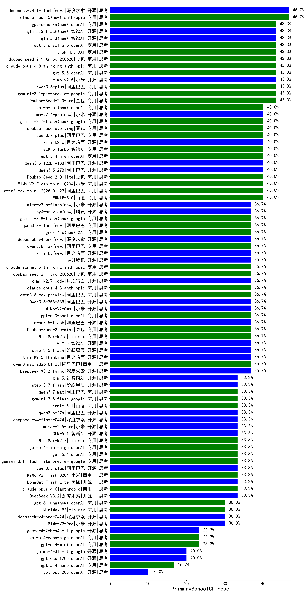

|类别|机构|大模型|【PrimarySchoolChinese】准确率|平均耗时|平均消耗token|花费/千次（元）|排名（准确率）|
|---|---|-----|-------------------|-------|-----------|-----------|-----------|
|商用|anthropic|claude-opus-5(new)|46.7%|12s|608|94.4|1|
|商用|openAI|gpt-6-astra(new)|43.3%|9s|191|47.9|2|
|商用|豆包|doubao-seed-2-1-turbo-260628(new)|43.3%|124s|6270|92.9|3|
|商用|豆包|Doubao-Seed-2.0-pro|43.3%|215s|1037|15.3|4|
|商用|google|gemini-3.1-pro-preview|43.3%|38s|1489|122.5|5|
|商用|阿里巴巴|qwen3.6-plus|43.3%|32s|1490|17.3|6|
|开源|小米|mimo-v2.5|43.3%|35s|1667|20.0|7|
|商用|anthropic|claude-opus-4.8-thinking(new)|43.3%|11s|646|101.0|8|
|商用|openAI|gpt-5.5|43.3%|7s|383|68.6|9|
|商用|XAI|grok-4.5(new)|43.3%|66s|2933|115.8|10|
|商用|openAI|gpt-5.6-sol-pro(new)|43.3%|26s|3105|238.5|11|
|开源|智谱AI|glm-5.3(new)|43.3%|181s|2270|62.3|12|
|开源|智谱AI|glm-5.3-flash(new)|43.3%|109s|1906|5.2|13|
|商用|豆包|doubao-seed-evolving(new)|40.0%|222s|7647|227.0|14|
|商用|阿里巴巴|qwen3.7-plus(new)|40.0%|57s|3044|24.0|15|
|商用|百度|ERNIE-5.0|40.0%|151s|3100|73.5|16|
|开源|月之暗面|kimi-k2.6|40.0%|105s|2019|53.4|17|
|商用|google|gemini-3.7-flash(new)|40.0%|5s|593|14.3|18|
|商用|openAI|gpt-5.4-high|40.0%|12s|650|62.3|19|
|开源|阿里巴巴|Qwen3.5-122B-A10B|40.0%|459s|3355|21.1|20|
|开源|阿里巴巴|Qwen3.5-27B|40.0%|130s|3023|14.3|21|
|商用|豆包|Doubao-Seed-2.0-lite|40.0%|175s|876|2.8|22|
|商用|小米|MiMo-V2-Flash-think-0204|40.0%|228s|2410|5.0|23|
|商用|阿里巴巴|qwen3-max-think-2026-01-23|40.0%|98s|3159|31.1|24|
|商用|智谱AI|GLM-5-Turbo|40.0%|28s|1325|28.2|25|
|商用|腾讯|hunyuan-2.0-thinking-20251109|40.0%|36s|932|3.6|26|
|商用|腾讯|hunyuan-2.0-instruct-20251111|40.0%|24s|366|0.6|27|
|商用|阿里巴巴|qwen3.6-max-preview|36.7%|93s|1618|84.7|28|
|开源|阿里巴巴|Qwen3.6-35B-A3B|36.7%|10s|1563|16.3|29|
|开源|深度求索|DeepSeek-V3.2-Think|36.7%|204s|1811|5.4|30|
|商用|豆包|doubao-seed-2-1-pro-260628(new)|36.7%|219s|7706|228.8|31|
|开源|深度求索|deepseek-v4-pro(new)|36.7%|39s|1913|49.3|32|
|开源|小米|MiMo-V2-Omni|36.7%|284s|1728|20.8|33|
|商用|阿里巴巴|qwen3.8-max(new)|36.7%|34s|1499|51.6|34|
|开源|月之暗面|kimi-k3(new)|36.7%|116s|983|87.5|35|
|商用|阿里巴巴|qwen3-max-2026-01-23|36.7%|143s|595|5.5|36|
|商用|openAI|gpt-5.3-chat|36.7%|14s|338|27.3|37|
|开源|腾讯|hy3(new)|36.7%|57s|217|0.7|38|
|商用|anthropic|claude-sonnet-5-thinking(new)|36.7%|17s|823|52.8|39|
|商用|阿里巴巴|qwen-plus-2025-12-01|36.7%|26s|984|1.9|40|
|商用|anthropic|claude-opus-4.8(new)|36.7%|8s|386|55.5|41|
|开源|月之暗面|kimi-k2.7-code(new)|36.7%|20s|735|18.7|42|
|商用|阿里巴巴|qwen3.8-flash(new)|36.7%|63s|1634|4.2|43|
|商用|XAI|grok-4.6(new)|36.7%|48s|2302|89.4|44|
|商用|google|gemini-3.8-flash(new)|36.7%|14s|605|29.2|45|
|开源|月之暗面|Kimi-K2.5-Thinking|36.7%|324s|1672|34.1|46|
|商用|豆包|doubao-seed-1-8-251215|36.7%|25s|553|3.7|47|
|开源|阿里巴巴|qwen3.5-flash|36.7%|125s|3437|6.8|48|
|开源|阶跃星辰|step-3.5-flash|36.7%|33s|3324|6.9|49|
|商用|minimax|MiniMax-M2.5|36.7%|57s|3139|25.8|50|
|开源|小米|MiMo-V2-Flash-think|36.7%|39s|2371|0.0|51|
|开源|智谱AI|GLM-5|36.7%|93s|2296|40.5|52|
|商用|豆包|Doubao-Seed-2.0-mini|36.7%|302s|1905|3.6|53|
|商用|google|gemini-3.1-flash-lite-preview|33.3%|2s|267|2.3|54|
|商用|百度|ernie-5.1|33.3%|24s|699|11.8|55|
|开源|阿里巴巴|qwen3.6-27b|33.3%|29s|1781|31.2|56|
|商用|anthropic|claude-opus-4.6|33.3%|12s|421|61.4|57|
|商用|google|gemini-3.5-flash|33.3%|11s|1652|100.8|58|
|商用|阿里巴巴|qwen3.7-max|33.3%|40s|1224|42.6|59|
|开源|小米|mimo-v2.5-pro|33.3%|40s|1817|33.9|60|
|开源|Mistral|Ministral-3-3B-Instruct-2512|33.3%|12s|411|0.3|61|
|开源|阶跃星辰|step-3.7-flash(new)|33.3%|29s|2548|20.2|62|
|开源|深度求索|deepseek-v4-flash-0424|33.3%|32s|1258|2.5|63|
|商用|小米|MiMo-V2-Flash-0204|33.3%|246s|426|0.8|64|
|商用|阿里巴巴|qwen-plus-think-2025-12-01|33.3%|100s|2605|20.4|65|
|开源|美团|LongCat-Flash-Lite|33.3%|237s|471|0.0|66|
|商用|阿里巴巴|qwen3-max-preview-think|33.3%|59s|2135|50.1|67|
|开源|智谱AI|GLM-5.1|33.3%|62s|1711|40.0|68|
|开源|深度求索|DeepSeek-V3.2|33.3%|9s|299|0.8|69|
|开源|智谱AI|GLM-4.7|33.3%|68s|2618|36.0|70|
|开源|阿里巴巴|qwen3.5-plus|33.3%|38s|3038|14.3|71|
|商用|minimax|MiniMax-M2.7|33.3%|103s|4466|37.0|72|
|开源|阿里巴巴|qwen3-next-80b-a3b-thinking|33.3%|213s|3774|14.9|73|
|商用|openAI|gpt-5.4-mini-high|33.3%|12s|950|28.1|74|
|开源|小米|MiMo-V2-Flash|33.3%|205s|342|0.0|75|
|商用|google|gemini-3-flash-preview|33.3%|119s|1550|31.9|76|
|商用|openAI|gpt-5.4|33.3%|4s|189|13.9|77|
|开源|智谱AI|glm-5.2(new)|33.3%|49s|2148|58.9|78|
|开源|Mistral|mistral-large-2512|30.0%|9s|287|2.6|79|
|开源|美团|LongCat-Flash-Thinking-2601|30.0%|73s|2169|0.0|80|
|商用|openAI|gpt-5.2|30.0%|10s|167|10.7|81|
|商用|minimax|MiniMax-M3(new)|30.0%|32s|934|12.9|82|
|开源|小米|MiMo-V2-Pro|30.0%|267s|1265|22.3|83|
|商用|openAI|gpt-5.2-medium|30.0%|10s|347|28.6|84|
|商用|openAI|gpt-5.2-high|30.0%|10s|477|41.5|85|
|开源|深度求索|deepseek-v4-pro-0424|30.0%|44s|1072|25.1|86|
|开源|google|gemma-4-26b-a4b-it|23.3%|39s|439|1.1|87|
|商用|openAI|gpt-5.4-nano-high|23.3%|90s|693|5.6|88|
|商用|openAI|gpt-5.4-mini|23.3%|60s|178|3.8|89|
|商用|minimax|MiniMax-M2.1|23.3%|60s|2571|21.0|90|
|开源|智谱AI|GLM-4.7-Flash|23.3%|1973s|8147|0.0|91|
|开源|Mistral|Ministral-3-14B-Instruct-2512|20.0%|14s|412|0.6|92|
|开源|google|gemma-4-31b-it|20.0%|46s|358|0.9|93|
|开源|openAI|gpt-oss-120b|20.0%|216s|696|2.0|94|
|商用|openAI|gpt-5.4-nano|16.7%|25s|162|0.9|95|
|开源|Mistral|Ministral-3-8B-Instruct-2512|13.3%|12s|444|0.5|96|
|开源|openAI|gpt-oss-20b|10.0%|232s|1839|2.0|97|

