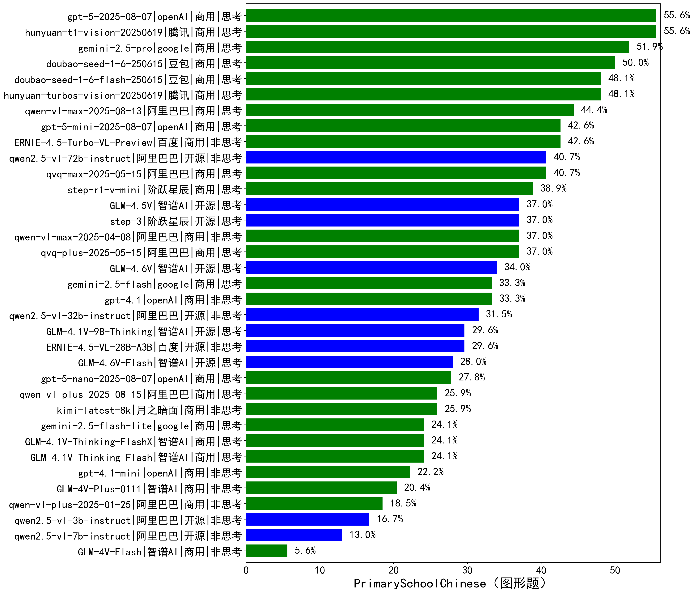

|类别|机构|大模型|【PrimarySchoolChinese（图形题）】准确率|平均耗时|平均消耗token|花费/千次（元）|排名（准确率）|
|---|---|-----|-------------------|-------|-----------|-----------|-----------|
|商用|腾讯|hunyuan-t1-vision-20250619|55.6%|22s|1157|6.8|1|
|商用|openAI|gpt-5-2025-08-07|55.6%|116s|1927|104.5|2|
|商用|google|gemini-2.5-pro|51.9%|173s|2645|160.3|3|
|商用|豆包|doubao-seed-1-6-250615|50.0%|/|473|1.5|4|
|商用|腾讯|hunyuan-turbos-vision-20250619|48.1%|24s|695|3.0|5|
|商用|豆包|doubao-seed-1-6-flash-250615|48.1%|/|494|0.3|6|
|商用|百度|ERNIE-4.5-Turbo-VL-Preview|42.6%|30s|1900|7.3|7|
|商用|openAI|gpt-5-mini-2025-08-07|42.6%|147s|1655|19.9|8|
|开源|阿里巴巴|qwen2.5-vl-72b-instruct|40.7%|31s|429|1.8|9|
|商用|阿里巴巴|qvq-max-2025-05-15|40.7%|49s|1072|27.1|10|
|商用|阶跃星辰|step-r1-v-mini|38.9%|45s|2395|15.4|11|
|商用|阿里巴巴|qvq-plus-2025-05-15|37.0%|86s|1250|5.4|12|
|商用|阿里巴巴|qwen-vl-max-2025-04-08|37.0%|30s|594|3.6|13|
|开源|智谱AI|GLM-4.5V|37.0%|27s|1185|6.0|14|
|开源|阶跃星辰|step-3|37.0%|137s|2549|9.3|15|
|商用|openAI|gpt-4.1|33.3%|25s|741|19.3|16|
|商用|google|gemini-2.5-flash|33.3%|147s|4318|70.3|17|
|开源|阿里巴巴|qwen2.5-vl-32b-instruct|31.5%|34s|635|1.2|18|
|开源|百度|ERNIE-4.5-VL-28B-A3B|29.6%|16s|541|1.3|19|
|开源|智谱AI|GLM-4.1V-9B-Thinking|29.6%|59s|1789|1.6|20|
|商用|openAI|gpt-5-nano-2025-08-07|27.8%|152s|4308|11.7|21|
|商用|月之暗面|kimi-latest-8k|25.9%|14s|1440|17.3|22|
|商用|智谱AI|GLM-4.1V-Thinking-FlashX|24.1%|41s|1429|2.9|23|
|商用|智谱AI|GLM-4.1V-Thinking-Flash|24.1%|13s|1165|0.0|24|
|商用|google|gemini-2.5-flash-lite|24.1%|3s|781|1.2|25|
|商用|openAI|gpt-4.1-mini|22.2%|38s|486|2.8|26|
|商用|智谱AI|GLM-4V-Plus-0111|20.4%|30s|485|1.9|27|
|商用|阿里巴巴|qwen-vl-plus-2025-01-25|18.5%|19s|423|1.0|28|
|开源|阿里巴巴|qwen2.5-vl-3b-instruct|16.7%|17s|379|0.6|29|
|开源|阿里巴巴|qwen2.5-vl-7b-instruct|13.0%|6s|411|0.1|30|
|商用|智谱AI|GLM-4V-Flash|5.6%|9s|483|0.0|31|

