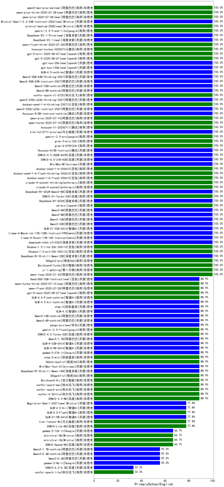

|类别|机构|大模型|【PrimarySchoolEnglish】准确率|平均耗时|平均消耗token|花费/千次（元）|排名（准确率）|
|---|---|-----|-------------------|-------|-----------|-----------|-----------|
|商用|阿里巴巴|qwen-long-2025-01-25|100.0%|6s|207|0.4|1|
|商用|百川智能|Baichuan4-Turbo|100.0%|/|/|/|2|
|商用|零一万物|yi-lightning|100.0%|/|/|/|3|
|商用|奇虎360|360gpt2-pro|100.0%|4s|126|0.4|4|
|开源|meta|Llama-4-Maverick-17B-128E-Instruct-FP8|100.0%|6s|366|1.4|5|
|开源|meta|Llama-4-Scout-17B-16E-Instruct|100.0%|11s|417|0.8|6|
|商用|商汤|SenseChat-5-1202|100.0%|/|/|/|7|
|商用|豆包|Doubao-1.5-pro-32k-250115|100.0%|7s|297|0.5|8|
|商用|豆包|Doubao-1.5-lite-32k-250115|100.0%|3s|153|0.1|9|
|开源|深度求索|DeepSeek-R1-Distill-Qwen-32B|100.0%|10s|571|0.7|10|
|开源|智谱AI|GLM-Z1-32B-0414|100.0%|345s|1019|3.9|11|
|开源|深度求索|deepseek-chat-v3-0324|100.0%|154s|193|1.3|12|
|开源|阿里巴巴|qwen3-235b-a22b-instruct-2507(new)|100.0%|4s|218|1.5|13|
|商用|豆包|doubao-seed-1-6-thinking-250715(new)|100.0%|7s|420|3.0|14|
|开源|阿里巴巴|qwen3-235b-a22b-thinking-2507(new)|100.0%|75s|1271|24.6|15|
|商用|科大讯飞|xunfei-spark-x1-0725(new)|100.0%|/|616|7.4|16|
|开源|阿里巴巴|Qwen3-32B-nothink|100.0%|15s|326|1.1|17|
|开源|阿里巴巴|Qwen3-8B-nothink|100.0%|14s|303|0.0|18|
|开源|阿里巴巴|Qwen3-30B-A3B-Instruct-2507(new)|100.0%|2s|263|0.7|19|
|开源|腾讯|Hunyuan-A13B-Instruct|100.0%|54s|399|1.5|20|
|商用|XAI|grok-4-0709|100.0%|67s|750|77.5|21|
|商用|腾讯|hunyuan-t1-20250711|100.0%|9s|521|1.8|22|
|开源|月之暗面|kimi-k2-0711-preview|100.0%|13s|249|3.4|23|
|商用|google|gemini-2.5-pro|100.0%|13s|1177|82.4|24|
|商用|XAI|grok-3-mini|100.0%|153s|814|2.9|25|
|商用|阿里巴巴|qwen-turbo-2025-07-15|100.0%|4s|203|0.1|26|
|商用|豆包|doubao-seed-1-6-flash-250615|100.0%|2s|221|0.3|27|
|商用|豆包|doubao-seed-1-6-flash-thinking-250615|100.0%|6s|418|0.5|28|
|商用|豆包|doubao-seed-1-6-250615|100.0%|98s|207|1.1|29|
|开源|minimax|MiniMax-M1|100.0%|41s|1031|6.2|30|
|开源|百度|ERNIE-4.5-21B-A3B|100.0%|35s|228|0.0|31|
|开源|百度|ERNIE-4.5-300B-A47B|100.0%|12s|208|1.3|32|
|商用|anthropic|claude-4-sonnet|100.0%|43s|300|28.4|33|
|商用|anthropic|claude-4-sonnet-thinking|100.0%|47s|543|54.8|34|
|商用|openAI|o4-mini|100.0%|38s|347|10.0|35|
|开源|深度求索|DeepSeek-R1-0528|100.0%|152s|1052|16.3|36|
|商用|百度|ERNIE-X1-Turbo-32K|100.0%|24s|608|2.3|37|
|开源|深度求索|DeepSeek-R1-0528-Qwen3-8B|100.0%|490s|1848|0.0|38|
|开源|阿里巴巴|Qwen3-4B|100.0%|15s|229|0.5|39|
|开源|阿里巴巴|Qwen3-8B|100.0%|16s|277|0.0|40|
|开源|阿里巴巴|Qwen3-14B|100.0%|18s|1301|2.5|41|
|开源|阿里巴巴|Qwen3-32B|100.0%|18s|327|1.2|42|
|开源|深度求索|DeepSeek-V3.1-Think(new)|100.0%|33s|598|6.8|43|
|商用|google|gemini-2.5-flash-lite(new)|100.0%|1s|212|0.5|44|
|商用|阿里巴巴|qwen-flash-think-2025-07-28(new)|100.0%|12s|1179|1.7|45|
|商用|openAI|gpt-5-mini-2025-08-07(new)|100.0%|17s|358|4.6|46|
|开源|openAI|gpt-oss-120b(new)|100.0%|104s|257|0.6|47|
|开源|openAI|gpt-oss-20b(new)|100.0%|3s|401|0.4|48|
|开源|智谱AI|GLM-4.5-nothink|100.0%|14s|389|4.9|49|
|开源|阿里巴巴|Qwen3-30B-A3B-Thinking-2507(new)|100.0%|57s|1113|3.0|50|
|开源|深度求索|DeepSeek-V3.1(new)|100.0%|11s|209|2.2|51|
|商用|腾讯|hunyuan-turbos-20250716(new)|100.0%|26s|310|0.5|52|
|商用|openAI|gpt-5-2025-08-07(new)|100.0%|47s|291|18.6|53|
|商用|阿里巴巴|qwen-plus-2025-07-14|100.0%|10s|266|0.5|54|
|开源|腾讯|Hunyuan-A13B-Instruct-nothink|100.0%|10s|288|1.0|55|
|商用|智谱AI|GLM-Z1-Flash|88.9%|39s|1056|0.0|56|
|商用|阿里巴巴|qwq-plus-2025-03-05|88.9%|27s|1116|4.3|57|
|商用|openAI|gpt-4.1|88.9%|10s|175|8.2|58|
|开源|深度求索|DeepSeek-R1-Distill-Qwen-14B|88.9%|/|/|/|59|
|商用|奇虎360|360gpt2-o1|88.9%|16s|348|15.7|60|
|商用|Mistral|mistral-small|88.9%|/|/|/|61|
|开源|minimax|MiniMax-Text-01|88.9%|6s|809|6.5|62|
|开源|Google|gemma-3-27b-it|88.9%|/|/|/|63|
|开源|阿里巴巴|qwq-32b|88.9%|28s|1036|6.0|64|
|商用|openAI|chatgpt-4o-latest|88.9%|/|/|/|65|
|商用|奇虎360|360zhinao2-o1|88.9%|/|/|/|66|
|商用|科大讯飞|xunfei-spark-pro|88.9%|/|/|/|67|
|商用|科大讯飞|xunfei-spark-max|88.9%|2s|106|3.2|68|
|商用|百度|ERNIE-3.5-8K|88.9%|18s|345|0.6|69|
|商用|科大讯飞|xunfei-4.0Ultra|88.9%|4s|106|7.4|70|
|商用|百川智能|Baichuan4-Air|88.9%|/|/|/|71|
|开源|智谱AI|GLM-4-32B-0414|88.9%|5s|172|0.3|72|
|开源|智谱AI|GLM-4-9B-0414|88.9%|6s|251|0.0|73|
|商用|阶跃星辰|step-2-mini|88.9%|5s|216|0.4|74|
|商用|智谱AI|GLM-4.5-Flash-nothink|88.9%|8s|383|0.0|75|
|开源|智谱AI|GLM-4.5-Air-nothink|88.9%|5s|389|2.1|76|
|商用|阿里巴巴|qwen-flash-2025-07-28(new)|88.9%|6s|303|0.4|77|
|开源|华为|pangu-pro-moe|88.9%|50s|832|3.2|78|
|开源|阿里巴巴|Qwen3-4B-nothink|88.9%|13s|286|0.7|79|
|开源|阿里巴巴|Qwen3-14B-nothink|88.9%|12s|354|0.6|80|
|开源|智谱AI|GLM-4.5(new)|88.9%|51s|1310|17.9|81|
|开源|阶跃星辰|step-3(new)|88.9%|72s|1414|5.5|82|
|商用|openAI|gpt-5-nano-2025-08-07(new)|88.9%|32s|800|2.2|83|
|商用|阶跃星辰|step-r1-v-mini|88.9%|17s|1059|8.1|84|
|商用|google|gemini-2.5-flash|88.9%|6s|849|14.7|85|
|开源|阿里巴巴|Qwen3-1.7B|88.9%|26s|1579|4.6|86|
|商用|百度|ERNIE-4.5-Turbo-32K|88.9%|16s|393|1.2|87|
|商用|百度|ERNIE-Lite-8K|77.8%|/|/|/|88|
|商用|Mistral|mistral-large|77.8%|/|/|/|89|
|开源|智谱AI|GLM-Z1-9B-0414|77.8%|52s|1895|0.0|90|
|商用|月之暗面|kimi-latest-8k|77.8%|7s|274|3.3|91|
|商用|智谱AI|GLM-4.5-Flash(new)|77.8%|32s|1504|0.0|92|
|商用|openAI|gpt-4.1-mini|77.8%|6s|135|1.2|93|
|开源|智谱AI|GLM-4.5-Air(new)|77.8%|34s|1583|9.3|94|
|开源|Mistral|Mistral-Small-3.1-24B-Instruct-2503|77.8%|/|/|/|95|
|商用|Mistral|ministral-8b|66.7%|/|/|/|96|
|商用|百度|ERNIE-Speed-8K|66.7%|/|/|/|97|
|商用|Mistral|ministral-3b|66.7%|/|/|/|98|
|开源|Google|gemma-3-12b-it|66.7%|/|/|/|99|
|开源|阿里巴巴|Qwen3-0.6B-nothink|55.6%|11s|93|0.1|100|
|商用|百度|ERNIE-Tiny-8K|55.6%|/|/|/|101|
|开源|Google|gemma-3-4b-it|55.6%|/|/|/|102|
|开源|阿里巴巴|Qwen3-1.7B-nothink|55.6%|6s|338|0.9|103|
|开源|阿里巴巴|Qwen3-0.6B|55.6%|4s|726|2.0|104|
|商用|科大讯飞|xunfei-spark-lite|33.3%|/|/|/|105|
|开源|百度|ERNIE-4.5-0.3B|33.3%|43s|196|0.0|106|

