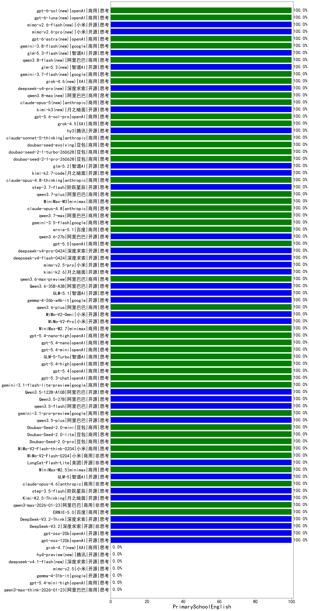

|类别|机构|大模型|【PrimarySchoolEnglish】准确率|平均耗时|平均消耗token|花费/千次（元）|排名（准确率）|
|---|---|-----|-------------------|-------|-----------|-----------|-----------|
|开源|openAI|gpt-oss-120b|100.0%|104s|257|0.6|1|
|商用|anthropic|claude-opus-4.8|100.0%|5s|241|32.4|2|
|商用|豆包|doubao-seed-2-1-pro-260628|100.0%|41s|610|16.1|3|
|开源|智谱AI|glm-5.2|100.0%|41s|642|16.9|4|
|开源|月之暗面|kimi-k2.7-code|100.0%|9s|165|3.5|5|
|商用|anthropic|claude-opus-4.8-thinking|100.0%|5s|306|43.8|6|
|开源|阶跃星辰|step-3.7-flash|100.0%|10s|297|2.0|7|
|商用|阿里巴巴|qwen3.7-plus|100.0%|13s|551|4.1|8|
|商用|minimax|MiniMax-M3|100.0%|13s|343|3.0|9|
|商用|阿里巴巴|qwen3.7-max|100.0%|21s|836|28.9|10|
|商用|豆包|doubao-seed-evolving|100.0%|106s|3962|116.7|11|
|商用|google|gemini-3.5-flash|100.0%|4s|450|25.9|12|
|商用|百度|ernie-5.1|100.0%|9s|243|3.7|13|
|开源|阿里巴巴|qwen3.6-27b|100.0%|12s|675|11.4|14|
|商用|openAI|gpt-5.5|100.0%|45s|109|14.8|15|
|开源|深度求索|deepseek-v4-pro-0424|100.0%|36s|630|14.6|16|
|开源|深度求索|deepseek-v4-flash-0424|100.0%|48s|983|1.9|17|
|开源|小米|mimo-v2.5-pro|100.0%|14s|838|13.5|18|
|商用|豆包|doubao-seed-2-1-turbo-260628|100.0%|74s|4145|61.1|19|
|商用|anthropic|claude-sonnet-5-thinking|100.0%|23s|226|11.9|20|
|商用|阿里巴巴|qwen3.6-max-preview|100.0%|38s|920|47.4|21|
|开源|智谱AI|glm-5.3(new)|100.0%|11s|321|7.9|22|
|商用|openAI|gpt-6-luna(new)|100.0%|212s|115|0.3|23|
|开源|小米|mimo-v2.6-flash(new)|100.0%|9s|233|0.4|24|
|开源|小米|mimo-v2.6-pro(new)|100.0%|12s|213|1.1|25|
|商用|openAI|gpt-6-astra(new)|100.0%|13s|118|28.4|26|
|商用|google|gemini-3.8-flash(new)|100.0%|12s|265|12.0|27|
|开源|智谱AI|glm-5.3-flash(new)|100.0%|25s|736|2.0|28|
|商用|阿里巴巴|qwen3.8-flash(new)|100.0%|12s|373|0.8|29|
|商用|google|gemini-3.7-flash(new)|100.0%|3s|238|5.3|30|
|开源|腾讯|hy3|100.0%|35s|158|0.5|31|
|商用|XAI|grok-4.6(new)|100.0%|14s|809|26.9|32|
|开源|深度求索|deepseek-v4-pro(new)|100.0%|91s|1361|34.5|33|
|商用|阿里巴巴|qwen3.8-max(new)|100.0%|38s|1042|35.4|34|
|商用|anthropic|claude-opus-5(new)|100.0%|11s|397|59.7|35|
|开源|月之暗面|kimi-k3(new)|100.0%|19s|350|24.9|36|
|商用|openAI|gpt-5.6-sol-pro|100.0%|7s|2041|116.1|37|
|商用|XAI|grok-4.5|100.0%|15s|980|34.1|38|
|开源|openAI|gpt-oss-20b|100.0%|3s|401|0.4|39|
|开源|月之暗面|kimi-k2.6|100.0%|33s|496|12.4|40|
|开源|阿里巴巴|Qwen3.6-35B-A3B|100.0%|7s|715|7.3|41|
|商用|minimax|MiniMax-M2.5|100.0%|28s|1448|11.7|42|
|开源|阿里巴巴|qwen3.5-plus|100.0%|15s|996|4.6|43|
|商用|豆包|Doubao-Seed-2.0-mini|100.0%|23s|520|0.9|44|
|商用|豆包|Doubao-Seed-2.0-lite|100.0%|53s|314|0.9|45|
|商用|豆包|Doubao-Seed-2.0-pro|100.0%|73s|372|4.8|46|
|商用|小米|MiMo-V2-Flash-think-0204|100.0%|1229s|1602|3.3|47|
|商用|小米|MiMo-V2-Flash-0204|100.0%|317s|361|0.7|48|
|开源|美团|LongCat-Flash-Lite|100.0%|118s|168|0.0|49|
|开源|智谱AI|GLM-5|100.0%|59s|1209|21.1|50|
|开源|阿里巴巴|qwen3.5-flash|100.0%|239s|648|1.2|51|
|商用|anthropic|claude-opus-4.6|100.0%|14s|137|15.6|52|
|开源|阶跃星辰|step-3.5-flash|100.0%|20s|2143|4.4|53|
|开源|月之暗面|Kimi-K2.5-Thinking|100.0%|615s|2603|53.8|54|
|商用|阿里巴巴|qwen3-max-2026-01-23|100.0%|12s|245|2.1|55|
|商用|百度|ERNIE-5.0|100.0%|93s|488|10.9|56|
|开源|深度求索|DeepSeek-V3.2-Think|100.0%|29s|809|2.4|57|
|开源|深度求索|DeepSeek-V3.2|100.0%|8s|175|0.5|58|
|开源|智谱AI|GLM-5.1|100.0%|156s|484|10.8|59|
|商用|google|gemini-3.1-pro-preview|100.0%|21s|964|78.9|60|
|开源|阿里巴巴|Qwen3.5-27B|100.0%|64s|1366|6.3|61|
|商用|openAI|gpt-5.4-nano|100.0%|5s|60|0.2|62|
|开源|google|gemma-4-26b-a4b-it|100.0%|21s|268|0.6|63|
|商用|阿里巴巴|qwen3.6-plus|100.0%|56s|860|9.8|64|
|开源|小米|MiMo-V2-Omni|100.0%|250s|536|4.2|65|
|开源|小米|MiMo-V2-Pro|100.0%|1825s|539|7.2|66|
|开源|阿里巴巴|Qwen3.5-122B-A10B|100.0%|220s|1027|6.3|67|
|商用|openAI|gpt-5.4-nano-high|100.0%|12s|107|0.6|68|
|商用|minimax|MiniMax-M2.7|100.0%|11s|428|3.1|69|
|商用|openAI|gpt-5.4-mini|100.0%|9s|109|2.2|70|
|商用|智谱AI|GLM-5-Turbo|100.0%|54s|388|7.8|71|
|商用|openAI|gpt-5.4-high|100.0%|5s|275|24.9|72|
|商用|openAI|gpt-5.4|100.0%|10s|110|7.5|73|
|商用|openAI|gpt-5.3-chat|100.0%|7s|125|8.3|74|
|商用|google|gemini-3.1-flash-lite-preview|100.0%|27s|116|0.8|75|
|商用|openAI|gpt-6-sol(new)|100.0%|495s|81|3.1|76|
|商用|openAI|gpt-5.4-mini-high|0.0%|232s|853|25.7|77|
|商用|阿里巴巴|qwen3-max-think-2026-01-23|0.0%|1225s|3758|37.2|78|
|开源|深度求索|deepseek-v4.1-flash(new)|0.0%|11s|1131|8.6|79|
|开源|腾讯|hy4-preview(new)|0.0%|154s|11546|207.0|80|
|开源|google|gemma-4-31b-it|0.0%|44s|300|0.7|81|
|开源|小米|mimo-v2.5|0.0%|19s|2083|25.9|82|

