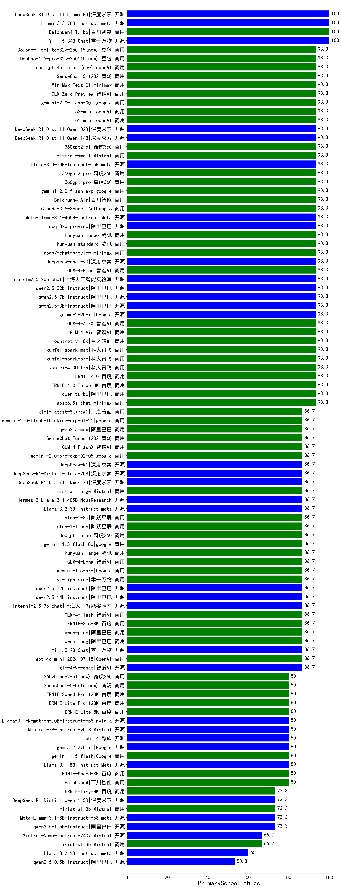

|类别|机构|大模型|【PrimarySchoolEthics】准确率|平均耗时|平均消耗token|排名（准确率）|
|---|---|-----|-------------------|-------|-----------|------------|
|商用|百川智能|Baichuan4-Turbo|100.0%|/|/|1|
|开源|百度|ERNIE-4.5-300B-A47B(new)|100.0%|5s|240|2|
|开源|阿里巴巴|Qwen3-235B-A22B-nothink|100.0%|10s|296|3|
|开源|meta|Llama-4-Scout-17B-16E-Instruct|100.0%|68s|376|4|
|商用|月之暗面|moonshot-v1-8k|75.0%|/|/|5|
|商用|百度|ERNIE-3.5-8K|75.0%|22s|345|6|
|商用|科大讯飞|xunfei-spark-pro|75.0%|/|/|7|
|商用|科大讯飞|xunfei-spark-max|75.0%|4s|159|8|
|开源|阿里巴巴|qwen2.5-7b-instruct|75.0%|3s|135|9|
|商用|腾讯|hunyuan-turbo|75.0%|13s|1081|10|
|商用|百川智能|Baichuan4-Air|75.0%|/|/|11|
|商用|奇虎360|360gpt2-pro|75.0%|39s|163|12|
|商用|零一万物|yi-lightning|75.0%|/|/|13|
|开源|阿里巴巴|qwen2.5-3b-instruct|75.0%|6s|222|14|
|商用|智谱AI|GLM-4-AirX|75.0%|2s|131|15|
|商用|科大讯飞|xunfei-4.0Ultra|75.0%|4s|158|16|
|商用|商汤|SenseChat-5-1202|75.0%|/|/|17|
|商用|豆包|Doubao-1.5-pro-32k-250115|75.0%|8s|345|18|
|商用|openAI|chatgpt-4o-latest|75.0%|/|/|19|
|开源|minimax|MiniMax-Text-01|75.0%|8s|843|20|
|开源|深度求索|DeepSeek-R1-Distill-Qwen-32B|75.0%|54s|1509|21|
|开源|深度求索|DeepSeek-R1-Distill-Qwen-14B|75.0%|/|/|22|
|商用|奇虎360|360gpt2-o1|75.0%|19s|427|23|
|商用|智谱AI|GLM-4-Plus|75.0%|17s|205|24|
|商用|Mistral|mistral-small|75.0%|/|/|25|
|开源|腾讯|Hunyuan-A13B-Instruct(new)|75.0%|40s|627|26|
|商用|google|gemini-2.5-flash-lite-preview-06-17(new)|75.0%|3s|586|27|
|开源|百度|ERNIE-4.5-21B-A3B(new)|75.0%|8s|153|28|
|商用|阿里巴巴|qwen-plus-think-2025-04-28|75.0%|222s|1636|29|
|开源|minimax|MiniMax-M1(new)|75.0%|564s|6687|30|
|商用|腾讯|hunyuan-t1-20250529|75.0%|10s|706|31|
|商用|阶跃星辰|step-r1-v-mini|75.0%|14s|766|32|
|开源|Google|gemma-3-4b-it|75.0%|/|/|33|
|开源|Google|gemma-3-12b-it|75.0%|/|/|34|
|商用|智谱AI|GLM-Z1-AirX|75.0%|114s|15588|35|
|开源|阿里巴巴|Qwen3-235B-A22B|75.0%|35s|1819|36|
|商用|豆包|Doubao-1.5-thinking-pro|75.0%|295s|658|37|
|商用|科大讯飞|xunfei-spark-x1|75.0%|37s|1160|38|
|开源|阿里巴巴|Qwen3-4B|75.0%|21s|1589|39|
|开源|阿里巴巴|Qwen3-30B-A3B|75.0%|27s|504|40|
|开源|阿里巴巴|qwq-32b|75.0%|25s|885|41|
|商用|阿里巴巴|qwq-plus-2025-03-05|75.0%|18s|974|42|
|开源|meta|Llama-4-Maverick-17B-128E-Instruct-FP8|75.0%|59s|510|43|
|开源|Mistral|Mistral-Small-3.1-24B-Instruct-2503|75.0%|/|/|44|
|商用|豆包|Doubao-1.5-lite-32k-250115|75.0%|4s|192|45|
|商用|腾讯|hunyuan-standard|75.0%|/|/|46|
|开源|阿里巴巴|qwen2.5-32b-instruct|75.0%|48s|144|47|
|商用|智谱AI|GLM-4-Air|75.0%|48s|130|48|
|商用|阿里巴巴|qwen-turbo-think-2025-04-28|75.0%|136s|1619|49|
|商用|google|gemini-2.5-flash(new)|75.0%|6s|1186|50|
|商用|google|gemini-2.5-pro(new)|75.0%|15s|1209|51|
|商用|豆包|doubao-seed-1-6-flash-250615(new)|75.0%|2s|225|52|
|商用|anthropic|claude-4-sonnet|75.0%|52s|385|53|
|开源|深度求索|DeepSeek-R1-0528-Qwen3-8B|75.0%|693s|1228|54|
|商用|XAI|grok-3-mini(new)|75.0%|63s|820|55|
|商用|豆包|doubao-seed-1-6-thinking-250615(new)|75.0%|491s|518|56|
|商用|豆包|doubao-seed-1-6-250615(new)|75.0%|121s|218|57|
|商用|百度|ERNIE-4.5-Turbo-32K|75.0%|15s|382|58|
|商用|豆包|doubao-seed-1-6-flash-thinking-250615(new)|75.0%|6s|463|59|
|商用|XAI|grok-4-0709(new)|75.0%|356s|630|60|
|商用|百度|ERNIE-Tiny-8K|50.0%|/|/|61|
|商用|Mistral|mistral-large|50.0%|/|/|62|
|商用|商汤|SenseChat-Turbo-1202|50.0%|/|/|63|
|开源|深度求索|deepseek-chat-v3-0324|50.0%|13s|192|64|
|开源|阿里巴巴|qwen2.5-1.5b-instruct|50.0%|5s|84|65|
|开源|上海人工智能实验室|internlm2_5-7b-chat|50.0%|/|/|66|
|商用|OpenAI|gpt-4o-mini|50.0%|/|/|67|
|商用|阿里巴巴|qwen-long-2025-01-25|50.0%|5s|246|68|
|商用|Mistral|ministral-3b|50.0%|/|/|69|
|商用|智谱AI|GLM-4-Flash|50.0%|107s|129|70|
|商用|阿里巴巴|qwen2.5-max|50.0%|51s|272|71|
|商用|月之暗面|kimi-latest-8k|50.0%|39s|377|72|
|开源|腾讯|hunyuan-large|50.0%|2s|124|73|
|商用|智谱AI|GLM-4-Long|50.0%|20s|149|74|
|开源|阿里巴巴|qwen2.5-14b-instruct|50.0%|2s|177|75|
|开源|阿里巴巴|qwen2.5-72b-instruct|50.0%|51s|163|76|
|开源|微软|phi-4|50.0%|/|/|77|
|商用|奇虎360|360gpt-turbo|50.0%|/|/|78|
|商用|智谱AI|GLM-4-FlashX|50.0%|173s|131|79|
|商用|商汤|SenseChat-5-beta|50.0%|13s|242|80|
|商用|阿里巴巴|qwen-plus-2025-04-28|50.0%|6s|281|81|
|商用|腾讯|hunyuan-turbos-20250604(new)|50.0%|5s|277|82|
|商用|openAI|gpt-4.1-mini|50.0%|5s|165|83|
|商用|openAI|gpt-4.1|50.0%|7s|206|84|
|商用|智谱AI|GLM-Z1-Flash|50.0%|78s|1411|85|
|开源|深度求索|DeepSeek-R1-0528|50.0%|196s|1789|86|
|商用|百度|ERNIE-X1-Turbo-32K|50.0%|63s|1519|87|
|商用|openAI|o4-mini|50.0%|17s|386|88|
|商用|anthropic|claude-4-sonnet-thinking|50.0%|47s|854|89|
|开源|智谱AI|GLM-4-32B-0414|50.0%|4s|193|90|
|商用|阶跃星辰|step-2-mini|50.0%|63s|277|91|
|开源|Google|gemma-3-27b-it|50.0%|/|/|92|
|开源|智谱AI|GLM-4-9B-0414|50.0%|13s|239|93|
|开源|智谱AI|GLM-Z1-Rumination-32B-0414|50.0%|48s|1981|94|
|开源|阿里巴巴|Qwen3-32B|50.0%|30s|1315|95|
|开源|阿里巴巴|Qwen3-14B|50.0%|21s|1270|96|
|开源|月之暗面|kimi-k2-0711-preview(new)|50.0%|10s|191|97|
|商用|阿里巴巴|qwen-turbo-2025-04-28|50.0%|4s|216|98|
|商用|百度|ERNIE-Speed-8K|25.0%|/|/|99|
|开源|阿里巴巴|qwen2.5-0.5b-instruct|25.0%|14s|192|100|
|商用|百度|ERNIE-Lite-8K|25.0%|/|/|101|
|商用|Mistral|ministral-8b|25.0%|/|/|102|
|开源|阿里巴巴|Qwen3-1.7B|25.0%|15s|1242|103|
|商用|智谱AI|GLM-Z1-Air|25.0%|244s|9000|104|
|商用|科大讯飞|xunfei-spark-lite|25.0%|/|/|105|
|开源|阿里巴巴|Qwen3-0.6B|25.0%|5s|941|106|
|开源|阿里巴巴|Qwen3-8B|25.0%|155s|3647|107|
|开源|智谱AI|GLM-Z1-32B-0414|25.0%|48s|2255|108|
|开源|智谱AI|GLM-Z1-9B-0414|25.0%|37s|1632|109|
|商用|奇虎360|360zhinao2-o1|25.0%|/|/|110|
|商用|智谱AI|GLM-Z1-FlashX|25.0%|57s|1015|111|
|开源|百度|ERNIE-4.5-0.3B(new)|/%|4s|226|112|

