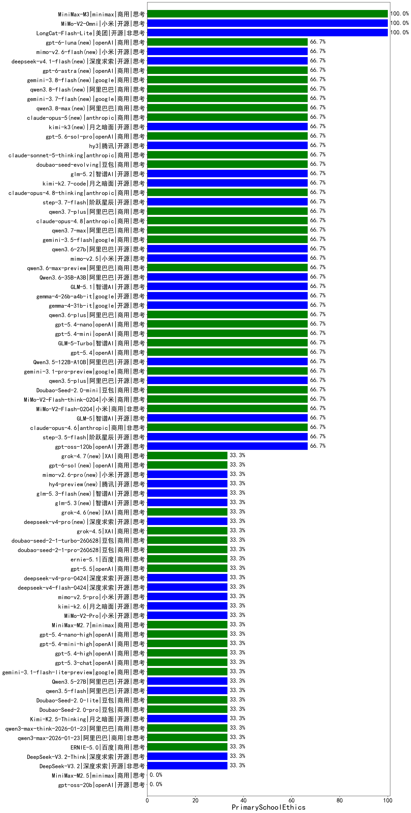

|类别|机构|大模型|【PrimarySchoolEthics】准确率|平均耗时|平均消耗token|花费/千次（元）|排名（准确率）|
|---|---|-----|-------------------|-------|-----------|-----------|-----------|
|商用|minimax|MiniMax-M3|100.0%|737s|7041|115.6|1|
|开源|小米|MiMo-V2-Omni|100.0%|18s|979|10.2|2|
|开源|美团|LongCat-Flash-Lite|100.0%|146s|499|0.0|3|
|开源|openAI|gpt-oss-120b|66.7%|45s|486|1.3|4|
|商用|阿里巴巴|qwen3.6-max-preview|66.7%|53s|1394|72.5|5|
|商用|openAI|gpt-5.4-nano|66.7%|6s|145|0.8|6|
|商用|anthropic|claude-opus-5(new)|66.7%|10s|432|61.5|7|
|开源|月之暗面|kimi-k3(new)|66.7%|35s|652|54.4|8|
|商用|openAI|gpt-5.6-sol-pro|66.7%|9s|2220|126.0|9|
|商用|阿里巴巴|qwen3.6-plus|66.7%|35s|1531|17.7|10|
|开源|google|gemma-4-31b-it|66.7%|36s|258|0.6|11|
|开源|google|gemma-4-26b-a4b-it|66.7%|75s|343|0.8|12|
|开源|智谱AI|GLM-5.1|66.7%|179s|1292|30.0|13|
|开源|阿里巴巴|Qwen3.6-35B-A3B|66.7%|141s|1518|15.8|14|
|开源|腾讯|hy3|66.7%|88s|162|0.4|15|
|开源|小米|mimo-v2.5|66.7%|31s|1475|17.2|16|
|开源|智谱AI|glm-5.2|66.7%|43s|1093|29.3|17|
|商用|anthropic|claude-sonnet-5-thinking|66.7%|9s|386|21.3|18|
|商用|豆包|doubao-seed-evolving|66.7%|471s|9763|290.5|19|
|开源|阿里巴巴|qwen3.6-27b|66.7%|37s|1339|23.2|20|
|商用|google|gemini-3.5-flash|66.7%|7s|1320|79.8|21|
|商用|阿里巴巴|qwen3.7-max|66.7%|26s|975|33.6|22|
|商用|anthropic|claude-opus-4.8|66.7%|8s|443|63.5|23|
|商用|阿里巴巴|qwen3.7-plus|66.7%|19s|947|7.2|24|
|开源|阶跃星辰|step-3.7-flash|66.7%|10s|606|4.5|25|
|商用|anthropic|claude-opus-4.8-thinking|66.7%|9s|502|73.8|26|
|商用|阿里巴巴|qwen3.8-max(new)|66.7%|21s|884|29.4|27|
|商用|openAI|gpt-5.4-mini|66.7%|10s|150|2.9|28|
|商用|智谱AI|GLM-5-Turbo|66.7%|19s|1026|21.6|29|
|商用|google|gemini-3.8-flash(new)|66.7%|14s|921|45.7|30|
|商用|openAI|gpt-6-luna(new)|66.7%|93s|206|0.5|31|
|开源|小米|mimo-v2.6-flash(new)|66.7%|33s|450|0.8|32|
|开源|深度求索|deepseek-v4.1-flash(new)|66.7%|5s|958|7.2|33|
|开源|阶跃星辰|step-3.5-flash|66.7%|35s|3275|6.8|34|
|商用|anthropic|claude-opus-4.6|66.7%|23s|430|60.9|35|
|开源|智谱AI|GLM-5|66.7%|49s|1599|28.0|36|
|商用|openAI|gpt-6-astra(new)|66.7%|8s|130|26.2|37|
|商用|小米|MiMo-V2-Flash-0204|66.7%|95s|341|0.6|38|
|商用|小米|MiMo-V2-Flash-think-0204|66.7%|711s|1174|2.4|39|
|开源|月之暗面|kimi-k2.7-code|66.7%|12s|324|7.6|40|
|商用|openAI|gpt-5.4|66.7%|6s|136|8.2|41|
|开源|阿里巴巴|qwen3.5-plus|66.7%|45s|3602|17.0|42|
|商用|google|gemini-3.1-pro-preview|66.7%|36s|1738|143.5|43|
|商用|阿里巴巴|qwen3.8-flash(new)|66.7%|45s|395|0.9|44|
|商用|豆包|Doubao-Seed-2.0-mini|66.7%|307s|1614|3.0|45|
|开源|阿里巴巴|Qwen3.5-122B-A10B|66.7%|232s|3733|23.6|46|
|商用|google|gemini-3.7-flash(new)|66.7%|3s|459|10.7|47|
|开源|腾讯|hy4-preview(new)|33.3%|142s|4335|77.2|48|
|商用|openAI|gpt-6-sol(new)|33.3%|75s|165|7.6|49|
|商用|XAI|grok-4.6(new)|33.3%|16s|1021|35.5|50|
|开源|小米|mimo-v2.6-pro(new)|33.3%|26s|747|4.3|51|
|开源|智谱AI|glm-5.3-flash(new)|33.3%|42s|1383|3.7|52|
|开源|智谱AI|glm-5.3(new)|33.3%|28s|740|19.4|53|
|商用|豆包|doubao-seed-2-1-turbo-260628|33.3%|309s|8136|120.8|54|
|开源|深度求索|deepseek-v4-pro(new)|33.3%|25s|1017|25.0|55|
|商用|XAI|grok-4.5|33.3%|135s|992|34.2|56|
|商用|豆包|doubao-seed-2-1-pro-260628|33.3%|181s|7589|225.3|57|
|开源|月之暗面|kimi-k2.6|33.3%|54s|815|20.8|58|
|商用|百度|ernie-5.1|33.3%|40s|924|15.8|59|
|商用|openAI|gpt-5.5|33.3%|9s|257|41.8|60|
|开源|深度求索|DeepSeek-V3.2|33.3%|140s|237|0.7|61|
|开源|深度求索|DeepSeek-V3.2-Think|33.3%|134s|1290|3.8|62|
|商用|百度|ERNIE-5.0|33.3%|148s|933|21.4|63|
|商用|阿里巴巴|qwen3-max-2026-01-23|33.3%|132s|429|3.8|64|
|商用|阿里巴巴|qwen3-max-think-2026-01-23|33.3%|143s|2331|22.8|65|
|开源|月之暗面|Kimi-K2.5-Thinking|33.3%|732s|3245|67.2|66|
|商用|豆包|Doubao-Seed-2.0-pro|33.3%|274s|1187|17.7|67|
|商用|豆包|Doubao-Seed-2.0-lite|33.3%|112s|767|2.5|68|
|开源|阿里巴巴|qwen3.5-flash|33.3%|590s|5180|10.2|69|
|开源|阿里巴巴|Qwen3.5-27B|33.3%|466s|3469|16.4|70|
|商用|google|gemini-3.1-flash-lite-preview|33.3%|15s|225|1.8|71|
|商用|openAI|gpt-5.3-chat|33.3%|13s|269|20.4|72|
|商用|openAI|gpt-5.4-high|33.3%|18s|267|22.0|73|
|商用|openAI|gpt-5.4-mini-high|33.3%|12s|370|9.8|74|
|商用|openAI|gpt-5.4-nano-high|33.3%|76s|309|2.2|75|
|商用|minimax|MiniMax-M2.7|33.3%|40s|1691|13.6|76|
|开源|小米|MiMo-V2-Pro|33.3%|725s|892|14.4|77|
|开源|小米|mimo-v2.5-pro|33.3%|39s|1949|36.6|78|
|开源|深度求索|deepseek-v4-flash-0424|33.3%|19s|688|1.3|79|
|开源|深度求索|deepseek-v4-pro-0424|33.3%|26s|880|20.4|80|
|商用|XAI|grok-4.7(new)|33.3%|31s|3296|102.0|81|
|商用|minimax|MiniMax-M2.5|0.0%|27s|1465|11.7|82|
|开源|openAI|gpt-oss-20b|0.0%|4s|584|0.6|83|

