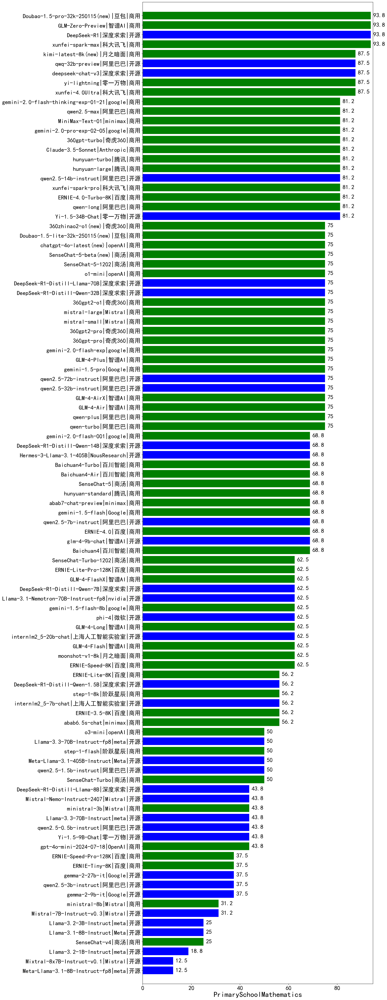

|类别|机构|大模型|【PrimarySchoolMathematics】准确率|平均耗时|平均消耗token|花费/千次（元）|排名（准确率）|
|---|---|-----|-------------------|-------|-----------|-----------|-----------|
|商用|豆包|Doubao-1.5-thinking-pro|100.0%|354s|861|13.1|1|
|商用|智谱AI|GLM-Z1-AirX|98.9%|19s|1793|9.0|2|
|开源|深度求索|DeepSeek-R1-0528|98.0%|223s|4348|68.9|3|
|商用|腾讯|hunyuan-t1-20250529|98.0%|144s|2053|7.9|4|
|商用|腾讯|hunyuan-t1-20250711(new)|98.0%|65s|3231|12.6|5|
|商用|阿里巴巴|qwen-turbo-think-2025-04-28|97.0%|291s|10498|15.3|6|
|商用|阶跃星辰|step-r1-v-mini|97.0%|70s|2925|23.0|7|
|商用|google|gemini-2.5-pro(new)|97.0%|37s|3212|229.1|8|
|商用|XAI|grok-4-0709(new)|96.6%|75s|2756|294.4|9|
|商用|智谱AI|GLM-Z1-Air|96.4%|69s|3045|1.2|10|
|开源|阿里巴巴|Qwen3-32B|96.0%|184s|6382|25.3|11|
|商用|阿里巴巴|qwen-plus-think-2025-04-28|96.0%|289s|3823|31.8|12|
|开源|腾讯|Hunyuan-A13B-Instruct(new)|96.0%|220s|2362|9.3|13|
|开源|阿里巴巴|Qwen3-235B-A22B|96.0%|197s|3970|39.2|14|
|商用|科大讯飞|xunfei-spark-x1|95.9%|91s|2373|28.5|15|
|开源|阿里巴巴|Qwen3-30B-A3B|95.0%|85s|4478|12.4|16|
|商用|google|gemini-2.5-flash(new)|95.0%|11s|2543|45.1|17|
|商用|百度|ERNIE-X1-Turbo-32K|95.0%|242s|2932|11.6|18|
|商用|百度|ERNIE-4.5-Turbo-32K|95.0%|192s|1167|3.6|19|
|开源|阿里巴巴|qwq-32b|94.5%|158s|8368|49.9|20|
|开源|月之暗面|kimi-k2-0711-preview(new)|94.0%|125s|1321|20.5|21|
|开源|智谱AI|GLM-Z1-32B-0414|94.0%|79s|3941|15.6|22|
|商用|阿里巴巴|qwq-plus-2025-03-05|93.9%|114s|4792|19.0|23|
|商用|智谱AI|GLM-Z1-FlashX|93.3%|29s|2594|0.3|24|
|开源|深度求索|deepseek-chat-v3-0324|93.0%|199s|1481|11.5|25|
|商用|腾讯|hunyuan-turbos-20250604(new)|93.0%|58s|1777|3.4|26|
|开源|深度求索|DeepSeek-R1-0528-Qwen3-8B|93.0%|160s|5049|0.0|27|
|开源|minimax|MiniMax-M1(new)|93.0%|288s|5020|53.6|28|
|商用|豆包|doubao-seed-1-6-250615(new)|93.0%|7s|431|3.0|29|
|开源|阿里巴巴|Qwen3-14B|92.0%|108s|7466|14.8|30|
|商用|智谱AI|GLM-Z1-Flash|92.0%|29s|3351|0.0|31|
|开源|华为|pangu-pro-moe(new)|92.0%|137s|3170|12.5|32|
|开源|阿里巴巴|Qwen3-4B|91.0%|65s|4179|12.4|33|
|商用|豆包|doubao-seed-1-6-thinking-250615(new)|91.0%|580s|3558|14.0|34|
|商用|奇虎360|360zhinao2-o1|90.6%|147s|3544|35.0|35|
|商用|openAI|gpt-4.1|90.0%|11s|253|12.5|36|
|商用|XAI|grok-3-mini(new)|90.0%|228s|1886|6.8|37|
|商用|豆包|doubao-seed-1-6-flash-thinking-250615(new)|90.0%|12s|981|1.8|38|
|开源|智谱AI|GLM-Z1-9B-0414|89.5%|61s|3142|0.0|39|
|开源|百度|ERNIE-4.5-300B-A47B(new)|89.0%|230s|1089|8.3|40|
|商用|奇虎360|360gpt2-o1|88.5%|123s|3095|152.7|41|
|商用|阿里巴巴|qwen-plus-2025-04-28|87.0%|16s|467|1.7|42|
|开源|智谱AI|GLM-4-32B-0414|85.3%|24s|1147|2.2|43|
|开源|阿里巴巴|Qwen3-235B-A22B-nothink|85.0%|33s|810|7.6|44|
|商用|豆包|Doubao-1.5-pro-32k-250115|84.4%|15s|708|1.3|45|
|开源|腾讯|hunyuan-large|84.4%|16s|740|8.3|46|
|商用|豆包|doubao-seed-1-6-flash-250615(new)|84.0%|7s|487|0.7|47|
|开源|阿里巴巴|Qwen3-8B|81.0%|356s|9342|0.0|48|
|商用|openAI|gpt-4.1-mini|80.0%|8s|294|3.0|49|
|商用|anthropic|claude-4-sonnet|80.0%|37s|301|27.4|50|
|商用|anthropic|claude-4-sonnet-thinking|80.0%|47s|708|71.6|51|
|商用|openAI|o4-mini|80.0%|25s|719|21.8|52|
|商用|科大讯飞|xunfei-spark-max|79.2%|36s|949|28.5|53|
|商用|阿里巴巴|qwen-turbo-2025-04-28|79.0%|10s|513|0.5|54|
|开源|百度|ERNIE-4.5-21B-A3B(new)|78.0%|140s|1520|0.0|55|
|开源|智谱AI|GLM-Z1-Rumination-32B-0414|77.9%|66s|4015|14.5|56|
|开源|meta|Llama-4-Maverick-17B-128E-Instruct-FP8|77.9%|14s|626|2.5|57|
|商用|科大讯飞|xunfei-4.0Ultra|77.8%|22s|660|46.2|58|
|商用|豆包|Doubao-1.5-lite-32k-250115|76.0%|6s|505|0.3|59|
|商用|google|gemini-2.5-flash-lite-preview-06-17(new)|75.0%|7s|1750|4.9|60|
|开源|阿里巴巴|Qwen3-1.7B|75.0%|47s|4085|12.1|61|
|商用|阿里巴巴|qwen2.5-max|72.9%|25s|764|6.8|62|
|商用|阿里巴巴|qwen-long-2025-01-25|71.9%|12s|548|1.0|63|
|开源|深度求索|DeepSeek-R1-Distill-Qwen-32B|70.8%|115s|1798|2.3|64|
|商用|腾讯|hunyuan-standard|70.8%|5s|361|0.6|65|
|开源|阿里巴巴|qwen2.5-72b-instruct|68.8%|15s|515|5.5|66|
|商用|智谱AI|GLM-4-Plus|68.0%|16s|569|2.8|67|
|开源|深度求索|DeepSeek-R1-Distill-Qwen-14B|67.7%|62s|2892|2.0|68|
|商用|智谱AI|GLM-4-Air|66.7%|18s|549|0.3|69|
|商用|商汤|SenseChat-5-beta|65.6%|26s|473|8.7|70|
|开源|minimax|MiniMax-Text-01|63.5%|20s|1083|8.7|71|
|开源|阿里巴巴|qwen2.5-32b-instruct|63.5%|18s|474|2.5|72|
|商用|月之暗面|kimi-latest-8k|63.5%|54s|600|7.2|73|
|开源|Google|gemma-3-27b-it|62.5%|22s|722|1.0|74|
|开源|阿里巴巴|qwen2.5-14b-instruct|61.5%|6s|534|1.4|75|
|商用|Mistral|mistral-large|61.5%|11s|841|33.8|76|
|商用|openAI|chatgpt-4o-latest|60.8%|7s|603|39.9|77|
|商用|百川智能|Baichuan4-Air|59.4%|11s|534|0.5|78|
|商用|奇虎360|360gpt2-pro|59.4%|20s|548|2.5|79|
|商用|零一万物|yi-lightning|58.3%|19s|679|0.7|80|
|商用|奇虎360|360gpt-turbo|58.3%|12s|603|1.1|81|
|商用|百度|ERNIE-3.5-8K|57.3%|13s|467|0.9|82|
|商用|商汤|SenseChat-5-1202|57.3%|31s|504|9.4|83|
|商用|智谱AI|GLM-4-Long|56.7%|23s|306|0.3|84|
|商用|科大讯飞|xunfei-spark-pro|56.2%|18s|663|4.6|85|
|开源|Google|gemma-3-12b-it|56.2%|33s|807|0.0|86|
|商用|Mistral|mistral-small|55.2%|63s|836|1.7|87|
|商用|OpenAI|gpt-4o-mini|54.2%|9s|608|2.4|88|
|商用|百川智能|Baichuan4-Turbo|54.2%|11s|539|8.1|89|
|商用|商汤|SenseChat-Turbo-1202|53.1%|19s|590|0.3|90|
|开源|微软|phi-4|53.1%|27s|1139|1.1|91|
|开源|meta|Llama-4-Scout-17B-16E-Instruct|51.6%|20s|573|1.2|92|
|开源|智谱AI|GLM-4-9B-0414|50.5%|9s|492|0.0|93|
|开源|Mistral|Mistral-Small-3.1-24B-Instruct-2503|50.5%|59s|888|1.8|94|
|商用|智谱AI|GLM-4-AirX|50.0%|10s|326|3.3|95|
|开源|阿里巴巴|Qwen3-0.6B|47.0%|39s|4514|13.4|96|
|商用|智谱AI|GLM-4-FlashX|45.8%|11s|378|0.0|97|
|开源|阿里巴巴|qwen2.5-7b-instruct|44.8%|20s|583|0.5|98|
|商用|智谱AI|GLM-4-Flash|44.5%|14s|492|0.0|99|
|开源|上海人工智能实验室|internlm2_5-7b-chat|41.7%|9s|526|0.0|100|
|商用|阶跃星辰|step-2-mini|41.7%|45s|542|1.0|101|
|开源|Google|gemma-3-4b-it|35.4%|10s|1217|0.0|102|
|开源|阿里巴巴|qwen2.5-3b-instruct|35.4%|22s|519|0.4|103|
|商用|Mistral|ministral-8b|35.4%|64s|662|0.5|104|
|商用|百度|ERNIE-Lite-8K|29.2%|7s|410|0.0|105|
|商用|百度|ERNIE-Speed-8K|26.5%|12s|367|0.0|106|
|开源|阿里巴巴|qwen2.5-1.5b-instruct|26.0%|21s|527|0.0|107|
|商用|Mistral|ministral-3b|20.8%|88s|627|0.2|108|
|商用|百度|ERNIE-Tiny-8K|12.5%|1s|275|0.0|109|
|开源|阿里巴巴|qwen2.5-0.5b-instruct|12.5%|34s|661|0.0|110|
|商用|科大讯飞|xunfei-spark-lite|8.0%|3s|246|0.0|111|
|开源|百度|ERNIE-4.5-0.3B(new)|7.0%|101s|942|0.0|112|

